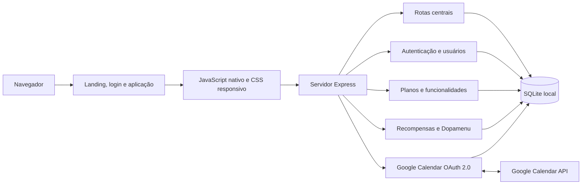

<p align="center">
  
</p>

<h1 align="center">Kairo</h1>

<p align="center">
  <strong>Inteligência pessoal para transformar tempo, foco e energia em decisões melhores.</strong>
</p>

<p align="center">
  
  
  
  
  
</p>

> [!IMPORTANT]
> O Kairo está em desenvolvimento ativo e, no estado atual, deve ser tratado como uma aplicação **local-first para uso pessoal e validação funcional**. A interface exige autenticação, mas parte das rotas centrais ainda não possui isolamento por usuário nem proteção de sessão no servidor. Consulte [Segurança e limitações conhecidas](#segurança-e-limitações-conhecidas) antes de expor a aplicação em rede ou utilizá-la em produção.

## Sumário

- [Visão do produto](#visão-do-produto)
- [Estado atual](#estado-atual)
- [Funcionalidades](#funcionalidades)
- [Arquitetura](#arquitetura)
- [Tecnologias e dependências](#tecnologias-e-dependências)
- [Instalação e execução](#instalação-e-execução)
- [Configuração](#configuração)
- [Integração com Google Calendar](#integração-com-google-calendar)
- [Persistência e modelo de dados](#persistência-e-modelo-de-dados)
- [Referência da API](#referência-da-api)
- [Regras de negócio](#regras-de-negócio)
- [Estrutura do projeto](#estrutura-do-projeto)
- [Qualidade e validação](#qualidade-e-validação)
- [Segurança e limitações conhecidas](#segurança-e-limitações-conhecidas)
- [Próximas entregas](#próximas-entregas)
- [Solução de problemas](#solução-de-problemas)
- [Licença e manutenção](#licença-e-manutenção)

## Visão do produto

O **Kairo** é um painel pessoal de gestão do tempo com foco em planejamento diário, execução consciente, análise de hábitos e reforço de consistência. A experiência reúne agenda, atividades, metas, ciclos de foco, relatórios, recompensas e administração de usuários em uma aplicação web responsiva e inteiramente em português do Brasil.

O produto foi desenhado para oferecer diferentes representações da mesma agenda — incluindo visões inspiradas em fluxos para TDAH, calendário, lista e Kanban — sem duplicar os eventos. A fonte central é o SQLite local, com sincronização manual e bidirecional opcional com o Google Calendar.

### Princípios do projeto

- **Dados reais:** os recursos operacionais persistem no SQLite; não há dados funcionais simulados para substituir integrações ausentes.
- **Múltiplas formas de visualizar:** os mesmos eventos podem ser consumidos em sete layouts de agenda.
- **Foco e energia:** ciclos de Pomodoro, carga cognitiva, prioridade e recompensas apoiam a execução diária.
- **Privacidade local:** a aplicação roda no computador do usuário por padrão.
- **Transparência:** funcionalidades incompletas e restrições arquiteturais são documentadas sem serem apresentadas como concluídas.

## Estado atual

| Área | Situação | Observação |
|---|---|---|
| Dashboard e indicadores | Operacional | KPIs de hoje, semana, conclusão e categorias são calculados no backend. |
| CRUD de eventos da agenda | Operacional | Criação, leitura, edição, exclusão e conclusão persistem no SQLite. |
| Sete layouts de agenda | Operacional | TDAH, Atual, Google, TickTick, Morgen, Todoist e Kanban. |
| Pomodoro e áudio 40 Hz | Operacional no navegador | Ciclos de 15, 25 e 50 minutos; estado não é persistido após recarregar a página. |
| Autenticação e administração | Operacional | Cadastro, login, sessão por cookie e CRUD administrativo de usuários. |
| Planos e funcionalidades | Parcial | Cadastro e associação existem; o bloqueio efetivo das funcionalidades por plano ainda não foi aplicado às rotas centrais. |
| Recompensas e Dopamenu | Operacional com restrições | Coins, streak, baús, colecionáveis, feedback e configuração administrativa; recursos chamados de “IA” usam regras heurísticas, não um modelo de IA. |
| Google Calendar | Operacional quando configurado | OAuth 2.0 e sincronização manual; não há sincronização automática em tempo real. |
| Relatórios | Operacional em nível básico | Gráficos e resumos atuais; análises avançadas e séries temporais permanecem pendentes. |
| Isolamento multiusuário | Não implementado | Agenda, atividades, metas, perfil e tokens do Google são globais no modelo atual. |
| Testes automatizados e CI | Não implementados | A validação disponível é manual e por verificações sintáticas/HTTP. |

O histórico detalhado de implementação e a fila operacional são mantidos em [`andamento-claude.md`](./andamento-claude.md). O código atual já contém a entrega de gamificação e recompensas; os itens ainda não implementados aparecem em [Próximas entregas](#próximas-entregas).

## Funcionalidades

### Dashboard

- cartões com horas de hoje, horas da semana, taxa de conclusão e categorias ativas;
- comparação visual entre períodos atual e anterior;
- resumo semanal por atividade;
- navegação direta para agenda e relatórios;
- atualização dos dados após alterações realizadas na agenda.

### Agenda unificada

- criação, edição e exclusão de eventos;
- horários inicial e final, data, descrição, prioridade, cor e carga cognitiva;
- associação do evento a uma categoria de atividade;
- conclusão rápida e indicação visual de status;
- filtros, navegação temporal e ações contextuais;
- coluna redimensionável na visão semelhante ao Google Calendar;
- persistência única para todos os layouts.

#### Layouts disponíveis

| Layout | Proposta de uso |
|---|---|
| **TDAH** | Reduzir sobrecarga visual, destacar o agora e oferecer ações rápidas. |
| **Atual** | Visualização própria do Kairo com contexto diário e semanal. |
| **Google** | Grade temporal familiar para compromissos com horário definido. |
| **TickTick** | Organização compacta em lista com foco em execução. |
| **Morgen** | Planejamento temporal limpo e concentrado nos eventos relevantes. |
| **Todoist** | Lista estruturada por tarefas, prioridade e conclusão. |
| **Kanban** | Distribuição visual dos eventos por estado e contexto. |

### Foco Pomodoro

- durações predefinidas de 15, 25 e 50 minutos;
- controles de iniciar, pausar, continuar e reiniciar;
- anel radial de progresso;
- seleção do evento em foco;
- gerador binaural de 40 Hz via Web Audio API;
- acesso integrado aos diferentes layouts da agenda.

### Conta, perfil e preferências

- cadastro e login com senha protegida por hash `bcrypt`;
- sessão em cookie `httpOnly` assinada com JWT;
- menu de perfil, preferências visuais e encerramento de sessão;
- tema claro e escuro;
- atualização de nome, e-mail, cargo, foto e preferências do perfil global;
- interface administrativa condicionada ao papel do usuário.

### Usuários, papéis e planos

- perfis de acesso `administrador`, `free`, `plus` e `pro`;
- planos comerciais `free`, `plus` e `pro`, com acesso total reservado ao perfil `administrador`;
- criação, edição e remoção de usuários pelo administrador;
- catálogo de planos e funcionalidades;
- associação de funcionalidades aos planos;
- ativação e desativação administrativa.

> [!NOTE]
> O cadastro dos planos e das funcionalidades é persistente, porém as restrições comerciais ainda não são aplicadas de ponta a ponta ao dashboard, à agenda ou às APIs centrais.

### Gamificação e recompensas

- moedas virtuais e sequência diária (`streak`);
- recompensas variáveis por conclusão;
- multiplicadores de combo;
- baús e itens colecionáveis;
- registro do histórico de recompensas;
- pesquisa de satisfação após recompensas;
- Dopamenu pessoal com sugestões de recompensas customizadas;
- configurações administrativas para ativar ou desativar mecanismos;
- painel executivo com métricas agregadas de uso e recompensa.

### Google Calendar

- autorização OAuth 2.0;
- envio de eventos locais ainda não sincronizados;
- importação de eventos dentro de uma janela temporal;
- atualização por vínculo de `google_event_id`;
- desconexão e remoção dos tokens locais;
- acionamento manual da sincronização pela interface.

### Landing page

- apresentação pública do produto em `/landing.html`;
- navegação para cadastro e login;
- mockup visual responsivo da experiência;
- conteúdo comercial separado da aplicação autenticada.

## Arquitetura



O projeto adota uma arquitetura monolítica simples:

- o Express entrega os arquivos estáticos e as APIs JSON;
- o frontend utiliza HTML, CSS e JavaScript nativos, sem etapa de compilação;
- o SQLite concentra a persistência;
- módulos separados estendem o servidor para autenticação, planos, recompensas e Google Calendar;
- as tabelas e evoluções de esquema são inicializadas durante a subida do servidor.

## Tecnologias e dependências

### Plataforma

- [Node.js 24 LTS](https://nodejs.org/en/download) recomendado;
- npm;
- SQLite 3;
- navegador moderno com suporte a CSS Grid, Custom Properties e Web Audio API.

### Dependências de execução

| Pacote | Responsabilidade |
|---|---|
| `express` | Servidor HTTP, arquivos estáticos e APIs. |
| `sqlite` e `sqlite3` | Persistência e acesso assíncrono ao banco local. |
| `bcryptjs` | Hash e verificação de senhas. |
| `jsonwebtoken` | Emissão e validação da sessão JWT. |
| `cookie-parser` | Leitura do cookie de autenticação. |
| `cors` | Habilitação de CORS no servidor. |
| `dotenv` | Carregamento opcional de variáveis do arquivo `.env`. |
| `googleapis` | OAuth 2.0 e operações no Google Calendar. |
| `nodemon` | Reinicialização automática no ambiente de desenvolvimento. |

## Instalação e execução

### Pré-requisitos

- Git;
- Node.js 24 LTS ou uma versão compatível recente;
- npm incluído na instalação do Node.js.

### Início rápido

```bash
git clone https://github.com/ilyra-ai/personal-time-tracker.git
cd personal-time-tracker
npm install
npm start
```

Acesse:

- aplicação autenticada: [http://localhost:3000](http://localhost:3000);
- login: [http://localhost:3000/login.html](http://localhost:3000/login.html);
- apresentação pública: [http://localhost:3000/landing.html](http://localhost:3000/landing.html).

### Credencial administrativa inicial

Na primeira inicialização, o servidor cria uma conta administrativa de desenvolvimento:

```text
E-mail: admin@admin.com
Senha: admin123
```

> [!WARNING]
> Troque essa senha antes de usar dados reais ou permitir qualquer acesso de terceiros. A credencial é conhecida e existe apenas para inicialização local.

### Atalhos por sistema operacional

No Windows, execute:

```powershell
.\run.bat
```

No Linux ou macOS:

```bash
chmod +x run.sh
./run.sh
```

Os scripts verificam o ambiente, instalam dependências quando necessário, identificam conflitos da porta e iniciam o servidor.

### Scripts npm

| Comando | Resultado |
|---|---|
| `npm start` | Executa `server.js` com Node.js. |
| `npm run dev` | Executa o servidor com reinicialização automática pelo Nodemon. |

## Configuração

O arquivo `.env` é opcional para a execução local sem Google Calendar. Use [`.env.example`](./.env.example) como referência.

No PowerShell:

```powershell
Copy-Item .env.example .env
```

No Linux ou macOS:

```bash
cp .env.example .env
```

| Variável | Obrigatória | Padrão | Finalidade |
|---|---:|---|---|
| `PORT` | Não | `3000` | Porta HTTP do servidor. |
| `GOOGLE_CLIENT_ID` | Para Google | — | Identificador OAuth 2.0 do Google Cloud. |
| `GOOGLE_CLIENT_SECRET` | Para Google | — | Segredo OAuth 2.0 do Google Cloud. |
| `GOOGLE_REDIRECT_URI` | Para Google | `http://localhost:3000/api/google/callback` | Callback autorizado do OAuth. |
| `GOOGLE_CALENDAR_ID` | Não | `primary` | Calendário utilizado na sincronização. |
| `GOOGLE_CALENDAR_TIMEZONE` | Não | `America/Sao_Paulo` | Fuso horário usado na criação e leitura dos eventos. |
| `JWT_SECRET` | Não | Gerado na primeira execução | Permite definir externamente o segredo da sessão antes da criação do banco. |

Quando `JWT_SECRET` não é informado antes da primeira execução, o servidor gera um valor criptograficamente aleatório e o armazena na tabela `app_config` do banco local. Depois disso, o valor persistido mantém as sessões estáveis entre reinicializações.

## Integração com Google Calendar

1. Crie ou selecione um projeto no [Google Cloud Console](https://console.cloud.google.com/).
2. Ative a **Google Calendar API**.
3. Configure a tela de consentimento OAuth.
4. Crie credenciais do tipo **Aplicativo da Web**.
5. Cadastre exatamente este URI de redirecionamento:

   ```text
   http://localhost:3000/api/google/callback
   ```

6. Preencha `GOOGLE_CLIENT_ID`, `GOOGLE_CLIENT_SECRET` e `GOOGLE_REDIRECT_URI` no `.env`.
7. Reinicie o servidor, conecte a conta na interface e use **Sincronizar agora**.

### Comportamento da sincronização

- eventos locais sem vínculo são enviados ao calendário primário;
- eventos remotos são importados entre 30 dias no passado e 180 dias no futuro;
- eventos vinculados são atualizados com base no identificador do Google;
- eventos de dia inteiro são ignorados pela importação atual;
- exclusões remotas não são conciliadas automaticamente;
- criar, editar ou excluir localmente não dispara sincronização imediata: é necessário executar a sincronização manual.

## Persistência e modelo de dados

O arquivo `database.sqlite` é criado na raiz na primeira execução e está ignorado pelo Git. Não o publique: ele pode conter senhas protegidas por hash, perfil, agenda, tokens OAuth e dados de uso.

### Tabelas centrais

| Tabela | Conteúdo |
|---|---|
| `activities` | Categorias de atividade, cores, ícones e metadados. |
| `timeframes` | Valores atual/anterior por atividade e período. |
| `goals` | Metas por atividade e período. |
| `profile_data` | Perfil e preferências globais da instalação. |
| `agenda_events` | Eventos, horários, status, prioridade, carga cognitiva e vínculo com Google. |
| `google_tokens` | Tokens OAuth da integração com Google Calendar. |

### Autenticação e acesso

| Tabela | Conteúdo |
|---|---|
| `users` | Conta, hash da senha, papel, plano e status. |
| `app_config` | Configurações internas, incluindo o segredo JWT gerado localmente. |

### Planos

| Tabela | Conteúdo |
|---|---|
| `plans` | Catálogo de planos e estado de ativação. |
| `features` | Catálogo de funcionalidades. |
| `plan_features` | Relação entre planos e funcionalidades. |

### Recompensas

| Tabela | Conteúdo |
|---|---|
| `user_gamification` | Moedas, sequência, combos, baús e colecionáveis por usuário. |
| `dopamenu` | Sugestões pessoais de recompensa organizadas por categoria. |
| `dopamine_config` | Ativação dos mecanismos de recompensa. |
| `ai_reward_config` | Parâmetros heurísticos apresentados como configuração inteligente. |
| `reward_events` | Histórico de recompensas concedidas. |
| `reward_feedback` | Avaliação de satisfação das recompensas. |

O projeto ainda não possui migrações versionadas. A inicialização utiliza `CREATE TABLE IF NOT EXISTS` e alterações defensivas de colunas durante a execução.

## Referência da API

### Convenções de acesso

| Rótulo | Significado atual |
|---|---|
| **Sem middleware** | A rota responde diretamente no servidor, mesmo que a interface normalmente exija login. |
| **Sessão** | Requer cookie JWT válido. |
| **Admin** | Requer sessão válida e perfil `administrador`. |

### Autenticação

| Método | Rota | Acesso | Finalidade |
|---|---|---|---|
| `POST` | `/api/auth/register` | Sem middleware | Criar conta de usuário. |
| `POST` | `/api/auth/login` | Sem middleware | Autenticar e definir cookie de sessão. |
| `POST` | `/api/auth/logout` | Sem middleware | Remover o cookie da sessão. |
| `GET` | `/api/auth/me` | Sessão | Obter o usuário autenticado. |

### Dashboard, atividades e metas

| Método | Rota | Acesso | Finalidade |
|---|---|---|---|
| `GET` | `/api/dashboard/kpis` | Sem middleware | Calcular indicadores do dashboard. |
| `GET` | `/api/activities` | Sem middleware | Listar atividades com períodos e metas. |
| `GET` | `/api/activities/:id/details` | Sem middleware | Obter detalhes e eventos de uma atividade. |
| `PUT` | `/api/activities/:id` | Sem middleware | Atualizar valores dos períodos. |
| `PUT` | `/api/activities/:id/goals` | Sem middleware | Criar ou atualizar metas. |
| `DELETE` | `/api/activities/:id` | Sem middleware | Excluir atividade e dados associados. |

> [!NOTE]
> Ainda não existe uma rota `POST /api/activities`; novas categorias não podem ser criadas pela API atual.

### Agenda

| Método | Rota | Acesso | Finalidade |
|---|---|---|---|
| `GET` | `/api/agenda` | Sem middleware | Listar eventos, com filtros opcionais. |
| `POST` | `/api/agenda` | Sem middleware | Criar evento. |
| `PUT` | `/api/agenda/:id` | Sem middleware | Atualizar evento. |
| `DELETE` | `/api/agenda/:id` | Sem middleware | Excluir evento. |
| `GET` | `/api/activities/:id/agenda` | Sem middleware | Listar eventos de uma atividade. |

### Perfil e configurações

| Método | Rota | Acesso | Finalidade |
|---|---|---|---|
| `GET` | `/api/profile` | Sem middleware | Obter perfil global. |
| `PUT` | `/api/profile` | Sem middleware | Atualizar perfil e preferências. |
| `POST` | `/api/settings/reset` | Sem middleware | Recriar os dados centrais da instalação. |

### Administração de usuários

| Método | Rota | Acesso | Finalidade |
|---|---|---|---|
| `GET` | `/api/users` | Admin | Listar usuários. |
| `POST` | `/api/users` | Admin | Criar usuário. |
| `PUT` | `/api/users/:id` | Admin | Atualizar usuário, papel, plano ou status. |
| `DELETE` | `/api/users/:id` | Admin | Excluir usuário. |

### Planos e funcionalidades

| Método | Rota | Acesso | Finalidade |
|---|---|---|---|
| `GET` | `/api/plans` | Sessão | Listar planos e suas funcionalidades. |
| `POST` | `/api/plans/toggle` | Admin | Ativar ou remover uma funcionalidade de um plano. |
| `POST` | `/api/plans` | Admin | Criar plano. |
| `PUT` | `/api/plans/:key` | Admin | Atualizar plano pela chave. |
| `DELETE` | `/api/plans/:key` | Admin | Excluir plano não protegido. |
| `POST` | `/api/features` | Admin | Criar funcionalidade. |
| `DELETE` | `/api/features/:key` | Admin | Excluir funcionalidade pela chave. |

### Recompensas e Dopamenu

| Método | Rota | Acesso | Finalidade |
|---|---|---|---|
| `GET` | `/api/rewards/state` | Sessão | Obter estado de gamificação e histórico. |
| `POST` | `/api/rewards/complete` | Sessão | Processar a conclusão e conceder recompensa. |
| `POST` | `/api/rewards/feedback` | Sessão | Avaliar uma recompensa recebida. |
| `GET` | `/api/dopamenu` | Sessão | Listar recompensas pessoais. |
| `POST` | `/api/dopamenu` | Sessão | Criar uma sugestão de recompensa pessoal. |
| `DELETE` | `/api/dopamenu/:id` | Sessão | Remover item pessoal. |
| `GET` | `/api/rewards/config` | Admin | Obter configurações de gamificação e parâmetros heurísticos. |
| `POST` | `/api/rewards/config` | Admin | Ativar ou desativar um mecanismo. |
| `POST` | `/api/rewards/ai` | Admin | Atualizar um parâmetro heurístico. |
| `GET` | `/api/rewards/dashboard` | Admin | Obter métricas executivas agregadas. |

### Google Calendar

| Método | Rota | Acesso | Finalidade |
|---|---|---|---|
| `GET` | `/api/google/status` | Sem middleware | Consultar configuração e conexão. |
| `GET` | `/api/google/auth` | Sem middleware | Iniciar autorização OAuth. |
| `GET` | `/api/google/callback` | Sem middleware | Receber o código OAuth e armazenar tokens. |
| `POST` | `/api/google/sync` | Sem middleware | Executar sincronização bidirecional manual. |
| `POST` | `/api/google/disconnect` | Sem middleware | Remover os tokens armazenados. |

## Regras de negócio

### Períodos e horas

- `daily` agrega eventos da data atual;
- `weekly` agrega eventos da semana corrente;
- `monthly` agrega eventos do mês corrente;
- a duração é calculada pela diferença entre `start_time` e `end_time` no mesmo dia;
- os totais sincronizados para os cartões são arredondados para horas inteiras;
- o campo `previous` dos períodos permanece histórico/manual e não é recalculado pela agenda.

### Eventos

- o título, a data, os horários e a atividade vinculada são obrigatórios na criação;
- prioridade, cor, descrição e carga cognitiva complementam o planejamento;
- a conclusão altera o status visual e pode disparar o motor de recompensa quando realizada pelo fluxo autenticado;
- a edição atual preserva a atividade original: trocar a categoria de um evento existente ainda não é efetivado pela consulta de atualização do backend;
- eventos que atravessam a meia-noite não possuem tratamento específico.

### Recompensas

- moedas e recompensa são definidas por regras de faixa e aleatoriedade configurada;
- combos podem aumentar o valor concedido;
- streak considera dias de conclusão;
- baús e colecionáveis são sorteados conforme as regras ativas;
- a configuração “não repetir” é uma heurística baseada no histórico recente;
- a configuração “aprender preferências” é armazenada, mas ainda não alimenta um modelo de aprendizado;
- não existe integração com modelo generativo ou serviço externo de IA nesta versão.

## Estrutura do projeto

```text
Time-tracker-dashboard/
├── index.html                 # Aplicação autenticada
├── login.html                 # Login e cadastro
├── landing.html               # Apresentação pública
├── script.js                  # Estado e interações do frontend
├── styles.css                 # Design system, layouts e responsividade
├── server.js                  # Servidor, banco e APIs centrais
├── auth.js                    # Sessão, usuários e autorização
├── plans.js                   # Planos e funcionalidades
├── rewards.js                 # Gamificação, Dopamenu e métricas
├── google-calendar.js         # OAuth e sincronização do calendário
├── data.json                  # Dados iniciais de atividades e períodos
├── package.json               # Dependências e scripts
├── package-lock.json          # Lockfile atual do npm
├── .env.example               # Modelo de configuração local
├── run.bat                    # Inicialização assistida no Windows
├── run.sh                     # Inicialização assistida em Linux/macOS
├── style-guide.md             # Referência visual original
├── andamento-claude.md        # Histórico e fila de implementação
├── images/                    # Logotipo, avatares e ícones
└── design/                    # Referências visuais históricas
```

Arquivos gerados localmente, como `.env`, `database.sqlite` e `node_modules/`, não devem ser versionados.

## Qualidade e validação

O repositório ainda não define suíte automatizada, cobertura, lint ou pipeline de CI. Antes de enviar mudanças, execute pelo menos:

```bash
node --check server.js
node --check auth.js
node --check plans.js
node --check rewards.js
node --check google-calendar.js
node --check script.js
npm start
```

Na validação manual, percorra:

1. cadastro, login, recarregamento da sessão e logout;
2. dashboard e atualização dos indicadores;
3. criação, edição, conclusão e exclusão de eventos;
4. os sete layouts da agenda em desktop e mobile;
5. Pomodoro, áudio e seleção de evento;
6. relatórios, perfil, preferências e temas;
7. usuários, planos e recompensas com uma conta administrativa;
8. conexão, sincronização e desconexão do Google Calendar, quando configurado.

## Segurança e limitações conhecidas

Esta seção descreve o comportamento real do código atual e funciona como critério de prontidão para uma futura publicação.

### Impeditivos para produção

- **Autorização incompleta:** rotas centrais de atividades, agenda, perfil, KPIs, redefinição e Google Calendar não usam middleware de autenticação.
- **Dados globais:** atividades, metas, agenda, perfil e tokens do Google não possuem `user_id`; usuários autenticados compartilham esses registros.
- **Credencial inicial conhecida:** `admin@admin.com` / `admin123` é criada automaticamente.
- **Tokens OAuth locais:** tokens do Google são armazenados em texto simples no SQLite.
- **OAuth sem parâmetro `state`:** o fluxo atual não implementa essa proteção contra vinculação indevida da autorização.
- **CORS amplo:** o servidor habilita CORS sem uma lista restrita de origens.
- **Cookie sem `secure`:** adequado ao HTTP local, mas insuficiente para uma publicação HTTPS sem ajuste.
- **Conteúdo dinâmico em HTML:** existem renderizações com `innerHTML` que precisam de sanitização sistemática antes de aceitar entradas não confiáveis.
- **Operação destrutiva exposta:** a redefinição dos dados centrais não exige sessão no servidor.

### Restrições funcionais

- os planos e feature flags ainda não bloqueiam recursos reais;
- o perfil é um único registro global;
- não há criação de categorias de atividade pela API;
- a categoria de um evento não é alterada na atualização atual;
- a sincronização do Google é manual, ignora eventos de dia inteiro e não reconcilia todas as exclusões;
- as métricas executivas de “retenção”, “A/B” e “LTV” são aproximações operacionais, não análises de coorte, experimento controlado ou valor monetário do cliente;
- o motor chamado de “IA” é heurístico e algumas opções configuráveis ainda não afetam o cálculo;
- não há testes automatizados, migrações versionadas, lint ou CI;
- o Pomodoro não persiste o ciclo em andamento após fechar ou recarregar a página.

### Estado do lockfile

O `package-lock.json` ainda não contém todas as dependências declaradas em `package.json`. Por isso, use `npm install` nesta versão. O comando `npm ci` somente será confiável após a sincronização e o versionamento do lockfile atualizado.

## Próximas entregas

As seguintes frentes constam na fila do projeto e **não devem ser consideradas implementadas**:

1. infraestrutura de atualização automática dos dados;
2. criação real de categorias/atividades pela interface e API;
3. séries temporais e gráficos reais de evolução;
4. criador de gráficos customizados;
5. visualização de projetos em Gantt;
6. gestão de energia e cronotipo;
7. módulo de IA conversacional com provedores configuráveis;
8. planos comerciais efetivamente aplicados e pagamentos;
9. proteção de rota central, isolamento por usuário e endurecimento de segurança;
10. testes automatizados, migrações versionadas, lint e integração contínua.

A ordem e o detalhamento das tarefas devem ser consultados em [`andamento-claude.md`](./andamento-claude.md), que é o registro de continuidade da implementação.

## Solução de problemas

### `npm ci` informa que o lockfile está fora de sincronia

Use o fluxo atual:

```bash
npm install
```

Isso instala as dependências declaradas diretamente em `package.json`. A correção definitiva exige atualizar e versionar o `package-lock.json` em uma tarefa própria.

### A porta 3000 já está em uso

Defina outra porta no `.env`:

```dotenv
PORT=3001
```

Depois acesse `http://localhost:3001`.

### A aplicação volta para o login

- confirme que o servidor está ativo;
- verifique se os cookies estão habilitados;
- faça login novamente;
- se o banco foi removido, use a credencial administrativa inicial recriada na subida.

### O Google Calendar aparece como não configurado

- confirme as três variáveis `GOOGLE_*` no `.env`;
- valide o URI de redirecionamento no Google Cloud;
- reinicie o servidor após alterar o `.env`.

### A sincronização não trouxe um evento

Confirme se o evento:

- possui horário inicial e final, pois eventos de dia inteiro são ignorados;
- está dentro da janela de 30 dias anteriores a 180 dias futuros;
- pertence ao calendário primário autorizado.

## Licença e manutenção

Este repositório não possui um arquivo `LICENSE` no estado atual. Até que uma licença seja adicionada, nenhum direito de uso, modificação ou redistribuição deve ser presumido além do permitido pelo titular do projeto.

Para relatar erros ou acompanhar a evolução, utilize as [issues do repositório](https://github.com/ilyra-ai/personal-time-tracker/issues) e inclua:

- comportamento esperado e comportamento observado;
- passos mínimos para reproduzir;
- sistema operacional e versão do Node.js;
- logs relevantes sem senhas, cookies, banco de dados ou tokens OAuth.

---

<p align="center">
  <strong>Kairo</strong> — tempo com intenção, dados com contexto e evolução com consistência.
</p>
