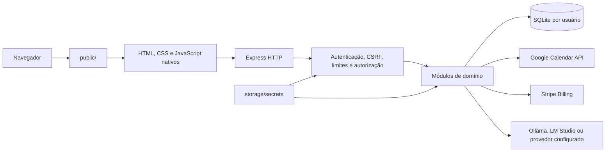
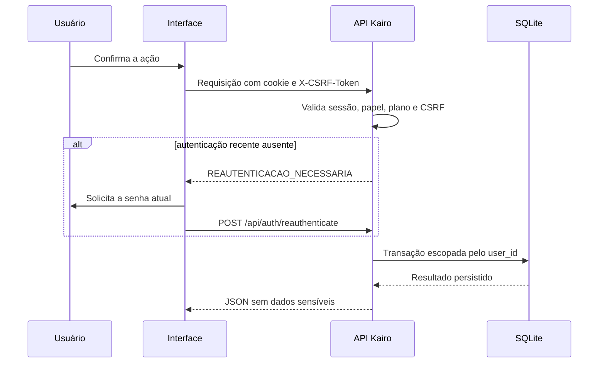

<p align="center">
  
</p>

<h1 align="center">Kairo</h1>

<p align="center">
  <strong>Domine o seu tempo com agenda, foco, contexto e decisões baseadas em dados reais.</strong>
</p>

<p align="center">
  
  
  
  
  
</p>

<p align="center">
  <a href="#início-rápido">Início rápido</a> ·
  <a href="#funcionalidades">Funcionalidades</a> ·
  <a href="#arquitetura">Arquitetura</a> ·
  <a href="#api-http">API</a> ·
  <a href="#qualidade-e-validação">Qualidade</a> ·
  <a href="./andamento-claude.md">Andamento integral</a>
</p>

> [!IMPORTANT]
> O Kairo está em desenvolvimento ativo. A base atual é **local-first**, possui autenticação, isolamento multiusuário, proteção CSRF, confirmação da senha exclusivamente na troca de senha, auditoria e criptografia dos tokens OAuth. Ainda existem itens impeditivos para uma publicação pública, registrados em [Limitações conhecidas](#limitações-conhecidas).

## O que é o Kairo

O **Kairo** é uma aplicação web de produtividade pessoal em português do Brasil. Ela reúne gestão de atividades, agenda multilayout, metas, indicadores, Pomodoro inclusivo, preferências, gamificação, administração de usuários e planos, analytics, recursos inteligentes, IA pessoal governada, memória privada criptografada, integração opcional com o Google Agenda e cobrança recorrente pelo Stripe.

Os dados funcionais são persistidos em SQLite. As telas consomem APIs reais do backend; integrações indisponíveis não são substituídas por respostas simuladas.

### Princípios

- **Privacidade por arquitetura:** cada registro operacional pertence ao usuário autenticado.
- **Local-first:** banco, backups, logs e segredos permanecem em `storage/` por padrão.
- **Backend como fonte de verdade:** regras de acesso, validações e autorização não dependem apenas da interface.
- **Uma agenda, sete perspectivas:** todos os layouts usam os mesmos eventos persistidos.
- **Segurança fechada:** falhas de autenticação não liberam a aplicação.
- **Evolução auditável:** decisões e tarefas ficam registradas em [`andamento-claude.md`](./andamento-claude.md).

## Estado verificado

Verificação técnica local mais recente: **26 de julho de 2026**. O Q.A navegável geral será repetido somente depois do encerramento da fila operacional.

| Área | Estado real | Evidência atual |
|---|---|---|
| Inicialização e páginas públicas | Operacional | Landing editorial responsiva, menu acessível, sessão reconhecida, cadastro orientado por plano, catálogo comercial vindo do backend, login, aplicação protegida, assets e redirecionamentos. |
| Autenticação e sessões | Operacional | Bootstrap local, login, logout, revogação, cookie `httpOnly`, CSRF e confirmação da senha na troca de senha testados. |
| Isolamento multiusuário | Operacional | FKs compostas, consultas por proprietário e testes de tentativa de acesso cruzado. |
| Dashboard, atividades e metas | Operacional | CRUD de atividades, períodos, metas e KPIs reais. |
| Agenda | Operacional | CRUD, conclusão rápida, filtros, duração em minutos e sete layouts. |
| Perfil e preferências | Operacional | Nome, e-mail, avatar validado, tema, som e confete por usuário. |
| Planos e funcionalidades | Operacional no backend | Matriz persistida e autorização aplicada a dashboard, atividades, agenda e Google Agenda. |
| Recompensas e Dopamenu | Operacional | Estado, conclusão idempotente, feedback, itens pessoais, configurações e painel agregado. |
| Google Agenda | Operacional quando configurado | OAuth com `state`, tokens AES-256-GCM por usuário e sincronização manual testada com cliente controlado. |
| IA pessoal e memória | Operacional quando configurada | Gateway administrável, Ollama/LM Studio, treinamento versionado, assistente com ações confirmadas e memória AES-256-GCM isolada por usuário. |
| Recursos inteligentes | Operacional e desativado por padrão | Doze engines determinísticos, governança administrativa e IA opcional; cada recurso precisa ser habilitado conscientemente. |
| Pagamentos Stripe | Sandbox real homologado | Checkout Billing hospedado, cartão oficial de teste, webhook assinado, concessão do plano Plus, fatura, reconciliação, portal e cancelamento ao fim do período validados de ponta a ponta no Stripe em 26/07/2026. Produção permanece desabilitada. |
| Testes automatizados | Operacional | **241 testes nativos aprovados** nesta verificação; o último marco E2E Chromium aprovado contém 7 cenários e será repetido somente no QA geral final. |
| Auditoria de dependências | Operacional | `npm audit` reporta **0 vulnerabilidades conhecidas** na árvore instalada. |

## Início rápido

### Requisitos

- Git;
- Node.js **20 ou superior** — Node.js 24 LTS é recomendado para uso estável;
- npm 10 ou superior;
- navegador moderno com CSS Grid, Web Audio API e cookies habilitados.

### Instalação

```bash
git clone https://github.com/ilyra-ai/kairo.git
cd kairo
npm ci
npm start
```

Acesse:

- landing page: [http://localhost:3000/](http://localhost:3000/);
- login e cadastro: [http://localhost:3000/login](http://localhost:3000/login);
- aplicação autenticada: [http://localhost:3000/app](http://localhost:3000/app);
- saúde da API: [http://localhost:3000/api/health](http://localhost:3000/api/health).

### Primeira conta

Não existe usuário ou senha padrão. Quando o banco ainda não possui contas:

1. abra `/login` no próprio computador do servidor;
2. escolha **Criar conta**;
3. informe nome, e-mail e uma senha com pelo menos 8 caracteres;
4. a primeira conta recebe papel `administrador` e plano `pro`;
5. os dados legados preservados, quando existentes, são associados a esse proprietário durante o bootstrap.

Por segurança, a primeira conta administrativa só pode ser criada por uma requisição local ao servidor.

#### Conta administrativa do ambiente local

O Kairo não possui usuário administrativo fixo, senha padrão ou credencial de demonstração versionada. A primeira conta criada localmente recebe o papel `administrador` e o plano `pro`; as contas seguintes entram como `usuario` no plano `free`.

### Política de senha e reautenticação

- A senha exige **no mínimo 8 caracteres** (máximo de 128). Não há exigência de letra maiúscula, número ou caractere especial.
- A senha é solicitada **apenas em dois momentos**: no login e ao alterar a senha de uma conta existente.
- Navegar, criar, editar, concluir ou excluir registros, salvar perfil e preferências, e executar operações administrativas **nunca** solicitam a senha novamente — a proteção dessas rotas é feita por sessão, papel e token CSRF.
- Cada usuário altera a própria senha em **Meu Perfil → Alterar minha senha**, informando a senha atual. Ao concluir, as demais sessões do usuário são revogadas automaticamente.

### Inicializadores assistidos

Para o QA local do Kairo no Windows, use os inicializadores oficiais da raiz:

```powershell
.\qa-iniciar-servidor.bat
```

Para encerrar somente o processo que escuta a porta `3000` e iniciar o código atual novamente:

```powershell
.\qa-reiniciar-servidor.bat
```

O orquestrador universal validado no Windows 11 também está disponível na raiz:

```powershell
.\run.bat
```

Ele detecta a stack, instala exatamente o `package-lock.json`, oferece ações não interativas e uma TUI em pt-BR, mantém metadados próprios de processo em `.orchestrator/` e nunca encerra um processo externo apenas porque ele ocupa a porta escolhida. Consulte [a validação operacional completa](docs/quality/validacao-run-windows.md).

Inicializador assistido específico do Kairo no Windows:

```powershell
.\scripts\windows\run.bat
```

Linux, WSL ou macOS:

```bash
chmod +x scripts/unix/run.sh
./scripts/unix/run.sh
```

Os inicializadores específicos localizam a raiz do projeto, verificam Node/npm, instalam dependências e iniciam o servidor. A opção de reiniciar o banco cria um backup em `storage/backups/` antes de remover a base operacional.

### Scripts npm

| Comando | Resultado |
|---|---|
| `npm start` | Inicia `src/server/index.js`. |
| `npm run dev` | Inicia o servidor com reinicialização pelo Nodemon. |
| `npm test` | Executa toda a suíte nativa `node:test`. |
| `npm run test:windows` | Valida o ciclo real do orquestrador em Windows, inclusive bootstrap limpo, SQLite nativo, porta, reinício e isolamento de processos. |
| `npm run test:e2e` | Executa o QA real Playwright/Chromium com servidor e banco temporários. |
| `npm run test:coverage` | Executa os testes com cobertura experimental do Node.js. |
| `npm run homologate:stripe` | Homologa o fluxo Stripe sandbox real em localhost, com Stripe CLI encaminhando webhooks assinados e Chromium preenchendo o Checkout hospedado. Recusa ambiente live. |
| `npm run check:syntax` | Valida a sintaxe do ponto de entrada e do JavaScript do app. |
| `npm run check` | Executa lint, formatação, sintaxe, testes nativos, cobertura e política do repositório. |
| `npm run check:e2e` | Executa a suíte E2E navegada. |
| `npm run check:full` | Executa o ciclo completo de qualidade local, incluindo E2E. |

## Funcionalidades

### Dashboard e atividades

- cartões por categoria com período diário, semanal e mensal;
- horas atuais e anteriores;
- metas por período e progresso visual;
- KPIs consolidados por usuário;
- criação, consulta, atualização e exclusão de atividades pela API;
- recálculo da agenda sem misturar dados entre contas.

As categorias iniciais são Trabalho, Lazer, Estudos, Exercícios, Social e Autocuidado. Elas são sementes versionadas em `src/server/database/seeds/default-activities.json`, não dados ocultos no frontend.

### Agenda unificada

- criação, leitura, edição, conclusão, reabertura e exclusão;
- associação obrigatória a uma atividade do mesmo usuário;
- data, início, término, descrição, prioridade, carga cognitiva e cor;
- duração calculada e persistida em minutos;
- filtros por intervalo, atividade e conclusão;
- ações rápidas de foco, edição e remoção;
- sete layouts sobre a mesma fonte de dados.

| Layout | Uso principal |
|---|---|
| **TDAH/TEA** | Reduzir carga visual, destacar esforço e orientar o próximo passo. |
| **Atual** | Timeline vertical própria do Kairo. |
| **Google** | Grade semanal com colunas redimensionáveis. |
| **TickTick** | Lista compacta com conclusão rápida. |
| **Morgen** | Time blocking diário. |
| **Todoist** | Lista agrupada por categoria. |
| **Kanban** | Planejado, em andamento e concluído. |

### Modo foco

- ciclos de 15, 25 e 50 minutos;
- iniciar, pausar, retomar e reiniciar;
- anel de progresso;
- vínculo com um compromisso real;
- chuva, ondas, ruído, áudio binaural de 40 Hz ou silêncio;
- sino de conclusão, confete configurável e resposta háptica quando suportada.

### Conta, perfil e administração

- senha de 8 a 128 caracteres;
- hash `bcrypt` com atualização de custo quando necessário;
- sessão revogável persistida no banco;
- cookie `httpOnly`, `SameSite` e configuração segura por ambiente;
- token CSRF por sessão em todas as mutações protegidas;
- confirmação de senha somente ao alterar a própria senha ou a senha de outra conta pela administração;
- papéis separados dos planos: `administrador` ou `usuario`;
- planos comerciais independentes: `free`, `plus`, `pro` ou planos criados pelo administrador;
- proteção contra remoção ou rebaixamento do último administrador ativo;
- registro de eventos de auditoria sem armazenar senhas.

### Planos e feature flags

O backend mantém catálogo, preço em centavos, descrição, funcionalidades e matriz de autorização. Os planos padrão são:

| Plano | Recursos padrão |
|---|---|
| `free` | Dashboard, agenda, relatórios, Pomodoro e temas. |
| `plus` | Recursos Free, binaural e Google Agenda. |
| `pro` | Todos os recursos cadastrados. |

Administradores possuem acesso operacional total, independentemente do plano. A interface administrativa permite criar planos e funcionalidades, excluir itens não protegidos e alterar a matriz.

### Cobrança recorrente com Stripe

- Checkout hospedado pelo Stripe Billing para os planos pagos, sem captura ou armazenamento de cartão pelo Kairo;
- Price ID mensal, moeda, valor, quantidade e ambiente validados antes de conceder acesso;
- plano alterado somente depois de uma `invoice.paid` confiável ou de reconciliação autenticada da Checkout Session;
- webhook com corpo bruto, assinatura `Stripe-Signature`, segregação entre teste e produção, hash do payload e processamento idempotente;
- proteção contra checkouts paralelos, eventos duplicados e eventos antigos fora de ordem;
- portal de cobrança, cancelamento remoto no fim do período, reconciliação individual e administrativa;
- suspensão coerente em cancelamento definitivo, fatura anulada/não cobrável, estorno integral ou disputa;
- segredos Stripe criptografados em repouso e nunca devolvidos pela API administrativa;
- painel administrativo com configuração, teste de conectividade, estado do provedor e métricas derivadas do banco.

A homologação sandbox de 26/07/2026 percorreu o Checkout hospedado oficial com o cartão de teste `4242 4242 4242 4242`, recebeu webhooks assinados pelo Stripe CLI, concedeu o plano Plus somente após pagamento, persistiu a fatura, abriu o Customer Portal, agendou o cancelamento remoto e confirmou a manutenção do acesso até o fim do período pago. A reconciliação aceita tanto `status: "paid"` da API Dahlia quanto o booleano legado `paid`, com teste de regressão dedicado.

O plano Free não passa pelo gateway. O Stripe Tax permanece desativado até existir enquadramento fiscal e registro tributário validados; o Kairo não presume regras fiscais universais.

### IA pessoal, memória e recursos inteligentes

- conexões administráveis com provedores locais compatíveis, inclusive Ollama e LM Studio;
- descoberta e verificação real de modelos e capacidades, com proteção SSRF;
- Estúdio de Treinamento com skills, workflows e instruções em snapshots imutáveis com hash SHA-256;
- pipeline LLMOps administrativo: avaliações persistidas de qualidade, segurança e ações, comparação entre versões, limite de regressão configurável, aprovação humana explícita, canary por coorte determinística, promoção/abortagem, rollback direcionado e scorecards por modelo/versão;
- Centro de Ferramentas com catálogo real, escopos de leitura/escrita, classes `somente_leitura`, `mutavel`, `destrutiva` e `externa`, limites por usuário/janela, aprovação, revogação e auditoria sem argumentos;
- registro MCP seguro por padrão: servidores entram desativados e em quarentena, exigem HTTPS fora do host local, allowlist, revisão de ferramentas e OAuth/cofre externo quando aplicável; cadastrar ou aprovar nunca habilita execução automaticamente;
- assistente com histórico criptografado por usuário, streaming cancelável, consentimento remoto e ferramentas reais para categorias, agenda, disponibilidade, tarefas, metas e foco; escritas e ações destrutivas usam propostas persistentes, expiráveis e de uso único;
- copiloto opcional nos formulários de compromissos e categorias com nove tipos de assistência, comparação lado a lado e aplicação somente após escolha explícita;
- memória privada por usuário com envelope criptográfico AES-256-GCM, expiração, rotação, limpeza e dashboard somente de metadados;
- doze recursos inteligentes governados pelo administrador e desativados por padrão, com engines determinísticos e IA opcional.

### Recompensas e Dopamenu

- moedas, sequência diária e combos;
- conclusão idempotente: o mesmo compromisso não concede recompensa duplicada;
- baús, itens colecionáveis e feedback;
- Dopamenu privado por usuário;
- configurações administrativas de geradores;
- painel executivo derivado de agregações reais do banco;
- eventos auditados e isolados por proprietário.

Os nomes históricos `ai_reward_config` e “IA” nessa área representam regras configuráveis. Eles não significam que um modelo generativo já esteja conectado.

### Google Agenda

- OAuth 2.0 com `state` de uso único vinculado ao usuário e à sessão;
- autorização, callback, status, sincronização e desconexão;
- tokens criptografados com AES-256-GCM e contexto autenticado por usuário;
- preservação segura de `refresh_token`;
- validação de propriedade antes de enviar, atualizar ou excluir eventos;
- revogação remota antes da remoção local da conexão;
- janela de sincronização configurável dentro dos limites validados.

## Arquitetura



### Camadas

| Camada | Local | Responsabilidade |
|---|---|---|
| Interface pública | `public/` | Landing, login, aplicação e assets versionados. |
| Composição HTTP | `src/server/app.js` | Middlewares, rotas, páginas e tratamento de erros. |
| Inicialização | `src/server/runtime.js` | Diretórios, banco, migração, serviços e encerramento. |
| Configuração | `src/server/config/` | Ambiente validado e caminhos absolutos. |
| Segurança | `src/server/middleware/` e `src/server/security/` | Sessão, CSRF, CORS, Helmet, rate limit, confirmação de senha na troca e AES-GCM. |
| Domínio | `src/server/modules/` | Atividades, agenda, autenticação, analytics, IA, memória, gráficos, energia, Google, pagamentos, planos, privacidade, perfil, recompensas e recursos inteligentes. |
| Persistência | `src/server/database/` | Cliente SQLite, migrações, bootstrap e sementes. |
| Dados locais | `storage/` | Banco, backups, logs e chaves; conteúdo ignorado pelo Git. |

### Fluxo de uma mutação sensível



## Configuração

Copie o modelo e ajuste somente o necessário:

```powershell
Copy-Item .env.example .env
```

| Variável | Padrão | Finalidade |
|---|---|---|
| `NODE_ENV` | `development` | Ambiente: `development`, `test` ou `production`. |
| `HOST` | `127.0.0.1` | Interface de rede de escuta. |
| `PORT` | `3000` | Porta HTTP. |
| `CORS_ORIGINS` | localhost da porta atual | Origens adicionais separadas por vírgula; `*` é rejeitado. |
| `TRUST_PROXY` | `false` | Confiança em proxy reverso explicitamente configurado. |
| `COOKIE_NAME` | `kairo.session` | Nome do cookie de sessão. |
| `COOKIE_SECURE` | depende do ambiente | Exige HTTPS quando `true`; padrão `true` em produção. |
| `COOKIE_HTTP_ONLY` | `true` | Não pode ser desativado. |
| `COOKIE_SAME_SITE` | `lax` | Política `strict`, `lax` ou `none`. |
| `COOKIE_DOMAIN` | vazio | Domínio opcional do cookie. |
| `SESSION_TTL_SECONDS` | `28800` | Duração da sessão, entre 5 minutos e 30 dias. |
| `SESSION_SECRET` | gerado localmente | Segredo com no mínimo 32 bytes. |
| `ENCRYPTION_KEY` | gerada localmente | Chave AES-256 com exatamente 32 bytes. |
| `KAIRO_DB_PATH` | `storage/database/kairo.sqlite` | Caminho absoluto ou relativo do banco. |
| `MIGRATION_OWNER_EMAIL` | vazio | Resolve o proprietário quando uma migração tiver múltiplos administradores possíveis. |
| `JSON_BODY_LIMIT` | `1mb` | Limite geral de JSON. |
| `URLENCODED_BODY_LIMIT` | `256kb` | Limite reservado a formulários codificados. |
| `AVATAR_BODY_LIMIT` | `3mb` | Limite da rota de perfil. |
| `GOOGLE_CLIENT_ID` | vazio | Cliente OAuth do Google. |
| `GOOGLE_CLIENT_SECRET` | vazio | Segredo OAuth do Google. |
| `GOOGLE_REDIRECT_URI` | vazio | Callback absoluto autorizado. |
| `GOOGLE_CALENDAR_ID` | `primary` | Calendário de destino. |
| `GOOGLE_CALENDAR_TIMEZONE` | `America/Sao_Paulo` | Fuso da agenda. |
| `PAYMENTS_ENABLED` | `false` | Libera novos checkouts somente depois da configuração Stripe completa. |
| `STRIPE_MODE` | `test` | Ambiente financeiro: `test` ou `live`; os dados são segregados. |
| `STRIPE_SECRET_KEY` | vazio | Chave privada; prefira uma chave restrita `rk_*` com permissões mínimas. |
| `STRIPE_WEBHOOK_SECRET` | vazio | Segredo `whsec_*` do endpoint assinado. |
| `STRIPE_PRICE_PLUS` | vazio | Price ID mensal em BRL do plano Plus. |
| `STRIPE_PRICE_PRO` | vazio | Price ID mensal em BRL do plano Pro. |
| `STRIPE_PUBLIC_APP_URL` | localhost | Origem absoluta usada nos retornos do Checkout e Portal; HTTPS é obrigatório fora do host local. |

Quando os segredos não são definidos no `.env`, o Kairo os gera uma vez em `storage/secrets/` e reaproveita o mesmo material nas próximas execuções. Não copie essas chaves para o Git.

### Google Cloud

1. ative a Google Calendar API;
2. configure a tela de consentimento OAuth;
3. crie um cliente do tipo **Aplicativo da Web**;
4. autorize `http://localhost:3000/api/google/callback` ou a URL configurada;
5. preencha as variáveis `GOOGLE_*`;
6. reinicie o servidor e conecte a conta pela interface.

### Stripe Billing

1. mantenha `STRIPE_MODE=test` durante a homologação;
2. crie ou selecione Products e Prices recorrentes mensais em BRL com os valores exatos dos planos;
3. em **Developers → API keys**, emita preferencialmente uma chave restrita com somente as permissões necessárias;
4. em produção, registre `/api/payments/webhooks/stripe` em um domínio HTTPS publicamente alcançável; em localhost, execute `stripe listen --latest --forward-to http://127.0.0.1:3000/api/payments/webhooks/stripe`;
5. configure as variáveis `STRIPE_*` ou salve os mesmos valores pela área administrativa;
6. teste a configuração e somente então habilite novos checkouts;
7. mantenha teste e produção separados; o Kairo bloqueia a troca de ambiente enquanto houver vínculos financeiros ativos.

Segredos reais pertencem ao `.env`, a um cofre ou ao armazenamento administrativo criptografado. Nunca os adicione ao Git. Em desenvolvimento local, um webhook remoto exige Stripe CLI autenticado ou uma URL HTTPS controlada; o Kairo não cria túneis públicos automaticamente.

Com o servidor e o encaminhamento do Stripe CLI ativos, execute `npm run homologate:stripe`. O script cria um usuário de teste isolado, usa somente o modo sandbox, valida Checkout, webhook, concessão, fatura, portal e cancelamento e não imprime credenciais.

## Persistência e migração

### Diretórios locais

```text
storage/
├── database/kairo.sqlite      # Base operacional
├── backups/                   # Backups e relatórios de migração
├── logs/                      # Saídas locais
└── secrets/                   # Segredo de sessão e chave AES-256
```

Todo o diretório `storage/` é ignorado pelo Git.

### Proteção do legado

Na primeira execução da nova estrutura, um eventual `database.sqlite` da raiz é:

1. validado pelo SQLite;
2. copiado para o novo caminho;
3. copiado para `storage/backups/`;
4. comparado por contagens e integridade;
5. registrado em relatório JSON;
6. arquivado somente depois das verificações.

A migração é transacional, idempotente e executa `foreign_key_check` antes do commit. Falhas restauram o esquema anterior.

### Tabelas

| Domínio | Tabelas principais |
|---|---|
| Identidade | `users`, `auth_sessions`, `audit_events` |
| Produtividade | `activities`, `timeframes`, `goals`, `agenda_events`, `profile_data` |
| Planos | `plans`, `features`, `plan_features` |
| Google | `google_tokens`, `oauth_states` |
| Recompensas | `user_gamification`, `dopamenu`, `dopamine_config`, `ai_reward_config`, `reward_events`, `reward_feedback` |
| IA e memória | `ai_connections`, `ai_training_artifacts`, `ai_training_versions`, `ai_eval_runs`, `ai_version_approvals`, `ai_canary_releases`, `ai_tool_policies`, `ai_tool_call_events`, `ai_mcp_servers`, `ai_memory_items`, `ai_memory_keys` e telemetria |
| Recursos inteligentes | `smart_features` e tabelas operacionais específicas de cada engine |
| Pagamentos | `payment_providers`, `payment_customers`, `payment_plan_prices`, `checkout_sessions`, `subscriptions`, `webhook_events`, `payment_events`, `invoices_or_receipts` |
| Privacidade | políticas de retenção, solicitações do titular, comprovantes de exclusão e trilha jurídica |
| Evolução | `schema_migrations` |

## API HTTP

### Convenções de proteção

| Símbolo | Exigência |
|---|---|
| `Público` | Não exige sessão. |
| `Sessão` | Cookie de sessão válido. |
| `Plano` | Funcionalidade liberada ao plano ou papel administrador. |
| `CSRF` | Cabeçalho `X-CSRF-Token` válido. |
| `Recente` | Senha confirmada recentemente; usada somente quando a operação altera uma senha. |
| `Admin` | Papel `administrador`. |

Erros seguem o contrato:

```json
{
  "error": {
    "code": "CODIGO_ESTAVEL",
    "message": "Mensagem segura em pt-BR.",
    "requestId": "identificador-da-requisicao"
  }
}
```

### Saúde e autenticação

| Método | Rota | Proteção | Finalidade |
|---|---|---|---|
| `GET` | `/api/health` | Público | Estado do runtime e necessidade de bootstrap. |
| `GET` | `/api/auth/status` | Público | Informa se a primeira conta é necessária. |
| `POST` | `/api/auth/register` | Público | Cria conta; o primeiro admin precisa ser local. |
| `POST` | `/api/auth/login` | Público | Autentica e cria sessão. |
| `GET` | `/api/auth/me` | Sessão | Retorna o usuário público autenticado. |
| `GET` | `/api/auth/csrf` | Sessão | Emite o token CSRF da sessão. |
| `POST` | `/api/auth/reauthenticate` | Sessão + CSRF | Confirma a senha para ações sensíveis. |
| `POST` | `/api/auth/logout` | Sessão + CSRF | Revoga a sessão e remove o cookie. |

### Usuários, perfil e configurações

| Método | Rota | Proteção | Finalidade |
|---|---|---|---|
| `GET` | `/api/users` | Sessão + Admin | Lista contas sem hashes. |
| `POST` | `/api/users` | Sessão + Admin + CSRF | Cria conta gerenciada. |
| `PUT` | `/api/users/:id` | Sessão + Admin + CSRF; Recente somente se alterar senha | Atualiza papel, plano, status ou credenciais. |
| `DELETE` | `/api/users/:id` | Sessão + Admin + CSRF | Exclui outra conta respeitando o último admin. |
| `GET` | `/api/profile` | Sessão | Obtém o perfil privado. |
| `PUT` | `/api/profile` | Sessão + CSRF | Atualiza perfil e preferências. |
| `POST` | `/api/settings/reset` | Sessão + CSRF | Restaura somente o workspace do usuário. |

### Dashboard, atividades e agenda

| Método | Rota | Proteção | Finalidade |
|---|---|---|---|
| `GET` | `/api/dashboard/kpis` | Sessão + Plano `dashboard` | Calcula indicadores pessoais. |
| `GET` | `/api/activities` | Sessão + Plano `dashboard` | Lista atividades, períodos e metas. |
| `GET` | `/api/activities/:id/details` | Sessão + Plano `dashboard` | Consulta detalhes próprios. |
| `POST` | `/api/activities` | Sessão + Plano `dashboard` + CSRF | Cria atividade. |
| `PUT` | `/api/activities/:id` | Sessão + Plano `dashboard` + CSRF | Atualiza horas do período. |
| `PUT` | `/api/activities/:id/goals` | Sessão + Plano `dashboard` + CSRF | Define meta. |
| `DELETE` | `/api/activities/:id` | Sessão + Plano `dashboard` + CSRF | Exclui atividade e dependências próprias. |
| `GET` | `/api/agenda` | Sessão + Plano `agenda` | Lista eventos com filtros. |
| `GET` | `/api/agenda/:id` | Sessão + Plano `agenda` | Obtém um evento próprio. |
| `GET` | `/api/activities/:activity_id/agenda` | Sessão + Plano `agenda` | Lista agenda da atividade própria. |
| `POST` | `/api/agenda` | Sessão + Plano `agenda` + CSRF | Cria compromisso. |
| `PUT` | `/api/agenda/:id` | Sessão + Plano `agenda` + CSRF | Atualiza compromisso completo. |
| `PATCH` | `/api/agenda/:id/completion` | Sessão + Plano `agenda` + CSRF | Conclui ou reabre. |
| `DELETE` | `/api/agenda/:id` | Sessão + Plano `agenda` + CSRF | Exclui compromisso. |

### Planos e funcionalidades

Antes da autenticação, a landing usa somente o contrato sanitizado abaixo. Ele deriva preços e funcionalidades das mesmas fontes persistidas usadas pelo aplicativo, informa a disponibilidade real do checkout e não expõe modo, origem ou credenciais do provedor.

| Método | Rota | Proteção | Finalidade |
|---|---|---|---|
| `GET` | `/api/public/landing` | Pública, somente leitura | Catálogo comercial sanitizado, funcionalidades por plano, disponibilidade do checkout e quantidade registrada de recursos inteligentes. |

| Método | Rota | Proteção | Finalidade |
|---|---|---|---|
| `GET` | `/api/plans` | Sessão | Obtém catálogo e matriz. |
| `POST` | `/api/plans` | Sessão + Admin + CSRF | Cria plano. |
| `PUT` | `/api/plans/:key` | Sessão + Admin + CSRF | Atualiza plano. |
| `DELETE` | `/api/plans/:key` | Sessão + Admin + CSRF | Exclui plano não protegido. |
| `POST` | `/api/plans/toggle` | Sessão + Admin + CSRF | Altera feature flag. |
| `POST` | `/api/features` | Sessão + Admin + CSRF | Cria funcionalidade. |
| `DELETE` | `/api/features/:key` | Sessão + Admin + CSRF | Exclui funcionalidade. |

### Assistente e copiloto de IA

Todas as rotas exigem sessão e a funcionalidade `ai_assistant` liberada pelo plano; mutações também exigem CSRF. Conteúdo remoto só é enviado com consentimento explícito.

| Método | Rota | Finalidade |
|---|---|---|
| `GET` | `/api/ai/assistant/status` | Informa conexão, modelo, privacidade, capacidades e ferramentas permitidas. |
| `GET` | `/api/ai/assistant/history` | Recupera somente o histórico criptografado do usuário autenticado. |
| `DELETE` | `/api/ai/assistant/history` | Elimina histórico e propostas do próprio usuário. |
| `GET` | `/api/ai/assistant/tools` | Lista ferramentas permitidas pelo plano, treinamento e política administrativa. |
| `POST` | `/api/ai/assistant/chat` | Conversa ou confirma uma proposta persistida por `proposal_id`. |
| `POST` | `/api/ai/assistant/chat/stream` | Responde por SSE com cancelamento imediato ao encerrar a conexão. |
| `DELETE` | `/api/ai/assistant/proposals/:proposal_id` | Cancela uma proposta pendente sem executar a ação. |
| `POST` | `/api/ai/assistant/copilot` | Gera sugestão opcional sem alterar o formulário nem o banco. |

### Administração de IA, LLMOps, ferramentas e MCP

Todas as rotas abaixo exigem sessão administrativa. Mutações exigem CSRF. Nenhuma resposta devolve credencial, conteúdo de memória ou argumentos de ferramentas.

| Método | Rota | Finalidade |
|---|---|---|
| `GET/POST` | `/api/admin/ai/training/artifacts` | Lista e cria artefatos governados. |
| `GET/PUT/DELETE` | `/api/admin/ai/training/artifacts/:id` | Consulta, cria nova versão integral ou exclui. |
| `GET` | `/api/admin/ai/training/artifacts/:id/versions` | Histórico de snapshots e hashes. |
| `GET` | `/api/admin/ai/training/artifacts/:id/compare` | Compara dois snapshots por campo. |
| `GET/POST` | `/api/admin/ai/training/artifacts/:id/evaluations` e `/evaluate` | Consulta ou executa a suíte persistida. |
| `POST` | `/api/admin/ai/training/artifacts/:id/approve` | Registra aprovação humana da versão avaliada. |
| `POST` | `/api/admin/ai/training/artifacts/:id/publish` | Publica somente com avaliação íntegra, regressão permitida e aprovação vigente. |
| `POST` | `/api/admin/ai/training/artifacts/:id/canary` | Inicia exposição controlada do candidato. |
| `POST` | `/api/admin/ai/training/canaries/:id/finish` | Promove ou aborta conforme amostra e erro. |
| `GET/PUT` | `/api/admin/ai/training/evaluation-settings` | Consulta ou altera o limite de regressão. |
| `GET` | `/api/admin/ai/training/scorecards` | Agrega avaliações e execuções reais por modelo/versão. |
| `GET/PUT` | `/api/admin/ai/tool-policies` | Lista ou salva política em revisão. |
| `POST` | `/api/admin/ai/tool-policies/:tool_name/decision` | Aprova ou revoga uma ferramenta. |
| `GET` | `/api/admin/ai/tool-audit` | Lista decisões e limites sem conteúdo sensível. |
| `GET/POST` | `/api/admin/ai/mcp/servers` | Lista ou cadastra servidor MCP desativado. |
| `PUT/DELETE` | `/api/admin/ai/mcp/servers/:id` | Reabre revisão ou remove o registro MCP. |
| `POST` | `/api/admin/ai/mcp/servers/:id/decision` | Aprova desativado ou revoga o servidor. |

### Recompensas

| Método | Rota | Proteção | Finalidade |
|---|---|---|---|
| `GET` | `/api/rewards/state` | Sessão | Estado e histórico pessoal. |
| `POST` | `/api/rewards/complete` | Sessão + CSRF | Registra conclusão idempotente. |
| `POST` | `/api/rewards/feedback` | Sessão + CSRF | Avalia uma recompensa própria. |
| `GET` | `/api/dopamenu` | Sessão | Lista itens pessoais. |
| `POST` | `/api/dopamenu` | Sessão + CSRF | Cria item pessoal. |
| `PUT` | `/api/dopamenu/:id` | Sessão + CSRF | Atualiza item pessoal. |
| `DELETE` | `/api/dopamenu/:id` | Sessão + CSRF | Remove item pessoal. |
| `GET` | `/api/rewards/config` | Sessão + Admin | Consulta configuração. |
| `POST` | `/api/rewards/config` | Sessão + Admin + CSRF | Ativa ou desativa gerador. |
| `POST` | `/api/rewards/ai` | Sessão + Admin + CSRF | Atualiza regra histórica de IA. |
| `GET` | `/api/rewards/dashboard` | Sessão + Admin | Métricas agregadas. |

### Google Agenda

| Método | Rota | Proteção | Finalidade |
|---|---|---|---|
| `GET` | `/api/google/status` | Sessão + Plano `google_calendar` | Estado da integração pessoal. |
| `POST` | `/api/google/auth` | Sessão + Plano + CSRF | Inicia OAuth. |
| `GET` | `/api/google/callback` | Sessão + Plano | Valida callback e armazena tokens criptografados. |
| `POST` | `/api/google/sync` | Sessão + Plano + CSRF | Sincroniza janela informada. |
| `POST` | `/api/google/disconnect` | Sessão + Plano + CSRF | Revoga e remove a conexão. |

### Pagamentos Stripe

| Método | Rota | Proteção | Finalidade |
|---|---|---|---|
| `GET` | `/api/payments/plans` | Sessão | Catálogo comercial e disponibilidade honesta do checkout. |
| `POST` | `/api/payments/checkout` | Sessão + CSRF | Cria ou reutiliza uma Checkout Session segura. |
| `GET` | `/api/payments/subscription` | Sessão | Assinatura e faturas do usuário no ambiente atual. |
| `POST` | `/api/payments/portal` | Sessão + CSRF | Abre o Stripe Customer Portal. |
| `POST` | `/api/payments/cancel` | Sessão + CSRF | Agenda cancelamento remoto no fim do período pago. |
| `POST` | `/api/payments/reconcile` | Sessão + CSRF | Reconcilia a assinatura e, opcionalmente, a Session ID retornada pelo Checkout. |
| `POST` | `/api/payments/webhooks/stripe` | Assinatura Stripe | Recebe corpo bruto, valida assinatura e processa o evento uma única vez. |
| `GET` | `/api/payments/admin/provider` | Sessão + Admin | Estado da configuração sem revelar segredos. |
| `POST` | `/api/payments/admin/provider/test` | Sessão + Admin + CSRF | Valida conta, URL e todos os Prices no Stripe. |
| `PUT` | `/api/payments/admin/provider` | Sessão + Admin + CSRF | Salva, ativa, desativa ou remove configuração quando seguro. |
| `GET` | `/api/payments/admin/metrics` | Sessão + Admin | Métricas financeiras persistidas e saúde dos webhooks. |
| `POST` | `/api/payments/admin/reconcile` | Sessão + Admin + CSRF | Reconcilia todas as assinaturas do ambiente atual. |

## Estrutura do projeto

```text
Kairo/
├── public/
│   ├── index.html                       # Landing page
│   ├── auth/index.html                  # Login e cadastro
│   ├── app/index.html                   # Aplicação autenticada
│   └── assets/
│       ├── css/app.css                  # Design system e responsividade
│       ├── js/app.js                    # Interface e integração HTTP
│       └── images/                      # Logotipo, ícones e favicons
├── src/server/
│   ├── index.js                         # Entrada do processo
│   ├── runtime.js                       # Inicialização e encerramento
│   ├── app.js                           # Composição Express
│   ├── config/                          # Ambiente e caminhos
│   ├── database/                        # SQLite, bootstrap, migração e seeds
│   ├── middleware/                      # Segurança e validação HTTP
│   ├── modules/                         # Domínios: IA, pagamentos, privacidade, produtividade e integrações
│   ├── security/                        # Criptografia e segredos
│   └── shared/                          # Erros HTTP compartilhados
├── scripts/
│   ├── windows/run.bat                  # Inicializador Windows
│   └── unix/run.sh                      # Inicializador Unix/WSL
├── tests/
│   ├── unit/                            # Criptografia e bootstrap
│   ├── integration/                     # Serviços, rotas e isolamento
│   ├── migration/                       # Migração tenant-safe
│   ├── frontend/                        # Contratos estáticos de CSP, DOM e acessibilidade
│   ├── windows/                         # Ciclo operacional real do orquestrador no Windows
│   └── e2e/                             # QA real com Playwright/Chromium
├── scripts/quality/                     # Políticas automatizadas do repositório
├── .github/workflows/quality.yml        # CI de qualidade e E2E
├── eslint.config.js                     # Lint moderno do projeto
├── playwright.config.js                 # Navegação real automatizada
├── docs/design/references/              # Referências visuais históricas
├── storage/                             # Dados locais ignorados pelo Git
├── .env.example                         # Contrato de configuração
├── AGENTS.md                            # Regras operacionais do workspace
├── andamento-claude.md                  # Histórico e fila detalhada
├── qa-iniciar-servidor.bat              # Inicialização oficial do servidor para QA local
├── qa-reiniciar-servidor.bat            # Reinício oficial e controlado do servidor de QA
├── run.bat                              # Orquestrador universal validado no Windows 11
├── run.sh                               # Orquestrador universal para Unix/WSL
├── package.json                         # Scripts e dependências
└── README.md                            # Este documento
```

## Qualidade e validação

### Validação automatizada

```bash
npm run check:full
```

Estado atual:

```text
testes nativos: 241
último marco E2E Chromium: 7 (não repetido durante a Tarefa 13)
pass técnico atual: 241
fail: 0
coverage: 85.57% statements / 85.57% lines / 75.98% branches / 92.73% functions
homologação Stripe sandbox real: aprovada
vulnerabilidades npm conhecidas: 0
```

A suíte cobre:

- transações, rollback, FKs, índices e migração;
- criação e isolamento de workspaces;
- CRUD de atividades e agenda;
- filtros, conclusão e recálculo;
- bootstrap limpo e idempotente do orquestrador em caminho Windows com espaços;
- instalação nativa real do SQLite, ciclo iniciar/parar/reiniciar e preservação de processos externos;
- autenticação, sessão, CSRF e confirmação de senha restrita à troca de senha;
- papéis, planos e proteção do último administrador;
- perfil, reset pessoal e indicadores;
- criptografia AES-256-GCM e adulteração de ciphertext;
- OAuth `state`, tokens e isolamento Google;
- Stripe Billing com Price validado, segregação teste/produção, Checkout, retorno autenticado, webhook assinado e idempotente, portal, cancelamento, reconciliação, estorno e disputa;
- recompensas idempotentes e Dopamenu;
- headers, CORS, rate limiting e contrato de erros;
- CSP sem `unsafe-inline`, ausência de atributos `style`, fonte Imprima computada e controles acessíveis;
- navegação administrativa real em Dashboard, Agenda, Relatórios, Configurações, Usuários, Planos e Dopamina;
- CRUD administrativo real de planos, funcionalidades e configurações de Dopamina;
- CRUD navegável de atividades, horas, metas, detalhes, exclusão sem nova senha e gestão administrativa de usuários;
- alteração administrativa de senha protegida por confirmação recente, com invalidação comprovada da senha anterior;
- agenda integral com criação, edição persistente, alternância de layouts e exclusão pelo card atual;
- relatórios alimentados por dados persistidos e Modo Foco aberto por compromisso real, com início, pausa e reinício do cronômetro;
- proteção contra limpeza tardia dos campos de autenticação depois que o usuário começa a digitar;
- dropdown de perfil, modal de perfil, modal de preferências e responsividade em mobile compacto, tablet e desktop;
- ausência de overflow horizontal documental nas páginas administrativas validadas pelo E2E.
- LLMOps com snapshots integrais, diff, avaliação, regressão, aprovação, canary, rollback e scorecards;
- autorização de ferramentas com classes, escopos, limites, revogação e auditoria, além de MCP seguro por padrão.
- landing sem links simbólicos, menu móvel com foco preso/Escape/restauração, sessão autenticada, cadastro com intenção de plano, catálogo comercial sanitizado e redução de movimento.

### Smoke test HTTP validado

- `/`, `/login`, `/assets/css/app.css`, `/api/health` e `/api/auth/status`: `200`;
- `/app` sem sessão: `303` para `/login`;
- rotas legadas: redirecionamentos permanentes corretos;
- `/server.js` e `/.env`: `404`, sem exposição de arquivos internos.

### Checklist manual de QA

1. bootstrap, login, recarregamento e logout;
2. dashboard e atualização de KPIs;
3. CRUD completo de atividades, metas e agenda;
4. sete layouts em desktop e mobile;
5. Pomodoro, sons, ciclo e conclusão;
6. perfil, avatar, temas e preferências;
7. usuários, papéis, planos e feature flags;
8. recompensas, Dopamenu e painel administrativo;
9. Google Agenda com credenciais reais, quando disponível;
10. teclado, foco visível, zoom, contraste e leitores de tela.

## Segurança

### Controles implementados

- configuração validada com Zod;
- senhas fortes e hash `bcrypt`;
- sessões revogáveis e expiráveis;
- cookies `httpOnly`, `SameSite` e `Secure` configurável;
- CSRF em mutações;
- confirmação da senha atual exclusivamente na troca da própria senha;
- autorização administrativa e por feature flag;
- isolamento por `user_id` e FKs compostas;
- consultas parametrizadas;
- CORS restritivo e guarda de origem;
- Helmet, CSP, HSTS em produção e `Permissions-Policy`;
- limites gerais, de login, cadastro, mutação e ações sensíveis;
- erros públicos sem stack ou segredo;
- IDs de requisição;
- trilha de auditoria;
- tokens Google criptografados por usuário com AES-256-GCM;
- chave Stripe e segredo de webhook criptografados com AES-256-GCM e AAD dedicado;
- webhook Stripe fail-closed, assinado, idempotente, limitado e segregado por ambiente;
- nenhum dado de cartão armazenado no Kairo;
- segredos fora do banco e do Git;
- arquivos públicos servidos somente de `public/assets/`.

### Produção

Antes de publicar:

1. use HTTPS;
2. configure `NODE_ENV=production` e `COOKIE_SECURE=true`;
3. forneça segredos por cofre ou volume protegido;
4. restrinja `CORS_ORIGINS` aos domínios reais;
5. configure proxy reverso e `TRUST_PROXY` conscientemente;
6. execute `npm run check:full` e uma auditoria de segurança completa;
7. valide backups e restauração;
8. faça QA de acessibilidade e navegadores;
9. revalide a política CSP depois de qualquer novo script, estilo, widget ou integração externa.
10. use credenciais Stripe de produção com menor privilégio, endpoint webhook HTTPS e Prices próprios de produção;
11. valide o modelo empresarial, tributário e de retenção antes de habilitar cobrança real.

## Limitações conhecidas

- a sincronização Google é manual e a validação automatizada usa um cliente controlado, não uma conta real;
- o Pomodoro em andamento não sobrevive ao fechamento ou recarregamento da página;
- recursos de IA dependem de um provedor/modelo compatível realmente conectado; quando indisponível, o app informa a falha em vez de simular resposta;
- a homologação Stripe sandbox está concluída; cobrança em produção permanece desabilitada até existir domínio HTTPS, credenciais live de menor privilégio, Products/Prices próprios de produção e validação empresarial, fiscal e jurídica;
- Mercado Pago, Pix/Nubank, PayPal, PagSeguro e Asaas não possuem adaptadores ativos; serão avaliados individualmente somente depois de uma decisão empresarial e credenciais oficiais;
- emissão fiscal e prazos de retenção financeira dependem do modelo empresarial, jurisdição e orientação contábil/jurídica validados; não existe prazo universal presumido no código;
- a interface ainda precisa ampliar a aplicação visual das permissões comerciais além das rotas já protegidas;
- não existe um arquivo `LICENSE` no repositório.

## Continuidade e roadmap

O documento [`andamento-claude.md`](./andamento-claude.md) é a fonte operacional detalhada. Ele registra requisitos, decisões, tarefas, critérios de aceite, evidências e ordem de implementação.

As próximas frentes incluem:

- atualização automática e tempo real;
- preparação controlada do Stripe para produção e definição empresarial/fiscal;
- gateways adicionais priorizados pelo negócio;
- evolução das análises e visualizações já existentes;
- refinamento contínuo das superfícies de IA e recursos inteligentes;
- CI, lint, cobertura e automação de release.

## Solução de problemas

### A porta está em uso

Altere `PORT` no `.env`:

```dotenv
PORT=3001
```

### A aplicação volta ao login

- confirme que o servidor está ativo;
- verifique se o navegador aceita cookies;
- confirme que o acesso é feito pelo mesmo host usado no login;
- faça login novamente se a sessão expirou ou foi revogada.

### A primeira conta não pode ser criada

O bootstrap administrativo aceita somente acesso local. Abra o Kairo diretamente no computador do servidor usando `http://localhost:3000/login` ou `http://127.0.0.1:3000/login`.

### O Google Agenda está indisponível

- confira `GOOGLE_CLIENT_ID`, `GOOGLE_CLIENT_SECRET` e `GOOGLE_REDIRECT_URI`;
- valide a mesma URI no Google Cloud;
- verifique se o plano possui `google_calendar`;
- reinicie o servidor após alterar o `.env`;
- confirme que a conta Google autorizada permanece ativa e que a URI de redirecionamento coincide exatamente com a cadastrada.

### O checkout Stripe está indisponível

- confirme `PAYMENTS_ENABLED`, `STRIPE_MODE`, chave privada/restrita, `whsec_*`, Price IDs e URL pública;
- execute o teste de configuração na área administrativa antes de habilitar novos checkouts;
- valide se cada Price está ativo, mensal, em BRL e com o valor exato do plano;
- não misture IDs ou eventos de teste e produção;
- para webhook local, mantenha o Stripe CLI autenticado encaminhando eventos ou use um endpoint HTTPS sob seu controle;
- consulte `webhook_events` e as métricas administrativas para identificar assinatura inválida, evento falho ou reconciliação pendente;
- não altere manualmente `users.plan`: a concessão comercial pertence ao fluxo financeiro confirmado.

### O banco não abre

- não edite o SQLite enquanto o servidor estiver ativo;
- preserve `storage/backups/`;
- consulte os relatórios JSON de migração;
- execute `PRAGMA integrity_check` e `PRAGMA foreign_key_check` em uma cópia antes de qualquer restauração manual.

## Licença e suporte

Este repositório não possui `LICENSE`. Nenhum direito de uso, modificação ou redistribuição deve ser presumido além do autorizado pelo titular.

Para relatar um problema, use as [issues do projeto](https://github.com/ilyra-ai/personal-time-tracker/issues) e informe:

- comportamento esperado e observado;
- passos mínimos de reprodução;
- sistema operacional, Node.js e npm;
- rota ou tela afetada;
- logs sem senha, cookie, token, chave, `.env` ou banco de dados.

---

<p align="center">
  <strong>Kairo</strong> — tempo com intenção, dados com contexto e evolução com consistência.
</p>
