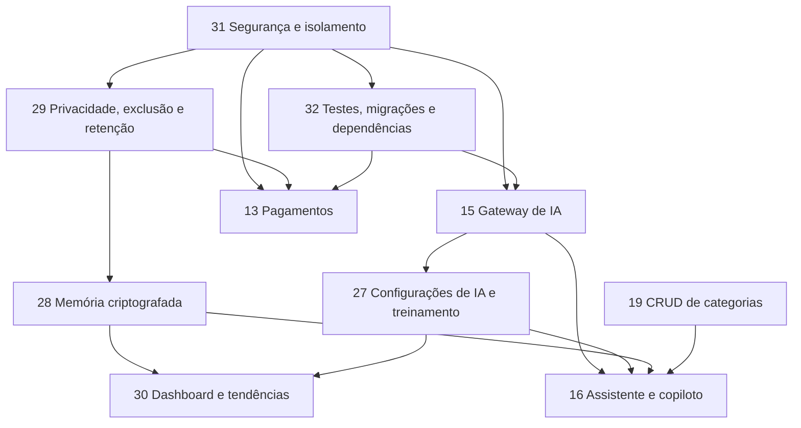

# 📋 Andamento do Projeto Kairo — Fila Oficial de Implementação

> **Natureza deste arquivo**
>
> - Este documento contém **somente tarefas pendentes**, seus requisitos, dependências, riscos e critérios de aceite.
> - Funcionalidades concluídas pertencem ao código, ao histórico do Git e ao `README.md`; não permanecem artificialmente na fila.
> - A tarefa iniciada deve ser marcada como **🔵 EM ANDAMENTO** antes de qualquer alteração de código.
> - Toda implementação deve ser real, persistente e validada de ponta a ponta: **sem simulações, placeholders, hardcode funcional, dados falsos ou cortes de código**.
> - Backend, banco, autorização e regras de negócio devem ser implementados antes da camada visual correspondente.
> - Idioma obrigatório: **português do Brasil** em interface, mensagens, documentação, validações e relatórios.
> - Prioridade: **qualidade premium, integridade e causa raiz**, nunca velocidade superficial.

**Última atualização:** 16 de julho de 2026.

**Inventário atual:** **16 tarefas pendentes**, identificadas por: **13, 15, 16, 18, 19, 20, 21, 22, 23, 24, 27, 28, 29, 30, 31 e 32**.

**Próxima tarefa recomendada:** **Tarefa 31 — Segurança, autorização e isolamento multiusuário**, pois é pré-requisito estrutural para memória de IA, exclusão de conta, integrações, analytics e qualquer tratamento seguro de dados pessoais.

---

## 🧭 Índice de categorias

1. [Segurança, privacidade e fundação de engenharia](#-categoria-1--segurança-privacidade-e-fundação-de-engenharia) — Tarefas **31, 32 e 29**
2. [Inteligência Artificial](#-categoria-2--inteligência-artificial) — Tarefas **15, 27, 28, 16 e 30**
3. [Dashboard e visualização de dados](#-categoria-3--dashboard-e-visualização-de-dados) — Tarefas **18, 19, 20 e 21**
4. [Agenda e planejamento](#-categoria-4--agenda-e-planejamento) — Tarefa **22**
5. [Engajamento, neurociência e inovação](#-categoria-5--engajamento-neurociência-e-inovação) — Tarefa **23**
6. [Monetização e pagamentos](#-categoria-6--monetização-e-pagamentos) — Tarefa **13**
7. [Validação operacional](#-categoria-7--validação-operacional) — Tarefa **24**

---

## 🔧 Contexto técnico confirmado

### Stack atual

- Node.js com módulos ESM.
- Express 4.
- SQLite.
- Frontend em HTML, CSS e JavaScript nativos, sem etapa de compilação.
- Aplicação, mensagens e documentação em pt-BR.
- Sessão por JWT em cookie `httpOnly`.
- Integração opcional com Google Calendar por OAuth 2.0.

### Arquivos principais

- `server.js`: servidor, banco e APIs centrais.
- `auth.js`: autenticação, sessão, perfis e usuários.
- `plans.js`: planos e matriz de funcionalidades.
- `rewards.js`: gamificação, Dopamenu e métricas agregadas.
- `google-calendar.js`: OAuth e sincronização manual.
- `script.js`: estado, renderizações e interações do frontend.
- `index.html`: aplicação autenticada.
- `login.html`: login e cadastro.
- `landing.html`: apresentação pública.
- `styles.css`: design system, layouts e responsividade.
- `data.json`: dados iniciais das atividades.
- `README.md`: documentação vigente do estado real do projeto.

### Perfis e planos atuais

- Perfis de acesso: `administrador`, `free`, `plus` e `pro`.
- Planos comerciais iniciais: `free`, `plus` e `pro`.
- O perfil `administrador` possui acesso administrativo total.
- Credencial de desenvolvimento criada na primeira execução: `admin@admin.com` / `admin123`.
- A credencial inicial deve ser alterada antes de qualquer exposição do sistema.

### Restrições estruturais já confirmadas e incorporadas à fila

- Atividades, metas, agenda, perfil e tokens do Google ainda são globais, sem isolamento consistente por `user_id`.
- Rotas centrais ainda respondem sem middleware de autenticação no servidor.
- Configurações de plano existem, mas ainda não protegem de ponta a ponta as funcionalidades.
- O Google OAuth ainda precisa de proteção `state`, segregação de tokens por usuário e endurecimento de armazenamento.
- Há renderizações de conteúdo dinâmico com `innerHTML` que exigem sanitização sistemática.
- O lockfile está dessincronizado do `package.json`.
- O repositório ainda não possui testes automatizados, lint, migrações versionadas ou CI.
- O alerta remoto do GitHub informou vulnerabilidades em dependências; elas precisam ser reproduzidas, classificadas e corrigidas na Tarefa 32, sem atualização cega.

---

# 🛡️ CATEGORIA 1 — Segurança, Privacidade e Fundação de Engenharia

## 🔴 Tarefa 31 — Segurança, autorização e isolamento multiusuário

### Objetivo

Eliminar a causa raiz que atualmente impede o Kairo de tratar memória de IA, perfil, agenda, tokens e analytics como dados realmente privados por usuário.

### Dependências

- Deve ser executada **antes** das Tarefas 15, 27, 28, 29, 30 e 13.
- Nenhuma interface de memória pessoal poderá ser implementada sobre tabelas globais.

### Backend e autorização

1. Aplicar `requireAuth` a todas as rotas de dados pessoais e operacionais.
2. Aplicar `requireAdmin` somente às operações administrativas.
3. Manter públicas apenas as rotas estritamente necessárias a cadastro, login, landing e callback OAuth devidamente protegido.
4. Criar política explícita de autorização por recurso:
   - usuário acessa somente registros cujo `user_id` seja o seu;
   - administrador gerencia conta, configuração e metadados permitidos;
   - administrador não recebe autorização automática para ler memória privada bruta;
   - operações destrutivas exigem reautenticação e confirmação forte.
5. Validar no servidor todos os campos de perfil, papel, plano, datas, horários, valores numéricos e identificadores.
6. Impedir alteração arbitrária de `role`, `plan`, `user_id`, proprietário ou flags administrativas pelo corpo da requisição.
7. Implementar respostas padronizadas para `400`, `401`, `403`, `404`, `409`, `422`, `429` e `500` sem vazamento de detalhes internos.

### Banco e isolamento

1. Adicionar `user_id` às entidades pessoais:
   - `activities`;
   - `timeframes` por meio da atividade proprietária;
   - `goals` por meio da atividade proprietária;
   - `profile_data`;
   - `agenda_events`;
   - `google_tokens`;
   - gráficos, memória, configurações pessoais e registros futuros.
2. Criar chaves estrangeiras, índices e regras de exclusão adequadas.
3. Migrar dados existentes para um proprietário definido, com relatório de migração e sem perda silenciosa.
4. Impedir colisões entre usuários nos identificadores externos do Google.
5. Garantir que consultas, agregações e dashboards sempre filtrem pelo usuário correto.

### Segurança web

1. Restringir CORS por origem e ambiente.
2. Definir cookies `secure` em HTTPS, `sameSite`, expiração e rotação coerentes.
3. Implementar proteção CSRF nas operações mutáveis baseadas em cookie.
4. Aplicar rate limiting a login, cadastro, IA, sincronização e exclusão.
5. Sanitizar e escapar todo conteúdo dinâmico antes de inserção no DOM.
6. Remover construção insegura de HTML com dados não confiáveis ou usar funções centralizadas de escape.
7. Adicionar cabeçalhos de segurança compatíveis com a aplicação, incluindo CSP progressiva.
8. Proteger o fluxo Google OAuth com `state`, vinculação ao usuário autenticado e tokens separados por usuário.
9. Criptografar segredos e tokens sensíveis em repouso.
10. Criar trilha de auditoria para login, mudança de papel, mudança de plano, configuração de IA, exclusão e limpeza de memória.

### Critérios de aceite

- Requisições anônimas às rotas privadas retornam `401`.
- Usuário A nunca lê, altera ou exclui qualquer registro do usuário B.
- Usuário comum recebe `403` em todas as rotas administrativas.
- Testes automatizados comprovam isolamento horizontal e vertical.
- Tokens Google são vinculados ao usuário correto.
- Reset destrutivo não pode ser executado anonimamente.
- Nenhum dado inserido pelo usuário executa HTML ou JavaScript na interface.
- Migração dos dados existentes é reversível por backup e validada por contagem e integridade referencial.

---

## 🔴 Tarefa 32 — Dependências, migrações, testes automatizados, CI e qualidade

### Objetivo

Criar uma base verificável para que as próximas funcionalidades não dependam apenas de testes manuais.

### Dependências e vulnerabilidades

1. Reproduzir localmente o estado informado pelo GitHub/Dependabot.
2. Executar auditoria das dependências diretas e transitivas.
3. Classificar cada vulnerabilidade por:
   - pacote e versão;
   - caminho de dependência;
   - explorabilidade no Kairo;
   - severidade;
   - correção disponível;
   - risco de regressão.
4. Atualizar dependências de forma controlada, consultando documentação oficial e changelogs.
5. Sincronizar e versionar o `package-lock.json`.
6. Validar `npm ci` em ambiente limpo.
7. Provar por nova auditoria que vulnerabilidades corrigíveis foram eliminadas.

### Migrações versionadas

1. Substituir alterações informais de esquema por um mecanismo versionado.
2. Manter tabela de controle de versão do banco.
3. Criar migrações `up` e estratégia segura de rollback/restore.
4. Fazer backup automático antes de migrações destrutivas.
5. Testar migração de um banco real legado para o esquema atual.
6. Validar contagens, chaves estrangeiras, índices e constraints após cada migração.

### Testes

1. Testes unitários das regras de domínio.
2. Testes de integração das 44 rotas atuais e de todas as futuras rotas.
3. Testes de autenticação, autorização e isolamento entre usuários.
4. Testes de CRUD completo para agenda, usuários, planos, Dopamenu, configurações de IA, treinamentos e memória.
5. Testes de contrato para Ollama, LM Studio e provedores remotos com servidores controlados de teste, sem apresentar mocks como validação do provedor real.
6. Testes de migração usando cópia descartável do banco.
7. Testes de acessibilidade, responsividade e navegação por teclado.
8. Testes end-to-end dos fluxos críticos em navegador real.

### Qualidade e CI

1. Adicionar lint e formatação com configuração versionada.
2. Adicionar scripts npm claros para `lint`, `test`, `test:integration`, `test:e2e` e `check`.
3. Criar pipeline de CI com instalação limpa, lint, testes, auditoria e verificação de sintaxe.
4. Bloquear merge quando validações obrigatórias falharem.
5. Nunca registrar `.env`, SQLite real, tokens, prompts privados ou memória em artefatos de CI.

### Critérios de aceite

- `npm ci` funciona em clone limpo.
- Auditoria final não mantém vulnerabilidade corrigível sem justificativa documentada.
- Migrações sobem um banco vazio e atualizam uma cópia legada.
- Testes cobrem autenticação, autorização, CRUD e isolamento.
- CI executa de forma reproduzível.
- Nenhum segredo ou dado pessoal aparece em logs ou artefatos.

---

## 🔴 Tarefa 29 — Direitos do titular, exclusão de conta e retenção legal

### Objetivo

Permitir que o usuário encerre sua conta e limpe sua memória de IA de forma imediata e verificável, preservando **somente** registros cuja conservação tenha base legal específica, finalidade definida e prazo documentado.

### Correção jurídica obrigatória

O requisito não será implementado como “guardar para sempre todos os dados legais/fiscais”. Essa regra genérica contrariaria os princípios de finalidade, adequação e necessidade. A implementação deverá seguir uma **matriz de retenção por categoria de dado**.

Segundo o art. 16 da LGPD, a conservação após o término do tratamento é autorizada para finalidades específicas, incluindo cumprimento de obrigação legal ou regulatória. Os demais dados devem ser eliminados ou anonimizados quando a finalidade terminar. O titular também possui direitos de confirmação, acesso, correção, eliminação nas hipóteses legais e revisão de decisões automatizadas.

### Investigação jurídica antes do código

1. Levantar o modelo empresarial real do Kairo:
   - pessoa física ou jurídica responsável;
   - existência de assinatura, cobrança, nota fiscal ou recibo;
   - municípios/estados envolvidos;
   - meios de pagamento;
   - obrigações contábeis e tributárias efetivamente aplicáveis;
   - existência de menores ou dados sensíveis.
2. Submeter a matriz a profissional jurídico e contábil habilitado.
3. Não presumir prazo fiscal universal de cinco anos para toda informação.
4. Registrar para cada categoria:
   - finalidade;
   - base legal;
   - controlador e operador;
   - origem;
   - prazo ou evento de expiração;
   - justificativa;
   - destino após o prazo: exclusão, anonimização ou conservação renovada;
   - responsáveis pela aprovação.

### Modelo de dados proposto

1. `data_retention_policies`:
   - categoria;
   - finalidade;
   - base legal;
   - prazo;
   - evento inicial da contagem;
   - ação ao vencer;
   - versão e aprovação.
2. `legal_retention_records`:
   - usuário relacionado;
   - categoria;
   - referência mínima ao documento;
   - `retention_until`;
   - `legal_basis`;
   - motivo;
   - hash de integridade;
   - estado de bloqueio.
3. `privacy_requests`:
   - tipo da solicitação;
   - titular;
   - data;
   - status;
   - prazo;
   - resultado;
   - evidência sem conteúdo sensível.
4. `deletion_receipts`:
   - identificador não reversível do pedido;
   - tabelas e integrações processadas;
   - contagens;
   - exceções legais;
   - horários;
   - hash do comprovante.

### Exclusão da própria conta em “Meu Perfil”

1. Criar zona de perigo separada e acessível.
2. Exigir senha atual ou reautenticação recente.
3. Exibir impacto real: agenda, categorias, preferências, recompensas, memória, integrações e acesso.
4. Exigir confirmação textual e confirmação final em modal próprio.
5. Em transação atômica:
   - revogar sessões;
   - impedir novo login;
   - revogar/desvincular integrações;
   - invalidar chaves de criptografia da memória;
   - excluir dados sem retenção legal;
   - mover somente o mínimo obrigatório para o cofre de retenção;
   - registrar comprovante.
6. Caso um provedor externo não permita conclusão síncrona, o acesso local deve ser encerrado imediatamente e a pendência externa deve ter status, retentativa e prazo transparente.
7. O usuário não poderá excluir outro usuário.

### Limpeza da memória pelo usuário

1. Botão específico em “Meu Perfil”.
2. Usuário pode limpar toda sua memória de IA sem visualizar a memória bruta pela interface.
3. A limpeza remove fatos, resumos, embeddings, índices, caches e históricos derivados usados para personalização.
4. A operação não exclui automaticamente dados operacionais independentes, como tarefas, salvo escolha expressa em outro fluxo.
5. Exigir confirmação e gerar comprovante.

### Direito de acesso e conflito com “nunca acessar a memória”

- A interface comum não exibirá um navegador de memória bruta.
- O administrador também não terá botão, endpoint ou consulta para ler o conteúdo descriptografado.
- Entretanto, o produto não poderá negar direitos previstos em lei. Solicitações formais de confirmação, acesso, correção, explicação ou revisão serão atendidas por fluxo de privacidade controlado, com autenticação forte, minimização, registro e análise jurídica.
- Quando tecnicamente possível, a resposta ao titular deve ser inteligível e não expor prompts internos, segredos comerciais ou dados de terceiros.

### Critérios de aceite

- Usuário limpa a própria memória e o contexto deixa de reaparecer em nova sessão.
- Usuário exclui a própria conta e perde acesso imediatamente.
- Dados sem base de retenção desaparecem de todas as tabelas, índices e caches.
- Dados legalmente retidos ficam bloqueados para uso de produto, marketing, perfilamento ou treinamento.
- Cada retenção possui base, prazo e vínculo correto com o titular.
- O vencimento dispara eliminação ou anonimização conforme a política.
- Administrador não acessa conteúdo bruto da memória.
- Pedidos de titular são rastreáveis e atendidos dentro do fluxo definido.

### Fontes oficiais mínimas

- LGPD compilada, especialmente arts. 6º, 7º, 15, 16, 18, 20, 37, 38, 46 e 48: https://www.planalto.gov.br/ccivil_03/_ato2015-2018/2018/lei/l13709compilado.htm
- Direitos dos titulares — ANPD: https://www.gov.br/anpd/pt-br/assuntos/titular-de-dados-1/direito-dos-titulares
- Relatório de Impacto à Proteção de Dados Pessoais — ANPD: https://www.gov.br/anpd/pt-br/canais_atendimento/agente-de-tratamento/relatorio-de-impacto-a-protecao-de-dados-pessoais-ripd
- Materiais e guias de segurança — ANPD: https://www.gov.br/anpd/pt-br/centrais-de-conteudo/materiais-educativos-e-publicacoes
- Privacidade e proteção de dados — Receita Federal: https://www.gov.br/receitafederal/pt-br/acesso-a-informacao/lgpd/

---

# 🤖 CATEGORIA 2 — Inteligência Artificial

## 🟡 Tarefa 15 — Gateway real de provedores de IA remotos e locais

### Objetivo

Criar uma camada única de conexão com modelos remotos e locais, preservando privacidade, permitindo escolha real do modelo e evitando dependência rígida de um único fornecedor.

### Provedores remotos previstos

- OpenAI.
- OpenRouter.
- Anthropic por adaptador nativo, sem presumir compatibilidade integral com OpenAI.
- Groq.
- Together AI.
- Outros provedores somente após contrato de API e capacidades serem validados.

### Provedores locais obrigatórios

#### Ollama

- Host padrão sugerido: `http://127.0.0.1:11434`.
- Descoberta real de modelos instalados por `GET /api/tags`.
- Chat nativo por `/api/chat` quando necessário.
- Compatibilidade OpenAI por `/v1/chat/completions` quando suportada.
- Embeddings por API oficial compatível com o modelo selecionado.
- API key não deve ser exigida no uso local padrão.
- Host remoto deve ser bloqueado por padrão e liberado somente por configuração administrativa explícita.

#### LM Studio

- Host padrão sugerido: `http://127.0.0.1:1234`.
- Compatibilidade OpenAI por `/v1`.
- Descoberta e validação dos modelos disponíveis/carregados.
- Suporte a chat, embeddings e tool calling somente quando o modelo e o servidor declararem capacidade.
- Compatibilidade com token opcional quando o servidor estiver configurado para autenticação.
- Não delegar a memória principal do Kairo ao armazenamento stateful do LM Studio; o Kairo deve controlar ciclo de vida, consentimento e exclusão.

### Arquitetura

1. Criar `ai.js` ou domínio equivalente com adaptadores:
   - `openai-compatible`;
   - `anthropic`;
   - `ollama`;
   - `lmstudio`.
2. Nunca detectar provedor apenas pelo texto da URL; persistir `provider_type` explícito.
3. Criar matriz real de capacidades por conexão/modelo:
   - chat;
   - streaming;
   - JSON estruturado;
   - embeddings;
   - visão;
   - tool calling;
   - contexto máximo quando informado;
   - modelo carregado/disponível;
   - latência e saúde.
4. Implementar roteamento por capacidade, não apenas por nome.
5. Configurar timeouts, cancelamento, limite de concorrência, retry apenas para falhas transitórias e circuit breaker.
6. Impedir SSRF:
   - validar protocolo e host;
   - bloquear metadados de nuvem, endereços reservados não autorizados e redirecionamentos inesperados;
   - permitir loopback para provedores locais;
   - manter allowlist administrativa para hosts remotos.
7. Segredos remotos devem ser criptografados em repouso e nunca devolvidos pela API após salvos.
8. Logs devem registrar somente metadados seguros, nunca token, prompt completo ou memória.

### Modelo de dados

`ai_connections`:

- `id`;
- `name`;
- `provider_type`;
- `base_url`;
- `encrypted_api_key` opcional;
- `is_local`;
- `is_active`;
- `health_status`;
- `last_health_check_at`;
- `created_by`;
- timestamps.

`ai_models`:

- conexão;
- identificador real do modelo;
- nome de exibição;
- capacidades detectadas e confirmadas;
- contexto máximo quando disponível;
- estado disponível/carregado;
- padrão de uso;
- última descoberta.

### APIs administrativas previstas

- `GET /api/admin/ai/connections`.
- `POST /api/admin/ai/connections`.
- `PUT /api/admin/ai/connections/:id`.
- `DELETE /api/admin/ai/connections/:id`.
- `POST /api/admin/ai/connections/:id/test`.
- `POST /api/admin/ai/connections/:id/discover-models`.
- `GET /api/admin/ai/models`.
- `PUT /api/admin/ai/models/:id`.
- `POST /api/admin/ai/models/:id/capability-check`.

### Critérios de aceite

- Administrador conecta uma API remota real com chave válida.
- Administrador conecta Ollama local, descobre os modelos instalados e executa teste real.
- Administrador conecta LM Studio local, descobre/valida os modelos disponíveis e executa teste real.
- Falha de serviço local apresenta diagnóstico correto, sem marcar conexão como funcional.
- Modelo sem tool calling não é usado em ações destrutivas.
- Segredo salvo nunca reaparece em texto claro.
- Desativar conexão interrompe seu uso imediatamente.
- Testes provam timeout, cancelamento, host bloqueado, segredo oculto e isolamento administrativo.

### Referências técnicas oficiais

- Ollama API: https://github.com/ollama/ollama/blob/main/docs/api.md
- Ollama — compatibilidade OpenAI: https://github.com/ollama/ollama/blob/main/docs/api/openai-compatibility.mdx
- LM Studio — API para desenvolvedores: https://lmstudio.ai/docs/developer
- LM Studio — API compatível com OpenAI: https://lmstudio.ai/docs/developer/openai-api

---

## 🟡 Tarefa 27 — Nova página administrativa “Configurações de IA” e Estúdio de Treinamento

### Objetivo

Criar uma página premium, acessível exclusivamente ao administrador, que concentre configuração de provedores, modelos, treinamento comportamental, memória, governança, avaliações e observabilidade.

### Migração da interface atual

1. Localizar toda configuração de modelo de IA atualmente existente na página geral de Configurações.
2. Mover integralmente o recurso para a nova página sem duplicar estado ou handlers.
3. Remover referências antigas somente após a nova rota, APIs e persistência estarem funcionais.
4. Executar busca global dos IDs, textos, funções e seletores removidos para provar que não restou código órfão.
5. A página geral de Configurações deve manter apenas configurações não relacionadas a IA.

### Acesso e navegação

- Item “Configurações de IA” visível somente ao perfil `administrador`.
- Proteção obrigatória também no backend; ocultar menu não é controle de acesso.
- Rota administrativa própria.
- Estado vazio instrutivo quando nenhuma conexão existir, sem fingir modelo conectado.
- Design mobile-first, responsivo, acessível e consistente com o Kairo.

### Seções da página

1. **Visão geral**:
   - provedor ativo;
   - modelo ativo;
   - saúde;
   - local/remoto;
   - capacidades;
   - última validação;
   - latência;
   - consumo agregado seguro.
2. **Conexões e modelos**:
   - provedores remotos;
   - Ollama;
   - LM Studio;
   - testar conexão;
   - descobrir modelos;
   - selecionar modelos por finalidade;
   - ativar, desativar, editar e excluir.
3. **Estúdio de Treinamento**.
4. **Memória e privacidade**.
5. **Permissões de ferramentas**.
6. **Avaliações e observabilidade**.
7. **Dashboard de memória**.

### Estúdio de Treinamento

O termo “treinamento” significará, nesta fase, **configuração governada de comportamento e conhecimento**, e não fine-tuning silencioso do modelo. Fine-tuning real só poderá ser adicionado com dataset, consentimento, avaliação, infraestrutura e modelo que o suportem.

#### Tipos de artefato

- instrução de sistema;
- workflow;
- skill;
- política de segurança;
- política de privacidade;
- modelo de resposta;
- exemplo aprovado;
- regra de ferramenta;
- base de conhecimento curada.

#### CRUD real

- criar;
- visualizar conteúdo administrativo;
- editar;
- duplicar;
- versionar;
- arquivar;
- restaurar;
- publicar;
- retirar de produção;
- excluir quando não estiver referenciado e a política permitir.

#### Campos mínimos

- nome;
- tipo;
- descrição;
- conteúdo;
- escopo: global, plano, funcionalidade ou perfil;
- prioridade;
- dependências;
- ferramentas permitidas;
- dados permitidos;
- versão;
- estado `rascunho`, `em_teste`, `publicado`, `arquivado`;
- autor e aprovador;
- changelog;
- datas.

#### Pipeline de publicação

1. Salvar como rascunho.
2. Validar schema, tamanho, conflitos e referências.
3. Executar suíte de avaliações.
4. Comparar versão candidata com versão publicada.
5. Exigir aprovação administrativa.
6. Publicar de forma atômica.
7. Monitorar regressões.
8. Permitir rollback imediato para versão anterior.

### Pacote inicial obrigatório de competências

O sistema deve criar por seed versionado, editável e auditável — nunca hardcode espalhado — as competências abaixo:

1. **Idioma e comunicação**:
   - responder em pt-BR;
   - ser claro, acolhedor e objetivo;
   - adaptar profundidade ao usuário;
   - não inventar conclusão, dado ou execução.
2. **Domínio Kairo**:
   - agenda e sete layouts;
   - atividades e categorias;
   - metas e períodos;
   - Pomodoro e foco;
   - carga cognitiva, prioridade e energia;
   - relatórios;
   - recompensas e Dopamenu;
   - perfil e preferências.
3. **Planejamento de tarefas**:
   - decompor tarefas grandes;
   - sugerir próxima ação;
   - estimar com incerteza explícita;
   - identificar dependências;
   - evitar sobrecarga;
   - recomendar blocos de foco.
4. **TDAH e acessibilidade cognitiva**:
   - instruções curtas e acionáveis;
   - redução de ambiguidade;
   - micro-passos;
   - alternativas de baixa energia;
   - linguagem não estigmatizante;
   - nunca realizar diagnóstico médico.
5. **Uso seguro de ferramentas**:
   - leitura pode ser automática conforme permissão;
   - criação e edição devem mostrar prévia quando houver ambiguidade;
   - exclusão, alteração em massa, pagamento, conta e memória exigem confirmação explícita;
   - validar argumentos no servidor;
   - respeitar proprietário do recurso.
6. **Privacidade**:
   - coletar o mínimo;
   - não revelar memória;
   - não incluir dados sensíveis em logs;
   - respeitar limpeza, exclusão, retenção e consentimento;
   - não inferir dado sensível desnecessário.
7. **Honestidade operacional**:
   - diferenciar sugestão de ação executada;
   - confirmar resultado real da API;
   - informar falha sem fingir sucesso;
   - nunca prometer persistência sem confirmação do banco.
8. **Qualidade textual**:
   - ortografia, gramática e clareza;
   - preservação da intenção do usuário;
   - títulos acionáveis;
   - descrições com resultado esperado e critério de conclusão.

### Segurança contra instruções maliciosas

- Separar instruções confiáveis de conteúdo do usuário e documentos recuperados.
- Nunca tratar texto de tarefa, memória ou documento como instrução de sistema.
- Detectar e neutralizar prompt injection.
- Manter allowlist de ferramentas e schemas rígidos.
- Aplicar menor privilégio e confirmação humana em ações sensíveis.
- Versionar e auditar toda mudança de instrução, skill e workflow.

### Modelo de dados

- `ai_training_artifacts`.
- `ai_training_versions`.
- `ai_training_dependencies`.
- `ai_training_assignments`.
- `ai_eval_suites`.
- `ai_eval_cases`.
- `ai_eval_runs`.
- `ai_deployments`.
- `ai_tool_policies`.
- `ai_audit_events`.

### APIs administrativas previstas

- CRUD `/api/admin/ai/training/artifacts`.
- `POST /api/admin/ai/training/artifacts/:id/validate`.
- `POST /api/admin/ai/training/artifacts/:id/evaluate`.
- `POST /api/admin/ai/training/artifacts/:id/publish`.
- `POST /api/admin/ai/training/artifacts/:id/rollback`.
- CRUD `/api/admin/ai/evals`.
- CRUD `/api/admin/ai/tool-policies`.
- `GET /api/admin/ai/audit`.

### Critérios de aceite

- Somente administrador acessa página e APIs.
- Configurações de IA deixam de existir na página geral sem perder funcionalidade.
- Administrador cria uma skill, testa, publica e reverte versão.
- Artefato inválido não chega a produção.
- Pacote inicial de competências é criado uma única vez, versionado e editável.
- Alteração publicada passa a compor o contexto do modelo ativo sem reiniciar o servidor.
- Logs de auditoria mostram autor, versão, decisão e resultado, sem memória privada.

---

## 🟡 Tarefa 28 — Memória de IA personalizada, criptografada e privada por usuário

### Objetivo

Criar memória persistente para que o modelo reconheça o contexto do usuário autenticado em novas sessões, com isolamento, consentimento, minimização, expiração e impossibilidade de leitura casual pelo administrador.

### Princípio técnico de honestidade

Não é tecnicamente correto prometer que “somente o modelo consegue ler”. Para usar a memória, o backend autorizado precisa descriptografar o mínimo necessário e enviá-lo ao processo de inferência; o texto existirá temporariamente na memória do processo. A garantia implementável será:

- banco e backups não revelam conteúdo em texto claro;
- interface e APIs administrativas não expõem conteúdo bruto;
- chaves são separadas dos dados;
- descriptografia ocorre somente no fluxo autorizado de inferência do próprio usuário;
- logs, métricas e dashboards recebem apenas metadados não sensíveis;
- conteúdo descriptografado não é mantido além do necessário.

### Tipos de memória

1. **Preferências explícitas**: idioma, estilo, horários, duração de foco e escolhas fornecidas pelo usuário.
2. **Fatos confirmados**: informações úteis que o usuário informou e que passaram por regra de minimização.
3. **Resumo de contexto**: síntese de interações relevantes, com origem e data.
4. **Padrões operacionais**: preferências inferidas com confiança, finalidade e possibilidade de correção.
5. **Memória episódica**: eventos relevantes de curto prazo com expiração.
6. **Memória semântica**: fatos duráveis aprovados pela política.
7. **Embeddings**: vetores vinculados ao conteúdo criptografado e sujeitos à mesma exclusão.

### Dados proibidos por padrão

- senhas, tokens, chaves e segredos;
- conteúdo completo desnecessário de documentos;
- dados de terceiros sem finalidade;
- dados sensíveis inferidos sem base e necessidade;
- informação médica, biométrica, política, religiosa, sexual ou sindical para personalização comum;
- qualquer dado classificado como proibido pela política administrativa.

### Captura e consentimento

1. Memória deve ser desativável por usuário.
2. Exibir finalidade e categorias antes da ativação.
3. Memorizar apenas eventos elegíveis pela política publicada.
4. Cada registro deve guardar origem, finalidade, confiança, data, expiração e versão da política.
5. Fatos de baixa confiança não entram como verdade durável.
6. Inferências relevantes devem ser corrigíveis por fluxo de privacidade, mesmo sem navegador de memória bruta.
7. Desativar memória interrompe novas gravações e oferece opção de limpar o histórico existente.

### Recuperação automática no login e no chat

1. Após cada autenticação bem-sucedida, iniciar automaticamente um **bootstrap de contexto da sessão** quando a memória estiver habilitada:
   - carregar somente metadados mínimos e o resumo de sessão estritamente necessário;
   - nunca descriptografar todo o acervo no login;
   - validar consentimento, política, expiração e usuário proprietário;
   - analisar o contexto mínimo com modelo local por padrão;
   - utilizar modelo remoto somente quando a política e o consentimento permitirem;
   - produzir um contexto efêmero da sessão, sem enviá-lo ao navegador e sem bloquear a abertura do app;
   - descartar o contexto efêmero no logout, expiração ou revogação da sessão;
   - se o modelo estiver indisponível, permitir acesso normal ao app e registrar falha segura para nova tentativa, sem fingir que a memória foi carregada.
2. Em cada solicitação de IA:
   - determinar finalidade;
   - buscar memórias candidatas do usuário;
   - filtrar por escopo, consentimento e expiração;
   - recuperar apenas o necessário dentro do orçamento de contexto;
   - descriptografar no último momento;
   - montar contexto com delimitação clara de dados, nunca como instrução;
   - apagar buffers temporários quando possível;
   - registrar uso apenas por identificador e finalidade.
3. Revalidar o bootstrap quando a memória for alterada, limpa, desativada ou quando mudar a versão das políticas/instruções.
4. Não misturar memória de usuários.
5. Não enviar memória a provedor remoto quando a política ou o consentimento exigir processamento local.

### Criptografia

1. Criptografia autenticada por registro, como AES-256-GCM ou equivalente aprovado.
2. Chave de dados exclusiva por usuário ou por domínio de sensibilidade.
3. Envelope encryption:
   - DEK criptografa o conteúdo;
   - KEK protege as DEKs;
   - KEK fica fora do SQLite, em segredo de ambiente protegido ou cofre de chaves.
4. Nonce único por operação.
5. AAD deve vincular registro, usuário, versão e finalidade.
6. Rotação de chave com recriptografia controlada e auditada.
7. Exclusão criptográfica por destruição da DEK quando aplicável.
8. Backups seguem a mesma política de criptografia e retenção.
9. Nunca usar hash como substituto de criptografia reversível.

### Modelo de dados

- `ai_memory_profiles`: estado, consentimento, política e estatísticas por usuário.
- `ai_memory_items`: ciphertext, nonce, tag, key version, tipo, finalidade, confiança, origem e expiração.
- `ai_memory_embeddings`: vetor/índice protegido e referência ao item.
- `ai_memory_access_events`: uso por finalidade e modelo, sem conteúdo.
- `ai_memory_deletion_events`: limpeza, escopo, contagens e comprovante.
- `ai_memory_key_versions`: metadados de rotação, nunca chave em texto claro.

### Gerenciamento administrativo sem curiosidade

O administrador pode:

- selecionar usuário;
- visualizar volume, quantidade, tipos agregados, idade, expiração e saúde;
- bloquear novas gravações;
- solicitar limpeza total ou por categoria;
- executar rotação de chave;
- verificar falhas e integridade;
- consultar auditoria sem conteúdo.

O administrador não pode:

- abrir item de memória;
- pesquisar texto da memória;
- exportar conteúdo descriptografado;
- acessar prompt completo contendo memória;
- usar memória do usuário em teste administrativo.

### APIs previstas

- `GET /api/ai/memory/status` para o próprio usuário.
- `POST /api/ai/memory/enable`.
- `POST /api/ai/memory/disable`.
- `DELETE /api/ai/memory` para limpeza do próprio usuário.
- `GET /api/admin/ai/memory/users` somente com metadados.
- `GET /api/admin/ai/memory/users/:id/stats` somente com metadados.
- `DELETE /api/admin/ai/memory/users/:id`.
- `POST /api/admin/ai/memory/users/:id/rotate-key`.

### Critérios de aceite

- Modelo relembra preferência válida em nova sessão do mesmo usuário.
- Modelo não recupera nenhuma memória do usuário B durante sessão do usuário A.
- Conteúdo não é legível diretamente no SQLite ou backup.
- Administrador gerencia e limpa sem endpoint de leitura.
- Limpeza remove itens, embeddings, índices e caches.
- Memória expirada deixa de ser recuperada e é eliminada pela rotina de ciclo de vida.
- Logs e telemetria não contêm prompt, memória ou segredo.
- Testes incluem troca de usuário, banco copiado, chave ausente, chave rotacionada, item adulterado e exclusão.

---

## 🟡 Tarefa 16 — Assistente de IA, chat com ações e copiloto de criação de tarefas

### Dependências

- Tarefa 31 concluída.
- Tarefa 15 concluída.
- Tarefa 27 com política e skills publicadas.
- Tarefa 28 concluída para personalização; o chat deve funcionar de forma limitada quando memória estiver desativada.
- Tarefa 19 concluída antes de permitir criação de categorias por IA.

### Chat flutuante

- Acesso no canto inferior direito.
- Histórico de conversa por usuário.
- Streaming com cancelamento.
- Estado de conexão e modelo utilizado.
- Recuperação controlada de contexto.
- Ações reais por tool calling.
- Respeito ao feature flag `ai_assistant` e ao plano.

### Ferramentas reais

- criar, editar, concluir e excluir tarefa;
- criar e editar categoria quando a API existir;
- consultar agenda e disponibilidade;
- consultar metas e progresso;
- iniciar sugestão de bloco de foco;
- nunca executar pagamento, exclusão de conta, limpeza de memória ou alteração administrativa pelo chat comum.

### Política de confirmação

- Leitura não sensível: pode executar diretamente dentro da autorização.
- Criação simples e inequívoca: apresentar confirmação final do resultado real.
- Edição ambígua: mostrar registro alvo e prévia.
- Exclusão, alteração em massa ou mudança de horário com conflito: exigir confirmação explícita.
- Toda ferramenta valida novamente proprietário, schema e permissão no servidor.
- Resposta só afirma sucesso após a transação confirmar.

### Copiloto dentro da criação/edição de atividades e tarefas

O usuário decide se deseja usar IA. Nenhum texto será enviado automaticamente sem ação consciente.

#### Nove assistências obrigatórias

1. **Correção ortográfica e gramatical** sem mudar a intenção.
2. **Melhoria da descrição** com clareza, contexto e resultado esperado.
3. **Sugestão de execução mais rápida** com passos objetivos.
4. **Dicas práticas** adequadas à tarefa e ao contexto.
5. **Decomposição em microtarefas** para reduzir paralisia e ambiguidade.
6. **Estimativa de duração em faixa**, com nível de confiança e sem falsa precisão.
7. **Dependências, conflitos e plano alternativo**: identificar bloqueios, sobreposição, excesso de carga e sugerir divisão ou reagendamento.
8. **Sugestão de prioridade, carga cognitiva e melhor período** usando dados autorizados de energia/agenda.
9. **Critério de conclusão verificável**: transformar “fazer X” em resultado observável.

#### Experiência de uso

- Botão “Ajudar com IA” no formulário.
- Menu das assistências; não executar todas obrigatoriamente.
- Mostrar original e sugestão lado a lado.
- Ações “Aplicar”, “Aplicar parcialmente”, “Tentar novamente” e “Descartar”.
- Nunca sobrescrever o texto original sem confirmação.
- Exibir provedor local/remoto antes do envio quando houver implicação de privacidade.
- Se a IA falhar, manter formulário e conteúdo original intactos.
- Salvar tarefa somente pelo fluxo normal do CRUD.

### Critérios de aceite

- Pedido “crie uma tarefa amanhã às 9h” cria registro real e visível na agenda.
- Pedido ambíguo solicita somente a informação indispensável.
- Exclusão exige confirmação e afeta apenas o registro correto.
- Copiloto não altera o formulário sem aceite.
- Modelo local funciona sem enviar texto à internet.
- Modelo remoto respeita consentimento e política de dados.
- Usuário sem feature flag não acessa frontend nem APIs.
- Todos os fluxos são validados em desktop e mobile.

---

## 🟡 Tarefa 30 — Dashboard de memória, governança e cinco tendências de IA para 2026

### Objetivo

Adicionar à página administrativa “Configurações de IA” um dashboard sem conteúdo sensível e cinco capacidades alinhadas às tendências técnicas observadas em 2026.

### Dashboard de consumo de memória

#### KPIs

- usuários com memória ativada;
- total de itens ativos;
- armazenamento lógico e físico;
- embeddings e índices;
- itens expirando;
- itens eliminados no período;
- falhas de criptografia/recuperação;
- taxa de crescimento;
- média e percentis por usuário;
- custo estimado de contexto local/remoto sem exibir conteúdo.

#### Top 10 usuários

- ranking por bytes totais;
- quantidade de itens;
- quantidade de embeddings;
- crescimento no período;
- última utilização;
- estado da memória;
- nenhuma coluna textual da memória.

#### Gráficos obrigatórios

1. Donut: distribuição por tipo de memória.
2. Barras: Top 10 usuários por consumo.
3. Linha temporal: crescimento, exclusões e recuperações.

Cada gráfico deve possuir três filtros com múltipla seleção:

- dia;
- mês;
- ano.

Os filtros precisam combinar períodos reais, ter estado persistente da sessão, opção de limpar e comportamento responsivo.

### Privacidade do dashboard

- Mostrar nome/e-mail somente quando necessário ao administrador e permitido pela política.
- Preferir identificador reduzido no gráfico; detalhes apenas após seleção autorizada.
- Não enviar conteúdo de memória ao navegador.
- Consultas agregadas devem ser calculadas no backend.
- Exportações, se futuras, devem conter apenas metadados autorizados e ser auditadas.

### Cinco tendências de 2026 a acrescentar à página

#### Tendência 1 — Roteador híbrido de modelos por privacidade, capacidade e custo

Adicionar um “Model Router” administrativo que permita definir políticas:

- dados pessoais/sensíveis somente em modelo local;
- tarefas com tool calling apenas em modelos compatíveis;
- fallback permitido ou proibido;
- teto de latência e custo;
- prioridade por finalidade;
- benchmark real por modelo;
- nunca transferir contexto local para remoto sem política e consentimento.

#### Tendência 2 — Registro versionado de prompts, skills e avaliações contínuas

Adicionar painel de LLMOps:

- versão publicada de instruções e skills;
- comparação entre versões;
- suíte de avaliações de qualidade, segurança e ações;
- regressão antes da publicação;
- canary administrativo;
- rollback;
- score por modelo e versão;
- aprovação humana.

#### Tendência 3 — Centro de permissões de ferramentas e preparação para MCP

Adicionar governança por ferramenta:

- catálogo de ferramentas;
- escopos de leitura/escrita;
- classificação `somente leitura`, `mutável`, `destrutiva`, `externa`;
- confirmação humana por risco;
- limite de chamadas;
- aprovação e revogação;
- auditoria;
- arquitetura preparada para Model Context Protocol sem habilitar servidores desconhecidos automaticamente.

O uso futuro de MCP deve aplicar OAuth/escopos quando apropriado, armazenamento seguro de tokens, allowlist e revisão de ferramentas.

#### Tendência 4 — Observabilidade GenAI com proteção de conteúdo

Adicionar telemetria compatível conceitualmente com convenções GenAI do OpenTelemetry:

- provedor e modelo;
- duração;
- tokens de entrada/saída quando fornecidos;
- sucesso, erro e cancelamento;
- tool calls;
- retrieval e quantidade de memórias recuperadas;
- custo estimado;
- versão da skill/workflow;
- nenhuma gravação padrão de prompt, resposta, argumentos sensíveis ou memória.

#### Tendência 5 — Cofre de privacidade e computação confidencial preparada

Adicionar painel de postura de privacidade:

- versão de chaves;
- rotação pendente;
- itens sem expiração;
- política de retenção;
- processamento local versus remoto;
- integridade de backups;
- readiness para cofre externo/HSM e confidential computing em implantação futura;
- nunca anunciar “criptografia em uso” sem ambiente de execução confiável e atestado de fato.

### Modelo de dados e endpoints

- Agregações devem vir de `ai_memory_items`, `ai_memory_access_events`, `ai_memory_deletion_events`, conexões e execuções de IA.
- Criar endpoint administrativo de resumo.
- Criar endpoint de série temporal com filtros validados.
- Criar endpoint Top 10 paginado e limitado.
- Criar configuração versionada do roteador.
- Criar configuração de observabilidade e política de retenção de telemetria.
- Nunca retornar ciphertext, nonce, tag, embedding bruto, prompt ou conteúdo.

### Critérios de aceite

- Donut, barras e linha usam dados reais e respondem a dia/mês/ano com múltipla seleção.
- Top 10 confere com consultas independentes ao banco.
- Administrador limpa a memória de um usuário pelo fluxo seguro sem lê-la.
- Políticas de roteamento impedem envio remoto quando configuradas para local-only.
- Publicação de skill falha quando regressão ultrapassa o limite.
- Tool destrutiva exige aprovação.
- Telemetria permite diagnosticar latência e erro sem revelar conteúdo.
- Dashboard funciona em desktop e mobile e possui estados de carregamento, vazio e erro reais.

### Referências de tendência e segurança

- Model Context Protocol — autorização: https://modelcontextprotocol.io/specification/2025-11-25/basic/authorization
- Model Context Protocol — segurança: https://modelcontextprotocol.io/docs/tutorials/security/authorization
- OpenTelemetry — atributos GenAI: https://opentelemetry.io/docs/specs/semconv/registry/attributes/gen-ai/
- NIST AI Resource Center e TEVV: https://airc.nist.gov/
- NIST AI RMF — perfil para IA generativa: https://nvlpubs.nist.gov/nistpubs/ai/NIST.AI.600-1.pdf
- NIST IR 8320E — confidential computing: https://csrc.nist.gov/pubs/ir/8320/e/ipd
- OWASP Top 10 para LLM e GenAI: https://genai.owasp.org/initiatives/top-10-for-llm-and-genai/

---

# 📊 CATEGORIA 3 — Dashboard e Visualização de Dados

## 🟢 Tarefa 18 — Dashboard em tempo real

### Escopo

- Atualizar KPIs, cards e dados relevantes automaticamente.
- Polling configurável entre 15 e 30 segundos.
- Pausar em aba oculta por `visibilitychange`.
- Retomar com atualização imediata.
- Evitar chamadas sobrepostas com `AbortController` ou trava de execução.
- Exibir estado “ao vivo”, última atualização e falha de conexão.
- Manter atualização suave sem piscar ou reconstruir toda a tela.
- Respeitar autenticação e usuário proprietário.

### Critérios de aceite

- Alteração persistida aparece sem recarregar a página dentro do intervalo.
- Aba oculta não continua consultando desnecessariamente.
- Falha temporária não apaga dados válidos já exibidos.
- Retorno da conexão atualiza o dashboard.
- Sem vazamento de timers ao navegar entre páginas.

---

## 🟢 Tarefa 19 — CRUD real de categorias e novos cards

### Backend

- Criar `POST /api/activities`.
- Criar `PUT /api/activities/:id` específico para metadados ou separar claramente da rota atual de timeframes.
- Validar título, cor, ícone e campos permitidos.
- Vincular ao `user_id`.
- Criar timeframes iniciais de forma transacional.
- Impedir duplicidade conforme regra definida.
- Tratar exclusão com eventos vinculados de forma explícita.

### Frontend

- Botão “Nova categoria”.
- Modal próprio em pt-BR.
- Criar, visualizar, editar e excluir.
- Atualizar cards sem recarregar a página.
- Estados de carregamento, erro e confirmação.
- Responsividade e navegação por teclado.

### Critérios de aceite

- CRUD completo persiste após reiniciar o servidor.
- Categoria de um usuário não aparece para outro.
- Exclusão não deixa registros órfãos.
- API e interface rejeitam conteúdo inválido.

---

## 🟢 Tarefa 20 — Gráficos temporais com filtros e drill-down editável

### Escopo

- Endpoint `GET /api/analytics/timeseries`.
- Agregação real por usuário e período.
- Três filtros de múltipla seleção: dia, mês e ano.
- Gráfico temporal interativo.
- Clique abre tabela dinâmica abaixo.
- Tabela permite editar e excluir o registro correto.
- Atualização do gráfico após CRUD.
- Fuso horário definido e consistente.
- Tratamento de períodos vazios e grande volume.

### Critérios de aceite

- Totais do gráfico conferem com o banco.
- Combinações de filtros retornam somente períodos selecionados.
- Drill-down soma exatamente o ponto clicado.
- Editar/excluir atualiza banco, tabela, gráfico e KPIs.
- Mobile não perde filtros nem ações.

---

## 🟢 Tarefa 21 — Construtor de gráficos e drill-down

### Tipos

- barras;
- donut;
- linhas;
- colunas;
- KPI;
- funil.

### Requisitos

- Escolher fonte, métrica, dimensão, agregação, filtros e visual.
- Prévia com dados reais.
- Persistir por usuário em `user_charts` e tabelas relacionadas.
- Editar, duplicar, reordenar e excluir.
- Drill-down com tabela dinâmica e CRUD autorizado.
- Validar combinações incompatíveis.
- Limitar consultas e volume.
- Design responsivo e acessível.

### Critérios de aceite

- Gráfico persiste após logout/login.
- Usuário vê somente seus gráficos.
- Cálculos conferem com consulta independente.
- Exclusão remove configuração sem afetar os dados-fonte.

---

# 📅 CATEGORIA 4 — Agenda e Planejamento

## 🟢 Tarefa 22 — Layout de agenda em Gráfico de Gantt

### Escopo

- Adicionar “Gantt” ao seletor de layouts.
- Linha do tempo horizontal por período.
- Barras com início e fim reais.
- Agrupamento por atividade/categoria.
- Clique abre edição do evento.
- Criar e excluir pelo CRUD da agenda.
- Arrastar para mover e redimensionar somente com persistência transacional e confirmação visual.
- Tratar conflito, horário inválido e evento atravessando meia-noite.
- Zoom de dia, semana e mês.
- Rolagem, cabeçalho fixo e alternativa acessível em lista.
- Mobile com gesto seguro e fallback por formulário.

### Critérios de aceite

- Mover/redimensionar altera o evento correto no banco.
- Recarregar preserva posição e duração.
- Falha de API reverte visualmente a mudança.
- Outros layouts refletem a alteração.
- Usuário não altera evento de outro usuário.

---

# 🎁 CATEGORIA 5 — Engajamento, Neurociência e Inovação

## 🟣 Tarefa 23 — Termômetro de energia, cronotipo e curadoria de inovações

### Recurso aprovado

**Termômetro de Energia e Cronotipo Inteligente**:

- registrar energia com um toque;
- escala e rótulos acessíveis;
- associar data, horário e contexto;
- aprender picos e vales com dados suficientes;
- sugerir tarefas de alta carga nos melhores horários;
- exibir heatmap do ritmo;
- permitir desativação e exclusão;
- não apresentar inferência como diagnóstico médico;
- explicar quando não houver dados suficientes.

### Integração futura com IA

- IA usa energia somente com consentimento e finalidade.
- Processamento local deve ser preferível para padrões pessoais.
- Sugestão deve mostrar motivo e confiança.
- Usuário aceita, descarta ou corrige.

### Itens ainda em curadoria

- foco coletivo/body doubling;
- gêmeo digital de produtividade;
- mapa emocional versus produtividade;
- ritual de encerramento;
- outras ideias somente após aprovação explícita do usuário.

### Critérios de aceite

- Registros persistem por usuário.
- Heatmap corresponde aos dados reais.
- Sugestões não aparecem antes de amostra mínima definida.
- Exclusão remove dados e derivados.

---

# 💳 CATEGORIA 6 — Monetização e Pagamentos

## 🟡 Tarefa 13 — Gateways de pagamento e aplicação real dos planos

### Gateways previstos

- Stripe.
- Mercado Pago.
- Pix/Nubank somente por integração oficial disponível e adequada ao negócio.
- PayPal.
- PagSeguro ou Asaas após decisão do usuário.

### Backend

- Módulo `payments.js`.
- `payment_providers` com segredos criptografados.
- `customers`.
- `subscriptions`.
- `payment_events`.
- `webhook_events` idempotentes.
- `invoices_or_receipts` conforme modelo fiscal validado.
- Rotas administrativas protegidas.
- Checkout autenticado.
- Webhooks com verificação de assinatura.
- Idempotência e reconciliação.
- Atualização do plano somente após confirmação confiável.

### Privacidade e retenção

- Não armazenar dados de cartão.
- Minimizar dados financeiros.
- Vincular registros ao usuário correto.
- Aplicar matriz jurídica da Tarefa 29.
- Segregar registros legalmente retidos após exclusão de conta.

### Dependências

- Tarefa 31.
- Tarefa 32.
- Tarefa 29.
- Credenciais reais de sandbox/produção fornecidas pelo usuário.
- Definição do modelo empresarial e fiscal.

### Critérios de aceite

- Criar checkout sandbox real.
- Receber webhook assinado.
- Processar evento uma única vez.
- Atualizar plano correto.
- Cancelamento e falha refletem estado real.
- Feature flags passam a ser aplicadas no backend e frontend.

---

# 🧪 CATEGORIA 7 — Validação Operacional

## 🟢 Tarefa 24 — Validação final do `run.bat` no Windows

### Escopo

- Executar em ambiente Windows real e limpo.
- Validar detecção de Node.js e npm.
- Validar instalação quando `node_modules` não existe.
- Validar comportamento com lockfile sincronizado.
- Validar porta livre e porta ocupada.
- Validar diretório com espaços.
- Validar encerramento e reinício.
- Validar mensagens em pt-BR.
- Confirmar que não encerra processos não pertencentes ao Kairo.

### Critérios de aceite

- Usuário executa o script e acessa a aplicação.
- Falhas exibem causa e orientação real.
- Porta ocupada é tratada com segurança.
- Script não altera nem remove dados do usuário.

---

## 🔗 Dependências entre tarefas

---

## 📌 Ordem obrigatória recomendada

1. **31 — Segurança, autorização e isolamento multiusuário.**
2. **32 — Dependências, migrações, testes e CI.**
3. **29 — Direitos do titular, exclusão e retenção legal.**
4. **18 — Dashboard em tempo real.**
5. **19 — CRUD real de categorias/cards.**
6. **15 — Gateway remoto/local com Ollama e LM Studio.**
7. **27 — Página Configurações de IA e Estúdio de Treinamento.**
8. **28 — Memória criptografada e privada.**
9. **16 — Chat com ações e copiloto de tarefas.**
10. **30 — Dashboard de memória e cinco tendências de 2026.**
11. **20 → 21 — Analytics e construtor de gráficos.**
12. **22 — Gantt.**
13. **23 — Energia, cronotipo e inovações aprovadas.**
14. **13 — Pagamentos**, após credenciais e definição fiscal.
15. **24 — Validação operacional final do `run.bat`.**

---

## ✅ Protocolo de conclusão de cada tarefa

Uma tarefa somente pode sair deste arquivo quando todos os itens abaixo forem verdadeiros:

1. requisitos e critérios de aceite implementados;
2. banco e migração concluídos;
3. autorização e isolamento validados;
4. CRUD integral validado quando aplicável;
5. testes automatizados pertinentes aprovados;
6. validação HTTP/API aprovada;
7. validação navegada em desktop e mobile aprovada;
8. acessibilidade básica e teclado validados;
9. ausência de erros de console e warnings relevantes;
10. documentação atualizada;
11. busca global confirma ausência de código legado removido;
12. diff revisado linha a linha;
13. commit e push realizados no `main` somente com o escopo correto;
14. resultado final informado com honestidade, incluindo qualquer limitação externa inevitável.
