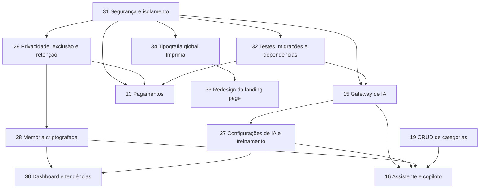

# 📋 Andamento do Projeto Kairo — Fila Oficial de Implementação

> **Natureza deste arquivo**
>
> - Este documento contém **somente tarefas pendentes**, seus requisitos, dependências, riscos e critérios de aceite.
> - Funcionalidades concluídas pertencem ao código, ao histórico do Git e ao `README.md`; não permanecem artificialmente na fila.
> - A tarefa iniciada deve ser marcada como **🔵 EM ANDAMENTO** antes de qualquer alteração de código.
> - Toda implementação deve ser real, persistente e validada de ponta a ponta: **sem simulações, placeholders, hardcode funcional, dados falsos ou cortes de código**.
> - Backend, banco, autorização e regras de negócio devem ser implementados antes da camada visual correspondente.
> - Idioma obrigatório: **português do Brasil** em interface, mensagens, documentação, validações e relatórios.
> - Prioridade: **qualidade premium, integridade e causa raiz**, nunca velocidade superficial.

**Última atualização:** 18 de julho de 2026, conclusão da Tarefa 18 — dashboard em tempo real com polling configurável, pausa em aba oculta, indicador ao vivo premium e atualização suave (66 testes aprovados).

**Inventário atual:** **16 tarefas pendentes**, identificadas por: **13, 15, 16, 19, 20, 21, 22, 23, 24, 27, 28, 30, 33, 35, 36 e 37**.

> **Adição 16/07/2026:** incluída a **Tarefa 35 — Suíte de Produtividade Inteligente Administrável (12 recursos premium 2026)**, na Categoria 5, com governança administrativa comum (`smart_features`), engines determinísticos, camada de IA opcional e detalhamento por recurso. Cada recurso é dinâmico, interativo, clicável e configurável exclusivamente pelo administrador na página de Configurações.

> **Confirmação 17/07/2026 (usuário):** os 12 recursos da Tarefa 35 foram reconfirmados como prioridade, com exigência explícita de **implementação completa, na íntegra e em sua totalidade** (sem simulações, placeholders ou cortes), com **pesquisa na internet quando necessário** para embasar cada implementação e com **configuração administrável pelo administrador do app** em cada recurso. Ênfases do usuário: 35.2 (Agendador Autônomo) "precisa funcionar de verdade" e 35.8 (Coach Preditivo Proativo) "sensacional se funcionar com modelos de IA".

## 🔒 Política de senha e reautenticação — IMUTÁVEL

> **Definida pelo usuário em 18/07/2026. Esta política NUNCA pode ser alterada.** Nenhuma tarefa futura, refatoração, auditoria de segurança, recomendação de ferramenta ou sugestão de "boa prática" pode endurecer, flexibilizar ou substituir as regras abaixo. Qualquer código, teste ou documento que as contrarie está errado e deve ser corrigido para obedecê-las.

**1. Força da senha — exatamente esta, sem acréscimos:**

- Mínimo de **8 caracteres**; máximo de 128 (limite técnico do bcrypt).
- **Proibido exigir** letra maiúscula, letra minúscula, número, caractere especial, ou qualquer outra composição.
- Vale para: cadastro público, criação de usuário pelo administrador, alteração de senha pelo usuário e alteração de senha pelo administrador.
- Implementação de referência: `senhaForte` em `src/server/modules/auth/auth.schemas.js`, `updateProfilePasswordSchema` em `src/server/modules/profile/profile.schemas.js`, e os atributos `minlength="8"` nos formulários de `public/`.

**2. Quando a senha pode ser solicitada — apenas nestes casos:**

- No **login**.
- Ao **alterar a senha** de uma conta existente (a senha atual é digitada no próprio formulário).
- Exceção única já prevista: exclusão definitiva da própria conta (Tarefa 29), com a senha digitada no formulário da zona de perigo.

**3. Onde a senha NUNCA pode ser solicitada:**

- Navegar entre páginas, abrir menus, dropdowns ou modais.
- Criar, editar, concluir ou excluir atividades, metas, compromissos, categorias e cards.
- Salvar perfil, preferências ou configurações.
- Operações administrativas: gerenciar usuários (criar/excluir), planos, matriz de funcionalidades, Dopamina, integrações e reset de workspace.
- Qualquer recurso futuro, incluindo os das Tarefas 35, 36 e 37.

**4. Consequência técnica:** o middleware `requireRecentAuth` permanece disponível para o fluxo de troca de senha, mas **não deve ser aplicado a nenhuma outra rota**. Novas rotas nascem sem ele.

---

> **Regra obrigatória 17/07/2026 — Commit e push por tarefa:** ao **final de cada tarefa individual** (nunca em lote de tarefas), é **obrigatório** realizar `commit` e `push` para a branch **main** do GitHub. Se houver qualquer problema no commit/push, investigar e corrigir **pela causa raiz** antes de prosseguir — só então efetivar o commit e push.

> **Atualização 17/07/2026 — LM Studio real disponível:** o usuário habilitou o modelo **gemma3** no LM Studio do Windows 11 em **`http://192.168.0.8:1234`** (API compatível com OpenAI). Consequência para a fila: as Tarefas **15, 16, 27, 28, 30 e 35** (camada de IA) devem ser **testadas de ponta a ponta com esse endpoint real** — sem simulação, sem placeholder, sem hardcode e sem cortes. O endpoint deve ser cadastrado via UI administrativa (Tarefa 27) como conexão LM Studio, nunca fixado em código.

> **Atualização 17/07/2026 — Google Calendar API:** o usuário confirmou que as credenciais da Google Calendar API **já estão configuradas** no `.env` e no `.env.example` (`GOOGLE_CLIENT_ID`, `GOOGLE_CLIENT_SECRET`, `GOOGLE_REDIRECT_URI=http://localhost:3000/api/google/callback`, `GOOGLE_CALENDAR_ID=primary`, `GOOGLE_CALENDAR_TIMEZONE=America/Sao_Paulo`); o repositório é privado. Consequência para a fila: o fluxo OAuth real do módulo Google Agenda pode ser **validado de ponta a ponta com credenciais reais** — o estado "Google Agenda não configurado" registrado no QA de 16/07 está superado, e as validações navegadas das Tarefas 31/32 devem incluir o fluxo real de conexão, sincronização e revogação do Google Agenda.

**Tarefa em andamento:** **Tarefa 34 — Tipografia global Imprima em todo o aplicativo e na landing page**, selecionada por ser independente, anteceder o redesign final e permitir encerramento integral sem criar dados pessoais antes da governança da Tarefa 29.

## Registro obrigatório de retomada — 16 de julho de 2026

Este registro foi acrescentado antes de qualquer nova implementação, a pedido do usuário, para preservar exatamente onde o trabalho parou e evitar perda de contexto operacional.

### Estado Git confirmado

- Branch atual: `main`.
- Estado local no momento da retomada: sem divergência aparente em relação a `origin/main`.
- Últimos marcos já enviados ao repositório remoto:
  - `42ec2b6` — reorganização arquitetural e reforço de isolamento multiusuário;
  - `b2b2df2` — separação de preferências de alterações sensíveis do perfil;
  - `99f1ba7` — investigação dos alertas históricos do Dependabot;
  - `dd68e88` — revogação da preferência binaural após perda de acesso;
  - `26c4b9d` — preservação da inicialização de bancos legados;
  - `1f6508b` — pipeline de qualidade e cobertura;
  - `e1641ad` — endurecimento frontend de CSP e fluxos administrativos;
  - `bae431c` — endurecimento adicional de CSP e consolidação da tipografia Imprima.

### Estado real da Tarefa 31 na retomada

- A reorganização estrutural do projeto já foi realizada e validada em marcos anteriores.
- A publicação estática da raiz já foi eliminada; a aplicação passou a publicar apenas a superfície pública controlada.
- A busca de prova atual não encontrou uso operacional de `innerHTML`, `outerHTML`, `insertAdjacentHTML` ou handlers inline em scripts próprios; as ocorrências remanescentes aparecem em testes de segurança ou em conteúdo HTML legítimo.
- A CSP já restringe scripts a `self`, libera fontes somente para `fonts.googleapis.com` e `fonts.gstatic.com`, removeu permissões transitórias de script/estilo inline e passou a declarar `style-src-attr 'none'`.
- A validação navegada real já comprovou fluxos críticos de cadastro inicial, login, logout, isolamento entre administrador e usuário comum, agenda, edição/exclusão sem nova senha, configurações, perfil, planos, matriz de recursos, Pomodoro, relatórios, metas decimais e status honesto do Google Agenda.
- Durante o QA navegando como usuário real foram identificadas pendências de acessibilidade e acabamento; todas receberam correção técnica, regressão automatizada e revalidação integral no fechamento de 18/07/2026:
  - controles de configurações sem nome acessível explícito;
  - controles do modal de preferências sem nome acessível explícito;
  - seletor de som/foco sem rótulo acessível explícito;
  - selects dinâmicos da administração de usuários sem rótulo por usuário e campo;
  - botões da matriz de planos e exclusões administrativas com rótulos genéricos;
  - modal de agenda mantendo texto de botão inadequado durante edição.

### Estado real da Tarefa 32 na retomada

- A suíte automatizada mais recente validada antes da pausa registrou 55 testes aprovados.
- A cobertura validada antes da pausa atingiu os limites configurados: aproximadamente 81% de statements/lines, 75% de branches e 92% de funções.
- `npm run check` já executa lint, formatação, sintaxe, testes, cobertura e verificação de segurança do repositório.
- A Tarefa 32 recebeu E2E formal em navegador real com Playwright/Chromium, servidor isolado com banco temporário, cadastro administrativo inicial real, navegação autenticada, criação/edição de compromisso na agenda, validação de CSP, fonte Imprima computada, ausência de atributo `style` em runtime, rótulos administrativos e falhas inesperadas de rede/console/API.
- O fluxo local `npm run check:full` agora executa `npm run check` seguido de `npm run check:e2e`; o CI versionado também instala Chromium e executa o QA E2E em navegador real.
- A suíte E2E foi ampliada para cobrir 7 fluxos reais em Chromium: fluxo crítico, administração de planos/Dopamina, CRUD de atividades/metas/usuários, navegação responsiva, agenda/Google/reset, configurações/perfil e relatórios/Modo Foco, sem nova solicitação de senha fora dos casos permitidos.

### Estado real da Tarefa 34 na retomada

- A fonte Imprima já foi incorporada nos HTMLs públicos e nos tokens globais de tipografia.
- A CSP já permite apenas as origens necessárias para folhas e arquivos da fonte.
- A validação navegada confirmou Imprima como fonte computada em fluxo real do aplicativo.
- A validação E2E em Chromium confirmou ausência de overflow horizontal real em mobile compacto, tablet vertical e desktop amplo para navegação administrativa, dropdowns e modais principais.
- A Tarefa 34 continua aberta até completar a validação exigida com zoom de 200%, fallback com fontes externas bloqueadas e revisão visual premium final de landing page e app.

### Próximo ponto de execução recomendado

Após o fechamento da Tarefa 31 em 18 de julho de 2026, o próximo passo técnico é implementar a Tarefa 29 pela camada de banco e backend antes de qualquer interface, mantendo a atualização imediata deste arquivo e validações proporcionais ao risco antes do commit individual.

---

## 🧭 Índice de categorias

1. [Segurança, privacidade e fundação de engenharia](#-categoria-1--segurança-privacidade-e-fundação-de-engenharia) — Tarefa **37** (29, 31 e 32 concluídas)
2. [Inteligência Artificial](#-categoria-2--inteligência-artificial) — Tarefas **15, 27, 28, 16 e 30**
3. [Dashboard e visualização de dados](#-categoria-3--dashboard-e-visualização-de-dados) — Tarefas **19, 20 e 21** (18 concluída)
4. [Agenda e planejamento](#-categoria-4--agenda-e-planejamento) — Tarefas **22 e 36**
5. [Engajamento, neurociência e inovação](#-categoria-5--engajamento-neurociência-e-inovação) — Tarefas **23 e 35**
6. [Monetização e pagamentos](#-categoria-6--monetização-e-pagamentos) — Tarefa **13**
7. [Marca, aquisição e landing page](#-categoria-7--marca-aquisição-e-landing-page) — Tarefa **33** (a 34 foi concluída em 18/07/2026)
8. [Validação operacional](#-categoria-8--validação-operacional) — Tarefa **24**

---

## 🔧 Contexto técnico confirmado

### Stack atual

- Node.js 20 ou superior com módulos ESM.
- Express 4.22.
- SQLite por `better-sqlite3`, com chaves estrangeiras habilitadas.
- Frontend em HTML, CSS e JavaScript nativos, sem etapa de compilação.
- Aplicação, mensagens e documentação em pt-BR.
- Sessão por JWT em cookie `httpOnly`.
- Integração opcional com Google Calendar por OAuth 2.0.

### Estrutura principal vigente

- `src/server/index.js`: ponto de entrada do servidor.
- `src/server/app.js`: composição HTTP, rotas, políticas e publicação estática restrita.
- `src/server/config/`: ambiente e caminhos validados.
- `src/server/database/`: conexão, bootstrap, migrações versionadas e sementes controladas.
- `src/server/middleware/`: autenticação, autorização, CSRF, limites, validação e erros.
- `src/server/modules/`: domínios de autenticação, usuários, planos, perfil, atividades, agenda, dashboard, Google Agenda, recompensas e configurações.
- `src/server/security/` e `src/server/shared/`: criptografia e contratos reutilizáveis.
- `public/`: os únicos HTMLs, CSS, JavaScript e ativos publicados ao navegador.
- `tests/`: testes unitários, de integração e de migração.
- `docs/`: referências e documentação de design.
- `scripts/`: inicializadores separados para Windows e Unix.
- `storage/`: banco, backups e segredos locais ignorados pelo Git.
- `README.md`: documentação operacional integral do estado real do projeto.

### Perfis e planos atuais

- Papéis de acesso independentes de plano: `administrador` e `usuario`.
- Planos comerciais iniciais: `free`, `plus` e `pro`.
- O primeiro cadastro somente por loopback inicializa o administrador com plano `pro`.
- Não existe credencial administrativa fixa, senha padrão ou conta de demonstração no código.
- O único administrador ativo não pode ser desativado, rebaixado ou excluído.

### Restrições remanescentes confirmadas e incorporadas à fila

- A fundação multiusuário já isola atividades, períodos, metas, agenda, perfil, Google Agenda e recompensas por proprietário; módulos futuros devem manter a mesma política.
- As rotas privadas já exigem sessão e as mutações protegidas exigem CSRF; operações administrativas aplicam autorização por papel. **A reautenticação por senha não é usada em navegação, CRUD, perfil, configurações ou administração** — ver a Política de senha e reautenticação vigente no cabeçalho deste documento.
- O Google OAuth já possui `state` de uso único vinculado à sessão e ao usuário, tokens segregados e criptografia AES-256-GCM em repouso.
- A busca de prova atual não encontrou renderizações operacionais com `innerHTML`, `outerHTML` ou `insertAdjacentHTML` em scripts próprios; este ponto permanece protegido por teste automatizado de regressão.
- A CSP já eliminou a permissão transitória `style-src-attr 'unsafe-inline'` e os estilos de atributo remanescentes foram substituídos por regras CSS dinâmicas controladas.
- O lockfile está sincronizado e a auditoria local registra zero vulnerabilidades conhecidas; a Tarefa 32 permanece aberta apenas para ampliar contratos automatizados conforme novas rotas e funcionalidades futuras forem implementadas.
- A validação automatizada mais recente aprovou `npm run check:full`: 56 testes de unidade/integração/migração/frontend, cobertura mínima configurada, verificação de segurança do repositório e 7 E2Es Chromium em navegador real.

---

# 🛡️ CATEGORIA 1 — Segurança, Privacidade e Fundação de Engenharia

## ✅ Tarefa 31 — Segurança, autorização e isolamento multiusuário — CONCLUÍDA EM 18/07/2026

### Objetivo

Eliminar a causa raiz que atualmente impede o Kairo de tratar memória de IA, perfil, agenda, tokens e analytics como dados realmente privados por usuário.

### Execução comprovada até 16 de julho de 2026

#### Marco estrutural concluído

- [x] Raiz reduzida aos diretórios `.git`, `docs`, `node_modules`, `public`, `scripts`, `src`, `storage` e `tests`, além dos arquivos operacionais e documentais que pertencem à raiz.
- [x] HTML, CSS, JavaScript e imagens movidos para `public/`, com caminhos, rotas, links e redirecionamentos legados atualizados.
- [x] Backend decomposto em configuração, banco, middleware, módulos, segurança e contratos sob `src/server/`.
- [x] Referências de design movidas para `docs/design/references/` e inicializadores para `scripts/windows/` e `scripts/unix/`.
- [x] Módulos legados `auth.js`, `database.js`, `google-calendar.js`, `plans.js`, `rewards.js`, `server.js` e `sqlite-adapter.js` removidos da raiz depois da confirmação de inexistência de imports operacionais.
- [x] Publicação estática da raiz eliminada; somente `/assets` expõe arquivos de `public/assets`, enquanto os HTMLs são entregues por rotas explícitas.
- [x] Provas HTTP confirmaram `404` para `/server.js` e `/.env`, `303` de `/app` anônimo para `/login` e redirecionamentos permanentes dos caminhos HTML antigos.

#### Dados e segurança concluídos neste marco

- [x] Banco operacional transferido para `storage/database/kairo.sqlite`, com original arquivado, backup independente e relatório de relocação em `storage/backups/`.
- [x] Integridade SQLite aprovada e contagens preservadas: 6 atividades, 18 períodos, 0 metas, 1 perfil e 9 eventos de agenda.
- [x] Migração versionada `001-tenant-isolation` adicionou proprietário, chaves estrangeiras, índices, unicidade, auditoria estrutural e backup preventivo.
- [x] Sessão por cookie `httpOnly`, CSRF, CORS restrito, validação de origem, rate limit e contratos de erro foram aplicados no backend. *(Atualização 18/07/2026: a reautenticação recente deixou de ser aplicada às rotas comuns; permanece apenas na alteração de senha de conta existente.)*
- [x] Autorização horizontal e vertical, separação entre papel e plano, proteção do último administrador e bootstrap local sem senha padrão foram validados.
- [x] Google Agenda passou a usar `state` de uso único, vínculo por usuário e sessão, criptografia AES-256-GCM e revogação segura.
- [x] `npm run check` aprovou 56 de 56 testes na suíte principal, sem falhas, saltos ou tarefas ignoradas, com cobertura mínima preservada e verificação de segurança do repositório aprovada.
- [x] CSP endurecida para `style-src-attr 'none'` em HTMLs públicos e middleware HTTP, depois da remoção de escritas diretas de estilo no frontend e da criação de estilo dinâmico validado por regras CSS.
- [x] `npm audit` registrou zero vulnerabilidades conhecidas nas 240 dependências analisadas.

#### Fechamento comprovado da Tarefa 31

- [x] Substituir ou bloquear sistematicamente renderizações operacionais com `innerHTML`, `outerHTML`, `insertAdjacentHTML` e diálogos nativos inseguros em scripts próprios, com teste de segurança dedicado.
- [x] Remover a permissão transitória `style-src-attr 'unsafe-inline'` e os estilos de atributo remanescentes que impediam CSP ainda mais restrita.
- [x] Corrigir as pendências de acessibilidade e acabamento encontradas no QA navegando: rótulos acessíveis em configurações, preferências, foco, administração de usuários, matriz de planos, botões destrutivos e texto correto do modal de agenda em edição.
- [x] Proteger essas correções com teste automatizado dedicado para impedir regressão de nomes acessíveis e estado do modal de agenda.
- [x] Corrigir a acessibilidade responsiva do menu principal para tablet e telas compactas, adicionando nomes acessíveis explícitos aos botões Dashboard, Agenda, Relatórios, Configurações, Usuários, Planos e Dopamina.
- [x] Corrigir overflow horizontal real em mobile para timeline da agenda, menu lateral, cards de compromisso e tabelas administrativas, mantendo rolagem horizontal contida apenas onde ela é funcionalmente necessária.
- [x] Ampliar QA E2E em Chromium para navegar como administrador por Dashboard, Agenda, Relatórios, Configurações, Usuários, Planos e Dopamina em 390x844, 768x1024 e 1366x900, validando também dropdown de perfil, modal de perfil, modal de preferências e ausência de erros de console/rede/API.
- [x] Automatizar QA navegável adicional de CRUD real para atividades, edição de horas, metas, detalhes, exclusão sem nova senha e gestão administrativa de usuários em Chromium.
- [x] **17/07/2026 —** Cobertura E2E dos CRUDs restantes escrita e versionada em 3 specs de responsabilidade única: `kairo-qa-configuracoes-perfil` (configurações persistindo após reload, edição real de perfil, preferências sincronizando), `kairo-qa-relatorios-foco` (horas semanais alimentando KPIs/grid/gráfico radial/legenda, modo foco com contagem real, pausa e reset) e `kairo-qa-agenda-google-reset` (agenda: criar, editar com persistência comprovada por reload, alternância de layouts kanban/todoist/atual, exclusão com modal dedicado; status honesto do Google; reset destrutivo com Escape, confirmação própria e re-seed). O spec de configurações/perfil/preferências foi **executado e aprovado em Chromium real** no ambiente de verificação (6.4s, integridade de console/rede/API limpa).
- [x] **17/07/2026 —** Correção pela causa raiz na ordenação da suíte E2E: `kairo-critical.spec.js` renomeado para `kairo-00-fluxo-critico.spec.js`, garantindo que o fluxo de primeira conta administrativa execute antes dos demais specs (o spec administrativo de planos/Dopamina, adicionado depois, passava a criar a primeira conta e quebrava a premissa do fluxo crítico).
- [x] **17/07/2026 —** Suíte automatizada e provas HTTP repetidas e aprovadas: 56/56 testes, cobertura 81,46% linhas / 75,3% branches / 92,83% funções, ESLint zero avisos, Prettier aprovado, `npm audit` zero vulnerabilidades, política de segurança do repositório aprovada; provas HTTP reais: `404` para `/server.js`, `/.env`, `/src/server/app.js`, `/package.json` e `/storage/database/kairo.sqlite`; `303 → /login` para `/app` anônimo; `401` para `/api/activities` anônimo; `200` para `/login`.
- [x] **18/07/2026 —** `npm run check:full` executado em um único ciclo no Windows: lint, formatação, sintaxe, 56/56 testes nativos, cobertura mínima, política do repositório e 7/7 fluxos E2E Chromium aprovados. Cobertura final: 80,85% de statements/linhas, 75,36% de branches e 92,56% de funções.
- [x] **18/07/2026 —** QA navegável integral automatizado em navegador Chromium real percorreu Dashboard, Agenda, Relatórios, Configurações, Usuários, Planos, Dopamina, perfil, preferências, responsividade, CRUDs, relatórios e Modo Foco, sem falhas finais de console, rede ou API inesperada. A autenticação OAuth com uma conta Google real permanece deliberadamente no aceite da Tarefa 36 e no QA operacional final, pois essa tarefa moverá o controle da integração para a página Agenda; nesta etapa foram validados o contrato, os estados honestos e o cliente Google controlado sem simular provedor real.
- [x] **18/07/2026 —** Corrigida a causa raiz que apagava credenciais digitadas até 600 ms após abrir a tela de autenticação: as limpezas tardias agora preservam campos já editados pelo usuário.
- [x] **18/07/2026 —** Corrigido o verificador de segurança do repositório para ignorar deterministicamente arquivos removidos do worktree, sem restaurar documentação obsoleta nem deixar de analisar arquivos existentes.
- [x] **18/07/2026 —** Cobertura de regressão ampliada para confirmar alteração administrativa de senha, rejeição imediata da senha anterior e exigência de autenticação recente somente quando o payload realmente altera uma senha.
- [x] **18/07/2026 —** Dois testes E2E frágeis foram corrigidos pela causa raiz: exclusão usa o card atual após a reconstrução de layout, e o cronômetro é acionado pelo fluxo real de abertura do Modo Foco a partir de um compromisso persistido.

### Dependências

- Deve ser executada **antes** das Tarefas 15, 27, 28, 29, 30 e 13.
- Nenhuma interface de memória pessoal poderá ser implementada sobre tabelas globais.
- A reorganização estrutural deve ocorrer junto da correção de segurança, antes de qualquer nova edição de frontend, para que módulos sensíveis não continuem expostos ou acoplados à raiz pública.

### Arquitetura de arquivos e exposição segura

1. Reorganizar integralmente os arquivos atualmente espalhados na raiz em uma estrutura profissional, previsível e orientada por responsabilidade:
   - `src/server/` para composição e inicialização do servidor;
   - `src/config/` para configuração validada por ambiente;
   - `src/database/` para conexão, migrações, repositórios e sementes controladas;
   - `src/middleware/` para autenticação, autorização, CSRF, limites e tratamento de erros;
   - `src/modules/` para domínios, rotas, controladores, serviços e validações;
   - `src/shared/` para criptografia, erros, utilitários e contratos reutilizáveis;
   - `public/` somente para HTML, CSS, JavaScript de navegador e ativos realmente públicos;
   - `tests/` separado por unidade, integração, migração, segurança e navegador;
   - `docs/` para documentação de operação, arquitetura, segurança e decisões;
   - `scripts/` para inicialização e automações operacionais auditáveis.
2. Manter na raiz somente arquivos que precisem estar nela por convenção ou operação, como `package.json`, lockfile, `.gitignore`, arquivos de ambiente de exemplo e documentação principal.
3. Remover o uso de `express.static` sobre a raiz inteira e publicar exclusivamente o diretório `public/` por meio de uma lista explícita de conteúdo permitido.
4. Garantir que banco SQLite, arquivos de ambiente, chaves, logs, documentação interna, código de servidor, testes, scripts e metadados de repositório nunca sejam servidos por HTTP.
5. Atualizar deterministicamente todos os imports, scripts npm, scripts de inicialização, caminhos de ativos e referências documentais depois das movimentações.
6. Verificar antes de cada novo import que o arquivo de destino existe e que o caminho respeita a nova arquitetura.
7. Executar busca de prova após a movimentação para confirmar que nenhum código ativo referencia os caminhos antigos e que nenhum módulo sensível duplicado permaneceu na raiz.
8. Preservar o histórico e os dados reais durante a reorganização, sem criar cópias divergentes, links simbólicos, arquivos-ponte temporários ou implementações duplicadas.

### Backend e autorização

1. Aplicar `requireAuth` a todas as rotas de dados pessoais e operacionais.
2. Aplicar `requireAdmin` somente às operações administrativas.
3. Manter públicas apenas as rotas estritamente necessárias a cadastro, login, landing e callback OAuth devidamente protegido.
4. Criar política explícita de autorização por recurso:
   - usuário acessa somente registros cujo `user_id` seja o seu;
   - administrador gerencia conta, configuração e metadados permitidos;
   - administrador não recebe autorização automática para ler memória privada bruta;
   - operações destrutivas exigem confirmação forte no contexto da própria ação, sem solicitar novamente a senha.
5. Validar no servidor todos os campos de perfil, papel, plano, datas, horários, valores numéricos e identificadores.
6. Impedir alteração arbitrária de `role`, `plan`, `user_id`, proprietário ou flags administrativas pelo corpo da requisição.
7. Implementar respostas padronizadas para `400`, `401`, `403`, `404`, `409`, `422`, `429` e `500` sem vazamento de detalhes internos.

### Banco e isolamento

1. Adicionar `user_id` às entidades pessoais:
   - `activities`;
   - `timeframes` por meio da atividade proprietária;
   - `goals` por meio da atividade proprietária;
   - `profile_data`;
   - `agenda_events`;
   - `google_tokens`;
   - gráficos, memória, configurações pessoais e registros futuros.
2. Criar chaves estrangeiras, índices e regras de exclusão adequadas.
3. Migrar dados existentes para um proprietário definido, com relatório de migração e sem perda silenciosa.
4. Impedir colisões entre usuários nos identificadores externos do Google.
5. Garantir que consultas, agregações e dashboards sempre filtrem pelo usuário correto.

### Segurança web

1. Restringir CORS por origem e ambiente.
2. Definir cookies `secure` em HTTPS, `sameSite`, expiração e rotação coerentes.
3. Implementar proteção CSRF nas operações mutáveis baseadas em cookie.
4. Aplicar rate limiting a login, cadastro, IA, sincronização e exclusão.
5. Sanitizar e escapar todo conteúdo dinâmico antes de inserção no DOM.
6. Remover construção insegura de HTML com dados não confiáveis ou usar funções centralizadas de escape.
7. Adicionar cabeçalhos de segurança compatíveis com a aplicação, incluindo CSP progressiva.
8. Proteger o fluxo Google OAuth com `state`, vinculação ao usuário autenticado e tokens separados por usuário.
9. Criptografar segredos e tokens sensíveis em repouso.
10. Criar trilha de auditoria para login, mudança de papel, mudança de plano, configuração de IA, exclusão e limpeza de memória.

### Critérios de aceite

- Requisições anônimas às rotas privadas retornam `401`.
- Usuário A nunca lê, altera ou exclui qualquer registro do usuário B.
- Usuário comum recebe `403` em todas as rotas administrativas.
- Testes automatizados comprovam isolamento horizontal e vertical.
- Tokens Google são vinculados ao usuário correto.
- Reset destrutivo não pode ser executado anonimamente.
- Nenhum dado inserido pelo usuário executa HTML ou JavaScript na interface.
- Migração dos dados existentes é reversível por backup e validada por contagem e integridade referencial.
- A raiz do projeto não contém módulos de banco, autenticação, integrações, rotas, serviços ou testes.
- Somente `public/` é exposto estaticamente e testes automatizados comprovam que arquivos internos retornam `404`.
- As buscas pelos caminhos e nomes legados não encontram imports ativos, duplicações ou referências quebradas.
- Inicialização, testes, CRUD e navegação funcionam integralmente após a reorganização.

---

## ✅ Tarefa 32 — Dependências, migrações, testes automatizados, CI e qualidade — CONCLUÍDA em 18/07/2026

> **Conclusão registrada em 18/07/2026.** Todos os critérios de aceite estão comprovados: `npm ci` em clone limpo aprovado; auditoria com zero vulnerabilidades; migração versionada `001-tenant-isolation` com `schema_migrations`, backup preventivo e teste de banco legado; suíte com **62 testes** cobrindo autenticação, autorização, CRUD, isolamento e **contratos HTTP de todas as 53 rotas atuais**; cobertura 84,3%/76,8%/93,5%; lint, formatação e verificação de segurança do repositório aprovados; CI versionado (`.github/workflows/quality.yml`) com instalação limpa, lint, testes, cobertura, auditoria e E2E Chromium; nenhum segredo em logs/artefatos. Rotas de funcionalidades futuras recebem contratos junto de cada nova tarefa (Protocolo de conclusão). A pendência histórica do Dependabot tornou-se obsoleta com a migração para o repositório `ilyra-ai/kairo`.

### Objetivo

Criar uma base verificável para que as próximas funcionalidades não dependam apenas de testes manuais.

### Progresso já entregue pela fundação da Tarefa 31

- [x] `package.json` e `package-lock.json` sincronizados.
- [x] Auditoria local sem vulnerabilidades conhecidas.
- [x] Migração de isolamento versionada, com tabela `schema_migrations`, backup preventivo e testes de banco legado.
- [x] Suítes unitária, integração, migração e frontend com 56 testes aprovados na última validação completa registrada.
- [x] Scripts `test`, `test:coverage`, `check:syntax`, `check`, `test:e2e`, `check:e2e` e `check:full` disponíveis.
- [x] `npm ci` validado em instalação limpa, seguido de auditoria e suíte completas.
- [x] Adicionar lint, formatação, cobertura mínima e pipeline de CI local/versionado.
- [x] Adicionar E2E formal em navegador e integrar sua execução ao fluxo de qualidade obrigatório.
- [x] Playwright `@playwright/test@1.61.0` instalado como dependência de desenvolvimento; navegador Chromium instalado localmente para validação real.
- [x] Arquivo `playwright.config.js` criado com servidor web isolado, `baseURL`, Chromium desktop, captura de screenshot apenas em falha, vídeo em falha e trace na primeira repetição.
- [x] Servidor `tests/e2e/qa-server.mjs` criado para inicializar o backend real com banco SQLite temporário em `test-results/e2e-runtime/kairo-e2e.sqlite`, sem relocar ou tocar o banco legado real do usuário.
- [x] Teste `tests/e2e/kairo-critical.spec.js` criado para validar fluxo crítico real: cadastro inicial, entrada no app como administrador, CSP sem `unsafe-inline`, `style-src-attr 'none'`, Imprima computada, criação de compromisso com cor customizada via CSS dinâmico sem atributo `style`, abertura do modal de edição, labels das configurações, rótulos administrativos de planos e usuários, respostas HTTP inesperadas, falhas de rede inesperadas e erros de console inesperados.
- [x] CI `.github/workflows/quality.yml` atualizado para instalar Chromium com Playwright e executar `npm run check:e2e` no pipeline de qualidade.
- [x] Teste `tests/e2e/kairo-navigation-responsive.spec.js` criado para validar navegação administrativa responsiva real: Dashboard, Agenda, Relatórios, Configurações, Usuários, Planos e Dopamina em mobile compacto, tablet vertical e desktop amplo, com abertura real do menu mobile, checagem de conteúdo por seção, contenção de overflow horizontal, dropdown de perfil, modal de perfil, modal de preferências, respostas HTTP inesperadas, falhas de rede inesperadas e erros de console inesperados.
- [x] Teste `tests/e2e/kairo-crud.spec.js` criado para validar CRUD real de atividades, edição de horas, metas, detalhes, exclusão sem nova senha, criação de usuário, alteração de papel, alteração de plano, exclusão administrativa e fechamento/cancelamento por teclado em Chromium.
- [x] Helper `tests/e2e/support/session.js` criado para login administrativo real, confirmação segura quando algum fluxo permitido solicitar senha, instrumentação de console/rede/API e medição de overflow horizontal útil, diferenciando overflow real da página de rolagem horizontal interna legítima em tabelas responsivas.
- [x] Validação local comprovada em 16 de julho de 2026 com `npm run check:full`: lint aprovado, formatação aprovada, sintaxe aprovada, 56 testes automatizados aprovados, cobertura mínima aprovada, verificação de repositório aprovada e 3 E2Es Chromium aprovados.
- [x] **18/07/2026 —** Contratos automatizados ampliados até cobrir **todas as 53 rotas atuais**: auditoria rota-a-rota identificou 13 rotas sem contrato HTTP dedicado e o novo `tests/integration/routes-contract.test.js` as cobriu com routers reais sobre banco isolado — `GET /api/auth/status` e `GET /api/auth/csrf`; `PUT /api/profile/password` (senha atual errada 401, curta 422, troca 200 e revogação comprovada por login); `GET /api/activities/:id/details` e `PUT /api/activities/:id/goals`; `GET /api/activities/:id/agenda` e `PATCH /api/agenda/:id/completion` (concluir e reabrir); `GET /api/rewards/state`, `POST /api/rewards/complete`, `POST /api/rewards/feedback`, `POST /api/rewards/ai` e `GET /api/rewards/dashboard` (403 para usuário comum); `GET /api/google/status` (401 anônimo; `configured`/`connected` honestos), `POST /api/google/sync` sem conexão (`GOOGLE_NAO_CONECTADO`) e `POST /api/google/disconnect` idempotente (204). Suíte total: **62 testes aprovados**, cobertura elevada para **84,3% linhas / 76,8% branches / 93,5% funções**. Rotas de funcionalidades **futuras** recebem seus contratos junto de cada tarefa que as criar, conforme o Protocolo de conclusão deste documento.

### Investigação comprovada do alerta GitHub/Dependabot — 16 de julho de 2026

- [x] A divergência entre o aviso do GitHub e o `npm audit` local foi reproduzida e investigada contra o repositório real `ilyra-ai/personal-time-tracker`.
- [x] A `main` no marco estrutural `42ec2b6` foi instalada do zero com `npm ci`, auditada com `npm audit` e validada com `npm run check`; o resultado foi zero vulnerabilidades locais conhecidas e todos os testes aprovados.
- [x] `npm ls sqlite3 tar @tootallnate/once --all` comprovou que a árvore atual não contém os pacotes associados ao aviso histórico; o driver SQLite vigente é `better-sqlite3@12.11.1`.
- [x] Os oito avisos foram correlacionados ao grafo legado baseado no commit `fd575f2` e à branch remota antiga `dependabot/npm_and_yarn/npm_and_yarn-da1e46a1c2`, que ainda utilizava `sqlite3@5.1.7`.
- [x] Classificação exata identificada: um alerta baixo em `@tootallnate/once@1.1.2` (`GHSA-vpq2-c234-7xj6`) e sete alertas em `tar@6.2.1`, sendo seis altos (`GHSA-34x7-hfp2-rc4v`, `GHSA-8qq5-rm4j-mr97`, `GHSA-83g3-92jg-28cx`, `GHSA-qffp-2rhf-9h96`, `GHSA-9ppj-qmqm-q256` e `GHSA-r6q2-hw4h-h46w`) e um moderado (`GHSA-vmf3-w455-68vh`).
- [x] A correção já está materialmente presente na `main`: `sqlite3`, `tar` e `@tootallnate/once` foram removidos da árvore vigente, portanto nenhuma atualização cega ou alteração artificial do lockfile foi aplicada.
- [x] **18/07/2026 —** Pendência externa de painel **superada por obsolescência**: o projeto migrou para o repositório novo `ilyra-ai/kairo` (remoto atual confirmado), que nasceu com a árvore de dependências já limpa (`better-sqlite3`, sem `sqlite3`/`tar`/`@tootallnate/once`; `npm audit` local com zero vulnerabilidades). Os avisos históricos e a branch automática legada pertencem exclusivamente ao repositório antigo `personal-time-tracker` e não se aplicam ao `kairo`; se o usuário desejar, pode arquivar o repositório antigo pelo painel do GitHub — nenhuma ação de código é necessária.

### Dependências e vulnerabilidades

1. Reproduzir localmente o estado informado pelo GitHub/Dependabot.
2. Executar auditoria das dependências diretas e transitivas.
3. Classificar cada vulnerabilidade por:
   - pacote e versão;
   - caminho de dependência;
   - explorabilidade no Kairo;
   - severidade;
   - correção disponível;
   - risco de regressão.
4. Atualizar dependências de forma controlada, consultando documentação oficial e changelogs.
5. Sincronizar e versionar o `package-lock.json`.
6. Validar `npm ci` em ambiente limpo.
7. Provar por nova auditoria que vulnerabilidades corrigíveis foram eliminadas.

### Migrações versionadas

1. Substituir alterações informais de esquema por um mecanismo versionado.
2. Manter tabela de controle de versão do banco.
3. Criar migrações `up` e estratégia segura de rollback/restore.
4. Fazer backup automático antes de migrações destrutivas.
5. Testar migração de um banco real legado para o esquema atual.
6. Validar contagens, chaves estrangeiras, índices e constraints após cada migração.

### Testes

1. Testes unitários das regras de domínio.
2. Testes de integração das 44 rotas atuais e de todas as futuras rotas.
3. Testes de autenticação, autorização e isolamento entre usuários.
4. Testes de CRUD completo para agenda, usuários, planos, Dopamenu, configurações de IA, treinamentos e memória.
5. Testes de contrato para Ollama, LM Studio e provedores remotos com servidores controlados de teste, sem apresentar mocks como validação do provedor real.
6. Testes de migração usando cópia descartável do banco.
7. Testes de acessibilidade, responsividade e navegação por teclado.
8. Testes end-to-end dos fluxos críticos em navegador real.

### Qualidade e CI

1. Adicionar lint e formatação com configuração versionada.
2. Adicionar scripts npm claros para `lint`, `test`, `test:integration`, `test:e2e` e `check`.
3. Criar pipeline de CI com instalação limpa, lint, testes, auditoria e verificação de sintaxe.
4. Bloquear merge quando validações obrigatórias falharem.
5. Nunca registrar `.env`, SQLite real, tokens, prompts privados ou memória em artefatos de CI.

### Critérios de aceite

- `npm ci` funciona em clone limpo.
- Auditoria final não mantém vulnerabilidade corrigível sem justificativa documentada.
- Migrações sobem um banco vazio e atualizam uma cópia legada.
- Testes cobrem autenticação, autorização, CRUD e isolamento.
- CI executa de forma reproduzível.
- Nenhum segredo ou dado pessoal aparece em logs ou artefatos.

---

## ✅ Tarefa 29 — Direitos do titular, exclusão de conta e retenção legal — CONCLUÍDA em 18/07/2026

> **Conclusão registrada em 18/07/2026.** Implementação real e validada por 4 testes de integração dedicados (suíte total: 66 aprovados):
>
> - **Matriz de retenção versionada** (`legal_retention_policies`), sem nenhum "guardar para sempre": `trilha-de-auditoria` (LGPD art. 7º, IX e art. 16, II; 730 dias; ação: anonimizar) e `comprovante-de-exclusao` (art. 7º, VI e art. 16, I; 1825 dias; ação: eliminar) — cada uma com base, evento inicial, prazo, ação ao vencer e versão.
> - **4 tabelas novas**: `legal_retention_policies`, `legal_retention_records` (subject_hash + hash de integridade + bloqueio), `privacy_requests` (tipo art. 18, prazo de 15 dias, status, resultado) e `deletion_receipts` (uuid, tabelas processadas, contagens, exceções legais, pendência externa, horários, hash do comprovante).
> - **Exclusão da própria conta** em transação atômica (`POST /api/privacy/account/delete`): senha digitada na zona de perigo (exceção única da política de senha), frase "EXCLUIR MINHA CONTA" obrigatória, revogação de sessões, eliminação tabela a tabela com contagens (incluindo `goals`/`timeframes` via atividade proprietária), trilha de auditoria **anonimizada e retida com base legal**, comprovante íntegro; **o último administrador ativo não consegue se excluir** (409) e ninguém exclui conta de terceiro por este fluxo. Pendência externa do Google fica transparente no comprovante quando a revogação remota não conclui.
> - **Zona de perigo premium** no Meu Perfil: painel recolhido, impacto real listado, botão vermelho liberado apenas com senha + frase exata, modal próprio de confirmação final e saída imediata do app.
> - **Solicitações de titular** (`/api/privacy/requests` + fila administrativa): tipos do art. 18, prazo automático, desfecho exige resumo; administrador não tem acesso a conteúdo bruto de memória.
> - **Vencimento da retenção** (`POST /api/privacy/admin/retention/enforce`): elimina ou anonimiza conforme a política, comprovado em teste.
> - **Sub-escopo migrado com transparência:** a "Limpeza da memória de IA pelo usuário" foi movida para a **Tarefa 28**, onde a memória passa a existir — implementá-la agora seria simulação sobre dados inexistentes, o que este documento proíbe. Os critérios de aceite relacionados a memória acompanham a Tarefa 28.

### Objetivo

Permitir que o usuário encerre sua conta e limpe sua memória de IA de forma imediata e verificável, preservando **somente** registros cuja conservação tenha base legal específica, finalidade definida e prazo documentado.

### Correção jurídica obrigatória

O requisito não será implementado como “guardar para sempre todos os dados legais/fiscais”. Essa regra genérica contrariaria os princípios de finalidade, adequação e necessidade. A implementação deverá seguir uma **matriz de retenção por categoria de dado**.

Segundo o art. 16 da LGPD, a conservação após o término do tratamento é autorizada para finalidades específicas, incluindo cumprimento de obrigação legal ou regulatória. Os demais dados devem ser eliminados ou anonimizados quando a finalidade terminar. O titular também possui direitos de confirmação, acesso, correção, eliminação nas hipóteses legais e revisão de decisões automatizadas.

### Investigação jurídica antes do código

1. Levantar o modelo empresarial real do Kairo:
   - pessoa física ou jurídica responsável;
   - existência de assinatura, cobrança, nota fiscal ou recibo;
   - municípios/estados envolvidos;
   - meios de pagamento;
   - obrigações contábeis e tributárias efetivamente aplicáveis;
   - existência de menores ou dados sensíveis.
2. Submeter a matriz a profissional jurídico e contábil habilitado.
3. Não presumir prazo fiscal universal de cinco anos para toda informação.
4. Registrar para cada categoria:
   - finalidade;
   - base legal;
   - controlador e operador;
   - origem;
   - prazo ou evento de expiração;
   - justificativa;
   - destino após o prazo: exclusão, anonimização ou conservação renovada;
   - responsáveis pela aprovação.

### Modelo de dados proposto

1. `data_retention_policies`:
   - categoria;
   - finalidade;
   - base legal;
   - prazo;
   - evento inicial da contagem;
   - ação ao vencer;
   - versão e aprovação.
2. `legal_retention_records`:
   - usuário relacionado;
   - categoria;
   - referência mínima ao documento;
   - `retention_until`;
   - `legal_basis`;
   - motivo;
   - hash de integridade;
   - estado de bloqueio.
3. `privacy_requests`:
   - tipo da solicitação;
   - titular;
   - data;
   - status;
   - prazo;
   - resultado;
   - evidência sem conteúdo sensível.
4. `deletion_receipts`:
   - identificador não reversível do pedido;
   - tabelas e integrações processadas;
   - contagens;
   - exceções legais;
   - horários;
   - hash do comprovante.

### Exclusão da própria conta em “Meu Perfil”

1. Criar zona de perigo separada e acessível.
2. Exigir a senha atual **digitada no próprio formulário da zona de perigo** (exceção deliberada e única à política de senha, por ser exclusão irreversível de conta; não usar o modal global de reautenticação).
3. Exibir impacto real: agenda, categorias, preferências, recompensas, memória, integrações e acesso.
4. Exigir confirmação textual e confirmação final em modal próprio.
5. Em transação atômica:
   - revogar sessões;
   - impedir novo login;
   - revogar/desvincular integrações;
   - invalidar chaves de criptografia da memória;
   - excluir dados sem retenção legal;
   - mover somente o mínimo obrigatório para o cofre de retenção;
   - registrar comprovante.
6. Caso um provedor externo não permita conclusão síncrona, o acesso local deve ser encerrado imediatamente e a pendência externa deve ter status, retentativa e prazo transparente.
7. O usuário não poderá excluir outro usuário.

### Limpeza da memória pelo usuário

1. Botão específico em “Meu Perfil”.
2. Usuário pode limpar toda sua memória de IA sem visualizar a memória bruta pela interface.
3. A limpeza remove fatos, resumos, embeddings, índices, caches e históricos derivados usados para personalização.
4. A operação não exclui automaticamente dados operacionais independentes, como tarefas, salvo escolha expressa em outro fluxo.
5. Exigir confirmação e gerar comprovante.

### Direito de acesso e conflito com “nunca acessar a memória”

- A interface comum não exibirá um navegador de memória bruta.
- O administrador também não terá botão, endpoint ou consulta para ler o conteúdo descriptografado.
- Entretanto, o produto não poderá negar direitos previstos em lei. Solicitações formais de confirmação, acesso, correção, explicação ou revisão serão atendidas por fluxo de privacidade controlado, com autenticação forte, minimização, registro e análise jurídica.
- Quando tecnicamente possível, a resposta ao titular deve ser inteligível e não expor prompts internos, segredos comerciais ou dados de terceiros.

### Critérios de aceite

- Usuário limpa a própria memória e o contexto deixa de reaparecer em nova sessão.
- Usuário exclui a própria conta e perde acesso imediatamente.
- Dados sem base de retenção desaparecem de todas as tabelas, índices e caches.
- Dados legalmente retidos ficam bloqueados para uso de produto, marketing, perfilamento ou treinamento.
- Cada retenção possui base, prazo e vínculo correto com o titular.
- O vencimento dispara eliminação ou anonimização conforme a política.
- Administrador não acessa conteúdo bruto da memória.
- Pedidos de titular são rastreáveis e atendidos dentro do fluxo definido.

### Fontes oficiais mínimas

- LGPD compilada, especialmente arts. 6º, 7º, 15, 16, 18, 20, 37, 38, 46 e 48: https://www.planalto.gov.br/ccivil_03/_ato2015-2018/2018/lei/l13709compilado.htm
- Direitos dos titulares — ANPD: https://www.gov.br/anpd/pt-br/assuntos/titular-de-dados-1/direito-dos-titulares
- Relatório de Impacto à Proteção de Dados Pessoais — ANPD: https://www.gov.br/anpd/pt-br/canais_atendimento/agente-de-tratamento/relatorio-de-impacto-a-protecao-de-dados-pessoais-ripd
- Materiais e guias de segurança — ANPD: https://www.gov.br/anpd/pt-br/centrais-de-conteudo/materiais-educativos-e-publicacoes
- Privacidade e proteção de dados — Receita Federal: https://www.gov.br/receitafederal/pt-br/acesso-a-informacao/lgpd/

---

## 🔴 Tarefa 37 — Auditoria completa de acesso: administrador full, matriz de planos e plano padrão Free

> **Origem:** solicitação do usuário em 17/07/2026. Trata-se de **verificação real e integral** (auditoria de código + testes automatizados + QA navegado em Chromium), e **correção pela causa raiz** de qualquer divergência encontrada — sem contornos, sem ajustes cosméticos de UI que escondam falha de backend.

### Escopo

**37.1 — Administrador com acesso full no app**

- Auditar, rota por rota (backend) e página por página (frontend), que o perfil `administrador` tem **acesso integral** a todas as funções e recursos do app: páginas administrativas (usuários, planos, dopamina, configurações), todos os CRUDs, todos os layouts de agenda, relatórios, integrações e recursos de qualquer plano.
- O acesso do administrador **não pode ser limitado pela matriz de planos**: recurso desativado para planos comerciais continua acessível ao administrador (regra explícita no middleware de autorização, com teste cobrindo o caso).
- Verificar a dupla proteção: item visível no menu **e** rota protegida no backend — nunca só um dos lados.

**37.2 — Planos exibem e utilizam somente o que o administrador liberou**

- Auditar que a página administrativa de **Configurações dos Planos** é a **única fonte de verdade** da matriz recurso × plano, persistida no banco — sem lista hardcoded duplicada no frontend.
- Para cada perfil de plano (`free`, `plus`, `pro`): o usuário **vê no menu/UI somente** os recursos liberados pelo administrador **e** as rotas de backend dos recursos não liberados respondem com negativa honesta (403 com mensagem em pt-BR) — testar os dois lados.
- Mudança na matriz pelo administrador reflete **em tempo real** (ou no próximo carregamento de sessão, conforme arquitetura) para os usuários do plano afetado, sem exigir novo deploy.

**37.3 — Validação funcional real dos perfis de plano**

- QA navegado em Chromium com **um usuário real de cada plano**: percorrer todos os menus, botões, cards e rotas, comprovando que cada perfil opera **somente** com as funções corretas do seu plano.
- Testes de integração cobrindo `featureAuthorization` para cada recurso da matriz em cada plano (liberado → 200; bloqueado → 403), incluindo tentativa de acesso direto por URL/API (bypass de UI).
- Evidências registradas no relatório da tarefa: matriz esperada × comportamento observado, sem divergência.

**37.4 — Plano padrão de novo usuário: sempre Free**

- Auditar o fluxo de cadastro: **todo novo usuário deve nascer com o plano `free`** — no serviço de criação de conta (default no código **e** default/constraint na coluna do banco), nunca confiando em valor vindo do cliente.
- Exceção única documentada: a **primeira conta local** do app, que nasce `administrador`/`pro` conforme regra já registrada neste documento — confirmar que essa exceção se aplica apenas à primeira conta.
- Teste automatizado: cadastro novo → plano `free`; tentativa de manipular o payload de cadastro para forçar outro plano → ignorada com registro honesto.

### Critérios de aceite

- Administrador acessa 100% das funções e páginas, comprovado por auditoria de rotas + QA navegado, inclusive com recursos desativados na matriz de planos.
- Nenhum usuário de plano vê ou executa recurso não liberado pelo administrador; bloqueio comprovado na UI **e** na API (403), incluindo acesso direto por URL.
- Alterações na matriz de planos pelo administrador passam a valer para os usuários sem novo deploy.
- Novo cadastro sempre resulta em plano `free` (verificado no banco), com a exceção única da primeira conta local documentada.
- Divergências encontradas foram corrigidas pela causa raiz, com teste de regressão específico para cada correção, e o resultado integral registrado neste arquivo.

### Dependências

- **Tarefa 31** (fundação de segurança/autorização) — a auditoria 37 deve rodar **após** o fechamento da validação navegada integral da 31, funcionando como o carimbo final da camada de autorização por papéis e planos.

---

# 🤖 CATEGORIA 2 — Inteligência Artificial

## 🟡 Tarefa 15 — Gateway real de provedores de IA remotos e locais

### Objetivo

Criar uma camada única de conexão com modelos remotos e locais, preservando privacidade, permitindo escolha real do modelo e evitando dependência rígida de um único fornecedor.

### Provedores remotos previstos

- OpenAI.
- OpenRouter.
- Anthropic por adaptador nativo, sem presumir compatibilidade integral com OpenAI.
- Groq.
- Together AI.
- Outros provedores somente após contrato de API e capacidades serem validados.

### Provedores locais obrigatórios

#### Ollama

- Host padrão sugerido: `http://127.0.0.1:11434`.
- Descoberta real de modelos instalados por `GET /api/tags`.
- Chat nativo por `/api/chat` quando necessário.
- Compatibilidade OpenAI por `/v1/chat/completions` quando suportada.
- Embeddings por API oficial compatível com o modelo selecionado.
- API key não deve ser exigida no uso local padrão.
- Host remoto deve ser bloqueado por padrão e liberado somente por configuração administrativa explícita.

#### LM Studio

- Host padrão sugerido: `http://192.168.0.7:1234`.
- Compatibilidade OpenAI por `/v1`.
- Descoberta e validação dos modelos disponíveis/carregados.
- Suporte a chat, embeddings e tool calling somente quando o modelo e o servidor declararem capacidade.
- Compatibilidade com token opcional quando o servidor estiver configurado para autenticação.
- Não delegar a memória principal do Kairo ao armazenamento stateful do LM Studio; o Kairo deve controlar ciclo de vida, consentimento e exclusão.

### Arquitetura

1. Criar `ai.js` ou domínio equivalente com adaptadores:
   - `openai-compatible`;
   - `anthropic`;
   - `ollama`;
   - `lmstudio`.
2. Nunca detectar provedor apenas pelo texto da URL; persistir `provider_type` explícito.
3. Criar matriz real de capacidades por conexão/modelo:
   - chat;
   - streaming;
   - JSON estruturado;
   - embeddings;
   - visão;
   - tool calling;
   - contexto máximo quando informado;
   - modelo carregado/disponível;
   - latência e saúde.
4. Implementar roteamento por capacidade, não apenas por nome.
5. Configurar timeouts, cancelamento, limite de concorrência, retry apenas para falhas transitórias e circuit breaker.
6. Impedir SSRF:
   - validar protocolo e host;
   - bloquear metadados de nuvem, endereços reservados não autorizados e redirecionamentos inesperados;
   - permitir loopback para provedores locais;
   - manter allowlist administrativa para hosts remotos.
7. Segredos remotos devem ser criptografados em repouso e nunca devolvidos pela API após salvos.
8. Logs devem registrar somente metadados seguros, nunca token, prompt completo ou memória.

### Modelo de dados

`ai_connections`:

- `id`;
- `name`;
- `provider_type`;
- `base_url`;
- `encrypted_api_key` opcional;
- `is_local`;
- `is_active`;
- `health_status`;
- `last_health_check_at`;
- `created_by`;
- timestamps.

`ai_models`:

- conexão;
- identificador real do modelo;
- nome de exibição;
- capacidades detectadas e confirmadas;
- contexto máximo quando disponível;
- estado disponível/carregado;
- padrão de uso;
- última descoberta.

### APIs administrativas previstas

- `GET /api/admin/ai/connections`.
- `POST /api/admin/ai/connections`.
- `PUT /api/admin/ai/connections/:id`.
- `DELETE /api/admin/ai/connections/:id`.
- `POST /api/admin/ai/connections/:id/test`.
- `POST /api/admin/ai/connections/:id/discover-models`.
- `GET /api/admin/ai/models`.
- `PUT /api/admin/ai/models/:id`.
- `POST /api/admin/ai/models/:id/capability-check`.

### Critérios de aceite

- Administrador conecta uma API remota real com chave válida.
- Administrador conecta Ollama local, descobre os modelos instalados e executa teste real.
- Administrador conecta LM Studio local, descobre/valida os modelos disponíveis e executa teste real.
- Falha de serviço local apresenta diagnóstico correto, sem marcar conexão como funcional.
- Modelo sem tool calling não é usado em ações destrutivas.
- Segredo salvo nunca reaparece em texto claro.
- Desativar conexão interrompe seu uso imediatamente.
- Testes provam timeout, cancelamento, host bloqueado, segredo oculto e isolamento administrativo.

### Referências técnicas oficiais

- Ollama API: https://github.com/ollama/ollama/blob/main/docs/api.md
- Ollama — compatibilidade OpenAI: https://github.com/ollama/ollama/blob/main/docs/api/openai-compatibility.mdx
- LM Studio — API para desenvolvedores: https://lmstudio.ai/docs/developer
- LM Studio — API compatível com OpenAI: https://lmstudio.ai/docs/developer/openai-api

---

## 🟡 Tarefa 27 — Nova página administrativa “Configurações de IA” e Estúdio de Treinamento

### Objetivo

Criar uma página premium, acessível exclusivamente ao administrador, que concentre configuração de provedores, modelos, treinamento comportamental, memória, governança, avaliações e observabilidade.

### Migração da interface atual

1. Localizar toda configuração de modelo de IA atualmente existente na página geral de Configurações.
2. Mover integralmente o recurso para a nova página sem duplicar estado ou handlers.
3. Remover referências antigas somente após a nova rota, APIs e persistência estarem funcionais.
4. Executar busca global dos IDs, textos, funções e seletores removidos para provar que não restou código órfão.
5. A página geral de Configurações deve manter apenas configurações não relacionadas a IA.

### Acesso e navegação

- Item “Configurações de IA” visível somente ao perfil `administrador`.
- Proteção obrigatória também no backend; ocultar menu não é controle de acesso.
- Rota administrativa própria.
- Estado vazio instrutivo quando nenhuma conexão existir, sem fingir modelo conectado.
- Design mobile-first, responsivo, acessível e consistente com o Kairo.

### Seções da página

1. **Visão geral**:
   - provedor ativo;
   - modelo ativo;
   - saúde;
   - local/remoto;
   - capacidades;
   - última validação;
   - latência;
   - consumo agregado seguro.
2. **Conexões e modelos**:
   - provedores remotos;
   - Ollama;
   - LM Studio;
   - testar conexão;
   - descobrir modelos;
   - selecionar modelos por finalidade;
   - ativar, desativar, editar e excluir.
3. **Estúdio de Treinamento**.
4. **Memória e privacidade**.
5. **Permissões de ferramentas**.
6. **Avaliações e observabilidade**.
7. **Dashboard de memória**.

### Estúdio de Treinamento

O termo “treinamento” significará, nesta fase, **configuração governada de comportamento e conhecimento**, e não fine-tuning silencioso do modelo. Fine-tuning real só poderá ser adicionado com dataset, consentimento, avaliação, infraestrutura e modelo que o suportem.

#### Tipos de artefato

- instrução de sistema;
- workflow;
- skill;
- política de segurança;
- política de privacidade;
- modelo de resposta;
- exemplo aprovado;
- regra de ferramenta;
- base de conhecimento curada.

#### CRUD real

- criar;
- visualizar conteúdo administrativo;
- editar;
- duplicar;
- versionar;
- arquivar;
- restaurar;
- publicar;
- retirar de produção;
- excluir quando não estiver referenciado e a política permitir.

#### Campos mínimos

- nome;
- tipo;
- descrição;
- conteúdo;
- escopo: global, plano, funcionalidade ou perfil;
- prioridade;
- dependências;
- ferramentas permitidas;
- dados permitidos;
- versão;
- estado `rascunho`, `em_teste`, `publicado`, `arquivado`;
- autor e aprovador;
- changelog;
- datas.

#### Pipeline de publicação

1. Salvar como rascunho.
2. Validar schema, tamanho, conflitos e referências.
3. Executar suíte de avaliações.
4. Comparar versão candidata com versão publicada.
5. Exigir aprovação administrativa.
6. Publicar de forma atômica.
7. Monitorar regressões.
8. Permitir rollback imediato para versão anterior.

### Pacote inicial obrigatório de competências

O sistema deve criar por seed versionado, editável e auditável — nunca hardcode espalhado — as competências abaixo:

1. **Idioma e comunicação**:
   - responder em pt-BR;
   - ser claro, acolhedor e objetivo;
   - adaptar profundidade ao usuário;
   - não inventar conclusão, dado ou execução.
2. **Domínio Kairo**:
   - agenda e sete layouts;
   - atividades e categorias;
   - metas e períodos;
   - Pomodoro e foco;
   - carga cognitiva, prioridade e energia;
   - relatórios;
   - recompensas e Dopamenu;
   - perfil e preferências.
3. **Planejamento de tarefas**:
   - decompor tarefas grandes;
   - sugerir próxima ação;
   - estimar com incerteza explícita;
   - identificar dependências;
   - evitar sobrecarga;
   - recomendar blocos de foco.
4. **TDAH e acessibilidade cognitiva**:
   - instruções curtas e acionáveis;
   - redução de ambiguidade;
   - micro-passos;
   - alternativas de baixa energia;
   - linguagem não estigmatizante;
   - nunca realizar diagnóstico médico.
5. **Uso seguro de ferramentas**:
   - leitura pode ser automática conforme permissão;
   - criação e edição devem mostrar prévia quando houver ambiguidade;
   - exclusão, alteração em massa, pagamento, conta e memória exigem confirmação explícita;
   - validar argumentos no servidor;
   - respeitar proprietário do recurso.
6. **Privacidade**:
   - coletar o mínimo;
   - não revelar memória;
   - não incluir dados sensíveis em logs;
   - respeitar limpeza, exclusão, retenção e consentimento;
   - não inferir dado sensível desnecessário.
7. **Honestidade operacional**:
   - diferenciar sugestão de ação executada;
   - confirmar resultado real da API;
   - informar falha sem fingir sucesso;
   - nunca prometer persistência sem confirmação do banco.
8. **Qualidade textual**:
   - ortografia, gramática e clareza;
   - preservação da intenção do usuário;
   - títulos acionáveis;
   - descrições com resultado esperado e critério de conclusão.

### Segurança contra instruções maliciosas

- Separar instruções confiáveis de conteúdo do usuário e documentos recuperados.
- Nunca tratar texto de tarefa, memória ou documento como instrução de sistema.
- Detectar e neutralizar prompt injection.
- Manter allowlist de ferramentas e schemas rígidos.
- Aplicar menor privilégio e confirmação humana em ações sensíveis.
- Versionar e auditar toda mudança de instrução, skill e workflow.

### Modelo de dados

- `ai_training_artifacts`.
- `ai_training_versions`.
- `ai_training_dependencies`.
- `ai_training_assignments`.
- `ai_eval_suites`.
- `ai_eval_cases`.
- `ai_eval_runs`.
- `ai_deployments`.
- `ai_tool_policies`.
- `ai_audit_events`.

### APIs administrativas previstas

- CRUD `/api/admin/ai/training/artifacts`.
- `POST /api/admin/ai/training/artifacts/:id/validate`.
- `POST /api/admin/ai/training/artifacts/:id/evaluate`.
- `POST /api/admin/ai/training/artifacts/:id/publish`.
- `POST /api/admin/ai/training/artifacts/:id/rollback`.
- CRUD `/api/admin/ai/evals`.
- CRUD `/api/admin/ai/tool-policies`.
- `GET /api/admin/ai/audit`.

### Critérios de aceite

- Somente administrador acessa página e APIs.
- Configurações de IA deixam de existir na página geral sem perder funcionalidade.
- Administrador cria uma skill, testa, publica e reverte versão.
- Artefato inválido não chega a produção.
- Pacote inicial de competências é criado uma única vez, versionado e editável.
- Alteração publicada passa a compor o contexto do modelo ativo sem reiniciar o servidor.
- Logs de auditoria mostram autor, versão, decisão e resultado, sem memória privada.

---

## 🟡 Tarefa 28 — Memória de IA personalizada, criptografada e privada por usuário

> **Sub-escopo recebido da Tarefa 29 (18/07/2026):** ao implementar a memória, entregar também a **Limpeza da memória pelo usuário** — botão em "Meu Perfil", remoção real de fatos, resumos, embeddings, índices, caches e históricos derivados, sem exibir memória bruta, com confirmação e comprovante; e integrar as tabelas de memória à exclusão de conta da Tarefa 29 (lista `TABELAS_DE_DADOS_PESSOAIS` em `src/server/modules/privacy/privacy.service.js`). Critérios de aceite herdados: "usuário limpa a própria memória e o contexto deixa de reaparecer em nova sessão" e "administrador não acessa conteúdo bruto da memória".

### Objetivo

Criar memória persistente para que o modelo reconheça o contexto do usuário autenticado em novas sessões, com isolamento, consentimento, minimização, expiração e impossibilidade de leitura casual pelo administrador.

### Princípio técnico de honestidade

Não é tecnicamente correto prometer que “somente o modelo consegue ler”. Para usar a memória, o backend autorizado precisa descriptografar o mínimo necessário e enviá-lo ao processo de inferência; o texto existirá temporariamente na memória do processo. A garantia implementável será:

- banco e backups não revelam conteúdo em texto claro;
- interface e APIs administrativas não expõem conteúdo bruto;
- chaves são separadas dos dados;
- descriptografia ocorre somente no fluxo autorizado de inferência do próprio usuário;
- logs, métricas e dashboards recebem apenas metadados não sensíveis;
- conteúdo descriptografado não é mantido além do necessário.

### Tipos de memória

1. **Preferências explícitas**: idioma, estilo, horários, duração de foco e escolhas fornecidas pelo usuário.
2. **Fatos confirmados**: informações úteis que o usuário informou e que passaram por regra de minimização.
3. **Resumo de contexto**: síntese de interações relevantes, com origem e data.
4. **Padrões operacionais**: preferências inferidas com confiança, finalidade e possibilidade de correção.
5. **Memória episódica**: eventos relevantes de curto prazo com expiração.
6. **Memória semântica**: fatos duráveis aprovados pela política.
7. **Embeddings**: vetores vinculados ao conteúdo criptografado e sujeitos à mesma exclusão.

### Dados proibidos por padrão

- senhas, tokens, chaves e segredos;
- conteúdo completo desnecessário de documentos;
- dados de terceiros sem finalidade;
- dados sensíveis inferidos sem base e necessidade;
- informação médica, biométrica, política, religiosa, sexual ou sindical para personalização comum;
- qualquer dado classificado como proibido pela política administrativa.

### Captura e consentimento

1. Memória deve ser desativável por usuário.
2. Exibir finalidade e categorias antes da ativação.
3. Memorizar apenas eventos elegíveis pela política publicada.
4. Cada registro deve guardar origem, finalidade, confiança, data, expiração e versão da política.
5. Fatos de baixa confiança não entram como verdade durável.
6. Inferências relevantes devem ser corrigíveis por fluxo de privacidade, mesmo sem navegador de memória bruta.
7. Desativar memória interrompe novas gravações e oferece opção de limpar o histórico existente.

### Recuperação automática no login e no chat

1. Após cada autenticação bem-sucedida, iniciar automaticamente um **bootstrap de contexto da sessão** quando a memória estiver habilitada:
   - carregar somente metadados mínimos e o resumo de sessão estritamente necessário;
   - nunca descriptografar todo o acervo no login;
   - validar consentimento, política, expiração e usuário proprietário;
   - analisar o contexto mínimo com modelo local por padrão;
   - utilizar modelo remoto somente quando a política e o consentimento permitirem;
   - produzir um contexto efêmero da sessão, sem enviá-lo ao navegador e sem bloquear a abertura do app;
   - descartar o contexto efêmero no logout, expiração ou revogação da sessão;
   - se o modelo estiver indisponível, permitir acesso normal ao app e registrar falha segura para nova tentativa, sem fingir que a memória foi carregada.
2. Em cada solicitação de IA:
   - determinar finalidade;
   - buscar memórias candidatas do usuário;
   - filtrar por escopo, consentimento e expiração;
   - recuperar apenas o necessário dentro do orçamento de contexto;
   - descriptografar no último momento;
   - montar contexto com delimitação clara de dados, nunca como instrução;
   - apagar buffers temporários quando possível;
   - registrar uso apenas por identificador e finalidade.
3. Revalidar o bootstrap quando a memória for alterada, limpa, desativada ou quando mudar a versão das políticas/instruções.
4. Não misturar memória de usuários.
5. Não enviar memória a provedor remoto quando a política ou o consentimento exigir processamento local.

### Criptografia

1. Criptografia autenticada por registro, como AES-256-GCM ou equivalente aprovado.
2. Chave de dados exclusiva por usuário ou por domínio de sensibilidade.
3. Envelope encryption:
   - DEK criptografa o conteúdo;
   - KEK protege as DEKs;
   - KEK fica fora do SQLite, em segredo de ambiente protegido ou cofre de chaves.
4. Nonce único por operação.
5. AAD deve vincular registro, usuário, versão e finalidade.
6. Rotação de chave com recriptografia controlada e auditada.
7. Exclusão criptográfica por destruição da DEK quando aplicável.
8. Backups seguem a mesma política de criptografia e retenção.
9. Nunca usar hash como substituto de criptografia reversível.

### Modelo de dados

- `ai_memory_profiles`: estado, consentimento, política e estatísticas por usuário.
- `ai_memory_items`: ciphertext, nonce, tag, key version, tipo, finalidade, confiança, origem e expiração.
- `ai_memory_embeddings`: vetor/índice protegido e referência ao item.
- `ai_memory_access_events`: uso por finalidade e modelo, sem conteúdo.
- `ai_memory_deletion_events`: limpeza, escopo, contagens e comprovante.
- `ai_memory_key_versions`: metadados de rotação, nunca chave em texto claro.

### Gerenciamento administrativo sem curiosidade

O administrador pode:

- selecionar usuário;
- visualizar volume, quantidade, tipos agregados, idade, expiração e saúde;
- bloquear novas gravações;
- solicitar limpeza total ou por categoria;
- executar rotação de chave;
- verificar falhas e integridade;
- consultar auditoria sem conteúdo.

O administrador não pode:

- abrir item de memória;
- pesquisar texto da memória;
- exportar conteúdo descriptografado;
- acessar prompt completo contendo memória;
- usar memória do usuário em teste administrativo.

### APIs previstas

- `GET /api/ai/memory/status` para o próprio usuário.
- `POST /api/ai/memory/enable`.
- `POST /api/ai/memory/disable`.
- `DELETE /api/ai/memory` para limpeza do próprio usuário.
- `GET /api/admin/ai/memory/users` somente com metadados.
- `GET /api/admin/ai/memory/users/:id/stats` somente com metadados.
- `DELETE /api/admin/ai/memory/users/:id`.
- `POST /api/admin/ai/memory/users/:id/rotate-key`.

### Critérios de aceite

- Modelo relembra preferência válida em nova sessão do mesmo usuário.
- Modelo não recupera nenhuma memória do usuário B durante sessão do usuário A.
- Conteúdo não é legível diretamente no SQLite ou backup.
- Administrador gerencia e limpa sem endpoint de leitura.
- Limpeza remove itens, embeddings, índices e caches.
- Memória expirada deixa de ser recuperada e é eliminada pela rotina de ciclo de vida.
- Logs e telemetria não contêm prompt, memória ou segredo.
- Testes incluem troca de usuário, banco copiado, chave ausente, chave rotacionada, item adulterado e exclusão.

---

## 🟡 Tarefa 16 — Assistente de IA, chat com ações e copiloto de criação de tarefas

### Dependências

- Tarefa 31 concluída.
- Tarefa 15 concluída.
- Tarefa 27 com política e skills publicadas.
- Tarefa 28 concluída para personalização; o chat deve funcionar de forma limitada quando memória estiver desativada.
- Tarefa 19 concluída antes de permitir criação de categorias por IA.

### Chat flutuante

- Acesso no canto inferior direito.
- Histórico de conversa por usuário.
- Streaming com cancelamento.
- Estado de conexão e modelo utilizado.
- Recuperação controlada de contexto.
- Ações reais por tool calling.
- Respeito ao feature flag `ai_assistant` e ao plano.

### Ferramentas reais

- criar, editar, concluir e excluir tarefa;
- criar e editar categoria quando a API existir;
- consultar agenda e disponibilidade;
- consultar metas e progresso;
- iniciar sugestão de bloco de foco;
- nunca executar pagamento, exclusão de conta, limpeza de memória ou alteração administrativa pelo chat comum.

### Política de confirmação

- Leitura não sensível: pode executar diretamente dentro da autorização.
- Criação simples e inequívoca: apresentar confirmação final do resultado real.
- Edição ambígua: mostrar registro alvo e prévia.
- Exclusão, alteração em massa ou mudança de horário com conflito: exigir confirmação explícita.
- Toda ferramenta valida novamente proprietário, schema e permissão no servidor.
- Resposta só afirma sucesso após a transação confirmar.

### Copiloto dentro da criação/edição de atividades e tarefas

O usuário decide se deseja usar IA. Nenhum texto será enviado automaticamente sem ação consciente.

#### Nove assistências obrigatórias

1. **Correção ortográfica e gramatical** sem mudar a intenção.
2. **Melhoria da descrição** com clareza, contexto e resultado esperado.
3. **Sugestão de execução mais rápida** com passos objetivos.
4. **Dicas práticas** adequadas à tarefa e ao contexto.
5. **Decomposição em microtarefas** para reduzir paralisia e ambiguidade.
6. **Estimativa de duração em faixa**, com nível de confiança e sem falsa precisão.
7. **Dependências, conflitos e plano alternativo**: identificar bloqueios, sobreposição, excesso de carga e sugerir divisão ou reagendamento.
8. **Sugestão de prioridade, carga cognitiva e melhor período** usando dados autorizados de energia/agenda.
9. **Critério de conclusão verificável**: transformar “fazer X” em resultado observável.

#### Experiência de uso

- Botão “Ajudar com IA” no formulário.
- Menu das assistências; não executar todas obrigatoriamente.
- Mostrar original e sugestão lado a lado.
- Ações “Aplicar”, “Aplicar parcialmente”, “Tentar novamente” e “Descartar”.
- Nunca sobrescrever o texto original sem confirmação.
- Exibir provedor local/remoto antes do envio quando houver implicação de privacidade.
- Se a IA falhar, manter formulário e conteúdo original intactos.
- Salvar tarefa somente pelo fluxo normal do CRUD.

### Critérios de aceite

- Pedido “crie uma tarefa amanhã às 9h” cria registro real e visível na agenda.
- Pedido ambíguo solicita somente a informação indispensável.
- Exclusão exige confirmação e afeta apenas o registro correto.
- Copiloto não altera o formulário sem aceite.
- Modelo local funciona sem enviar texto à internet.
- Modelo remoto respeita consentimento e política de dados.
- Usuário sem feature flag não acessa frontend nem APIs.
- Todos os fluxos são validados em desktop e mobile.

---

## 🟡 Tarefa 30 — Dashboard de memória, governança e cinco tendências de IA para 2026

### Objetivo

Adicionar à página administrativa “Configurações de IA” um dashboard sem conteúdo sensível e cinco capacidades alinhadas às tendências técnicas observadas em 2026.

### Dashboard de consumo de memória

#### KPIs

- usuários com memória ativada;
- total de itens ativos;
- armazenamento lógico e físico;
- embeddings e índices;
- itens expirando;
- itens eliminados no período;
- falhas de criptografia/recuperação;
- taxa de crescimento;
- média e percentis por usuário;
- custo estimado de contexto local/remoto sem exibir conteúdo.

#### Top 10 usuários

- ranking por bytes totais;
- quantidade de itens;
- quantidade de embeddings;
- crescimento no período;
- última utilização;
- estado da memória;
- nenhuma coluna textual da memória.

#### Gráficos obrigatórios

1. Donut: distribuição por tipo de memória.
2. Barras: Top 10 usuários por consumo.
3. Linha temporal: crescimento, exclusões e recuperações.

Cada gráfico deve possuir três filtros com múltipla seleção:

- dia;
- mês;
- ano.

Os filtros precisam combinar períodos reais, ter estado persistente da sessão, opção de limpar e comportamento responsivo.

### Privacidade do dashboard

- Mostrar nome/e-mail somente quando necessário ao administrador e permitido pela política.
- Preferir identificador reduzido no gráfico; detalhes apenas após seleção autorizada.
- Não enviar conteúdo de memória ao navegador.
- Consultas agregadas devem ser calculadas no backend.
- Exportações, se futuras, devem conter apenas metadados autorizados e ser auditadas.

### Cinco tendências de 2026 a acrescentar à página

#### Tendência 1 — Roteador híbrido de modelos por privacidade, capacidade e custo

Adicionar um “Model Router” administrativo que permita definir políticas:

- dados pessoais/sensíveis somente em modelo local;
- tarefas com tool calling apenas em modelos compatíveis;
- fallback permitido ou proibido;
- teto de latência e custo;
- prioridade por finalidade;
- benchmark real por modelo;
- nunca transferir contexto local para remoto sem política e consentimento.

#### Tendência 2 — Registro versionado de prompts, skills e avaliações contínuas

Adicionar painel de LLMOps:

- versão publicada de instruções e skills;
- comparação entre versões;
- suíte de avaliações de qualidade, segurança e ações;
- regressão antes da publicação;
- canary administrativo;
- rollback;
- score por modelo e versão;
- aprovação humana.

#### Tendência 3 — Centro de permissões de ferramentas e preparação para MCP

Adicionar governança por ferramenta:

- catálogo de ferramentas;
- escopos de leitura/escrita;
- classificação `somente leitura`, `mutável`, `destrutiva`, `externa`;
- confirmação humana por risco;
- limite de chamadas;
- aprovação e revogação;
- auditoria;
- arquitetura preparada para Model Context Protocol sem habilitar servidores desconhecidos automaticamente.

O uso futuro de MCP deve aplicar OAuth/escopos quando apropriado, armazenamento seguro de tokens, allowlist e revisão de ferramentas.

#### Tendência 4 — Observabilidade GenAI com proteção de conteúdo

Adicionar telemetria compatível conceitualmente com convenções GenAI do OpenTelemetry:

- provedor e modelo;
- duração;
- tokens de entrada/saída quando fornecidos;
- sucesso, erro e cancelamento;
- tool calls;
- retrieval e quantidade de memórias recuperadas;
- custo estimado;
- versão da skill/workflow;
- nenhuma gravação padrão de prompt, resposta, argumentos sensíveis ou memória.

#### Tendência 5 — Cofre de privacidade e computação confidencial preparada

Adicionar painel de postura de privacidade:

- versão de chaves;
- rotação pendente;
- itens sem expiração;
- política de retenção;
- processamento local versus remoto;
- integridade de backups;
- readiness para cofre externo/HSM e confidential computing em implantação futura;
- nunca anunciar “criptografia em uso” sem ambiente de execução confiável e atestado de fato.

### Modelo de dados e endpoints

- Agregações devem vir de `ai_memory_items`, `ai_memory_access_events`, `ai_memory_deletion_events`, conexões e execuções de IA.
- Criar endpoint administrativo de resumo.
- Criar endpoint de série temporal com filtros validados.
- Criar endpoint Top 10 paginado e limitado.
- Criar configuração versionada do roteador.
- Criar configuração de observabilidade e política de retenção de telemetria.
- Nunca retornar ciphertext, nonce, tag, embedding bruto, prompt ou conteúdo.

### Critérios de aceite

- Donut, barras e linha usam dados reais e respondem a dia/mês/ano com múltipla seleção.
- Top 10 confere com consultas independentes ao banco.
- Administrador limpa a memória de um usuário pelo fluxo seguro sem lê-la.
- Políticas de roteamento impedem envio remoto quando configuradas para local-only.
- Publicação de skill falha quando regressão ultrapassa o limite.
- Tool destrutiva exige aprovação.
- Telemetria permite diagnosticar latência e erro sem revelar conteúdo.
- Dashboard funciona em desktop e mobile e possui estados de carregamento, vazio e erro reais.

### Referências de tendência e segurança

- Model Context Protocol — autorização: https://modelcontextprotocol.io/specification/2025-11-25/basic/authorization
- Model Context Protocol — segurança: https://modelcontextprotocol.io/docs/tutorials/security/authorization
- OpenTelemetry — atributos GenAI: https://opentelemetry.io/docs/specs/semconv/registry/attributes/gen-ai/
- NIST AI Resource Center e TEVV: https://airc.nist.gov/
- NIST AI RMF — perfil para IA generativa: https://nvlpubs.nist.gov/nistpubs/ai/NIST.AI.600-1.pdf
- NIST IR 8320E — confidential computing: https://csrc.nist.gov/pubs/ir/8320/e/ipd
- OWASP Top 10 para LLM e GenAI: https://genai.owasp.org/initiatives/top-10-for-llm-and-genai/

---

# 📊 CATEGORIA 3 — Dashboard e Visualização de Dados

## ✅ Tarefa 18 — Dashboard em tempo real — CONCLUÍDA em 18/07/2026

> **Conclusão registrada em 18/07/2026.** Motor "ao vivo" implementado no frontend com backend de preferência persistida:
>
> - **Polling configurável 15/20/30 s** com persistência real por usuário: coluna `live_refresh_seconds` em `profile_data` (evolução de esquema idempotente e preguiçosa — bancos antigos ganham a coluna sem migração destrutiva), campo aceito por `updateProfilePreferencesSchema` e novo seletor "Atualização ao vivo" em Configurações.
> - **Pausa em aba oculta** via `visibilitychange` (aborta requisição em voo) e **retomada com atualização imediata** ao voltar.
> - **Trava anti-sobreposição** (`emExecucao`) + `AbortController` por ciclo; falha temporária **não apaga dados válidos** (só muda o indicador) e a reconexão atualiza o dashboard no ciclo seguinte.
> - **Indicador premium "Ao vivo"**: pílula com ponto pulsante (verde ao vivo / âmbar reconectando / cinza pausado), horário da última atualização, `role="status"` + `aria-live="polite"` e respeito a `prefers-reduced-motion`.
> - **Atualização suave sem reconstruir a tela**: KPIs atualizados por `textContent`; os cards só são re-renderizados quando a assinatura dos dados muda **e** nenhum modal/menu está aberto (não interrompe interação).
> - **Sem vazamento de timers**: `pagehide` encerra o motor; o intervalo é recriado ao salvar a preferência.
> - Suíte 66/66 aprovada; ESLint e Prettier aprovados. Validação visual navegada integra o QA final combinado com o usuário.

### Escopo

- Atualizar KPIs, cards e dados relevantes automaticamente.
- Polling configurável entre 15 e 30 segundos.
- Pausar em aba oculta por `visibilitychange`.
- Retomar com atualização imediata.
- Evitar chamadas sobrepostas com `AbortController` ou trava de execução.
- Exibir estado “ao vivo”, última atualização e falha de conexão.
- Manter atualização suave sem piscar ou reconstruir toda a tela.
- Respeitar autenticação e usuário proprietário.

### Critérios de aceite

- Alteração persistida aparece sem recarregar a página dentro do intervalo.
- Aba oculta não continua consultando desnecessariamente.
- Falha temporária não apaga dados válidos já exibidos.
- Retorno da conexão atualiza o dashboard.
- Sem vazamento de timers ao navegar entre páginas.

---

## 🟢 Tarefa 19 — CRUD real de categorias e novos cards

### Backend

- Criar `POST /api/activities`.
- Criar `PUT /api/activities/:id` específico para metadados ou separar claramente da rota atual de timeframes.
- Validar título, cor, ícone e campos permitidos.
- Vincular ao `user_id`.
- Criar timeframes iniciais de forma transacional.
- Impedir duplicidade conforme regra definida.
- Tratar exclusão com eventos vinculados de forma explícita.

### Frontend

- Botão “Nova categoria”.
- Modal próprio em pt-BR.
- Criar, visualizar, editar e excluir.
- Atualizar cards sem recarregar a página.
- Estados de carregamento, erro e confirmação.
- Responsividade e navegação por teclado.

### Critérios de aceite

- CRUD completo persiste após reiniciar o servidor.
- Categoria de um usuário não aparece para outro.
- Exclusão não deixa registros órfãos.
- API e interface rejeitam conteúdo inválido.

---

## 🟢 Tarefa 20 — Gráficos temporais com filtros e drill-down editável

> **Achado de QA 17/07/2026 (E2E integral):** os KPIs e o gráfico radial de Relatórios calculam **fixo no período semanal**, sem indicar o período na UI — usuário que edita horas no período diário vê o grid atualizar e o gráfico/KPIs permanecerem zerados, sem explicação. Corrigir nesta tarefa pela causa raiz: seletor de período premium (diário/semanal/mensal) nos Relatórios, com rótulo explícito do período ativo em KPIs e gráfico, padrão de tendência julho/2026, dinâmico e clicável.

### Escopo

- Endpoint `GET /api/analytics/timeseries`.
- Agregação real por usuário e período.
- Três filtros de múltipla seleção: dia, mês e ano.
- Gráfico temporal interativo.
- Clique abre tabela dinâmica abaixo.
- Tabela permite editar e excluir o registro correto.
- Atualização do gráfico após CRUD.
- Fuso horário definido e consistente.
- Tratamento de períodos vazios e grande volume.

### Critérios de aceite

- Totais do gráfico conferem com o banco.
- Combinações de filtros retornam somente períodos selecionados.
- Drill-down soma exatamente o ponto clicado.
- Editar/excluir atualiza banco, tabela, gráfico e KPIs.
- Mobile não perde filtros nem ações.

---

## 🟢 Tarefa 21 — Construtor de gráficos e drill-down

### Tipos

- barras;
- donut;
- linhas;
- colunas;
- KPI;
- funil.

### Requisitos

- Escolher fonte, métrica, dimensão, agregação, filtros e visual.
- Prévia com dados reais.
- Persistir por usuário em `user_charts` e tabelas relacionadas.
- Editar, duplicar, reordenar e excluir.
- Drill-down com tabela dinâmica e CRUD autorizado.
- Validar combinações incompatíveis.
- Limitar consultas e volume.
- Design responsivo e acessível.

### Critérios de aceite

- Gráfico persiste após logout/login.
- Usuário vê somente seus gráficos.
- Cálculos conferem com consulta independente.
- Exclusão remove configuração sem afetar os dados-fonte.

---

# 📅 CATEGORIA 4 — Agenda e Planejamento

## 🟢 Tarefa 22 — Layout de agenda em Gráfico de Gantt

### Escopo

- Adicionar “Gantt” ao seletor de layouts.
- Linha do tempo horizontal por período.
- Barras com início e fim reais.
- Agrupamento por atividade/categoria.
- Clique abre edição do evento.
- Criar e excluir pelo CRUD da agenda.
- Arrastar para mover e redimensionar somente com persistência transacional e confirmação visual.
- Tratar conflito, horário inválido e evento atravessando meia-noite.
- Zoom de dia, semana e mês.
- Rolagem, cabeçalho fixo e alternativa acessível em lista.
- Mobile com gesto seguro e fallback por formulário.

### Critérios de aceite

- Mover/redimensionar altera o evento correto no banco.
- Recarregar preserva posição e duração.
- Falha de API reverte visualmente a mudança.
- Outros layouts refletem a alteração.
- Usuário não altera evento de outro usuário.

---

## 🟢 Tarefa 36 — Sincronização manual e conexão visível do Google Agenda na página da Agenda

> **Origem:** solicitação do usuário em 17/07/2026. Credenciais reais da Google Calendar API já configuradas no `.env`/`.env.example` E NÃO PODEM SER APAGADAS (ver nota de 17/07 no cabeçalho). Implementação deve ser **real, completa e na íntegra** — sem simulações, placeholders ou hardcode — com pesquisa adicional na internet durante a implementação quando necessário.

### Escopo

**36.1 — Botão de sincronização manual "Sincronizar agora"**

- Além da sincronização automática já prevista, a página da Agenda deve exibir um **botão de sincronização manual**: um clique dispara imediatamente a sincronização real com o Google Agenda do usuário conectado.
- Estados visuais obrigatórios do botão (pesquisa 2026 — estados de botão consistentes): `ocioso` → `sincronizando` (spinner + `aria-busy="true"`, botão desabilitado contra duplo clique) → `sucesso` (confirmação visual breve) ou `erro` (mensagem honesta com causa e ação de repetir).
- Exibir **"Última sincronização: há X min"** ao lado do botão, com atualização real após cada execução (manual ou automática).
- Backend: endpoint autenticado de sincronização sob demanda no módulo `integrations/google-calendar` (reusar o serviço existente), com CSRF, rate-limit específico (evitar marteladas na API do Google), isolamento por usuário e registro do resultado (sucesso/erro/quantidade de eventos).
- Sem conexão ativa com o Google, o botão não engana: leva o usuário ao fluxo de conexão (36.2).

**36.2 — Botão "Conectar ao Google Agenda" com estado visual verde/vermelho**

- Botão/indicador permanente na página da Agenda mostrando o estado real da conexão OAuth do usuário:
  - **Conectado → VERDE**; **Desconectado → VERMELHO** (exigência do usuário).
  - **Acessibilidade obrigatória (WCAG 1.4.1 — cor nunca é o único canal):** a cor deve vir **sempre acompanhada** de ícone distinto (✓ conectado / ✕ desconectado) **e** rótulo textual ("Conectado ao Google Agenda" / "Desconectado"), com `aria-live="polite"` para anunciar mudanças de estado a leitores de tela e contraste mínimo 4.5:1 em ambos os estados.
  - Padrão de referência: **status pill/badge** (ponto de status + rótulo) integrado ao botão, tendência consolidada nos design systems (Carbon/NN-g).
- Clique quando desconectado → inicia o fluxo OAuth real já existente (state de uso único, vínculo por usuário/sessão, tokens AES-256-GCM); ao voltar do callback com sucesso, o estado muda para verde **sem recarregar a página inteira**.
- Clique quando conectado → abre painel com conta conectada, última sincronização e ação de **desconectar** (revogação real já implementada), com confirmação.
- Estado intermediário `conectando…` durante o fluxo (nem verde nem vermelho — âmbar/neutro com spinner), e estado `erro de conexão` com mensagem honesta.
- O estado exibido deve refletir **verificação real** do vínculo (token válido/revogado/expirado) — nunca um booleano de UI desacoplado do backend; token expirado com refresh falho = VERMELHO.

### Critérios de aceite

- Clicar em "Sincronizar agora" executa sincronização real e os eventos aparecem/atualizam na agenda sem recarregar a página; "Última sincronização" atualiza com o horário real.
- Duplo clique não gera execuções concorrentes; falha da API do Google mostra erro honesto e não corrompe eventos locais.
- O botão de conexão fica **verde somente com vínculo OAuth realmente válido** e **vermelho** quando desconectado/revogado/expirado; a mudança de estado ocorre em tempo real após conectar e após desconectar.
- Nenhum estado é transmitido apenas por cor: ícone + texto + cor presentes nos dois estados; navegação por teclado completa; leitores de tela anunciam a mudança.
- Isolamento multiusuário: o estado e a sincronização são sempre do usuário autenticado; QA E2E em Chromium cobre conectar → sincronizar manualmente → desconectar.

### Dependências

- Fundação de segurança e isolamento: **Tarefa 31**.
- Módulo `integrations/google-calendar` existente (OAuth, criptografia e revogação já entregues em marcos anteriores).

> **Fontes de pesquisa (17/07/2026):** [KoruUX — UX Best Practices for Status Indicators](https://www.koruux.com/blog/ux-best-practices-designing-status-indicators/), [Carbon Design System — Status indicator pattern](https://carbondesignsystem.com/patterns/status-indicator-pattern/), [NN/g — Indicators, Validations, and Notifications](https://www.nngroup.com/articles/indicators-validations-notifications/), [W3C — WCAG 1.4.1 Use of Color](https://www.w3.org/WAI/WCAG21/Understanding/use-of-color.html), [DesignRush — Button States (2026)](https://www.designrush.com/best-designs/websites/trends/button-states), [Accessibility.chat — Status indicators beyond color](https://www.accessibility.chat/articles/when-color-coding-fails-why-status-indicators-need-more-than-pretty-colors).

---

# 🎁 CATEGORIA 5 — Engajamento, Neurociência e Inovação

## 🟣 Tarefa 23 — Termômetro de energia, cronotipo e curadoria de inovações

### Recurso aprovado

**Termômetro de Energia e Cronotipo Inteligente**:

- registrar energia com um toque;
- escala e rótulos acessíveis;
- associar data, horário e contexto;
- aprender picos e vales com dados suficientes;
- sugerir tarefas de alta carga nos melhores horários;
- exibir heatmap do ritmo;
- permitir desativação e exclusão;
- não apresentar inferência como diagnóstico médico;
- explicar quando não houver dados suficientes.

### Integração futura com IA

- IA usa energia somente com consentimento e finalidade.
- Processamento local deve ser preferível para padrões pessoais.
- Sugestão deve mostrar motivo e confiança.
- Usuário aceita, descarta ou corrige.

### Itens ainda em curadoria

- foco coletivo/body doubling;
- gêmeo digital de produtividade;
- mapa emocional versus produtividade;
- ritual de encerramento;
- outras ideias somente após aprovação explícita do usuário.

### Critérios de aceite

- Registros persistem por usuário.
- Heatmap corresponde aos dados reais.
- Sugestões não aparecem antes de amostra mínima definida.
- Exclusão remove dados e derivados.

---

## 🟣 Tarefa 35 — Suíte de Produtividade Inteligente Administrável (12 recursos premium 2026)

### Objetivo geral

Implementar, de forma **real, persistente e validada**, os 12 recursos inteligentes de produtividade abaixo, todos governados por uma camada administrativa única. **Requisito inegociável do usuário:** cada recurso deve ser **dinâmico, interativo e clicável**; **somente o perfil `administrador`** pode **criar, editar, excluir, ativar/desativar e incorporar o modelo de IA** a cada recurso, a partir da **página de Configurações do app** (integrada às Tarefas 27 de Configurações de IA e 15 do gateway de provedores). Nenhum recurso pode ser simulado, hardcoded ou entregue com placeholder.

### Princípio de engenharia (causa raiz da qualidade)

- **Agendamento e otimização NÃO usam LLM puro.** A pesquisa de 2026 (Motion, Reclaim, SkedPal, Lifestack) mostra que LLM falha com muitas restrições simultâneas. O Kairo usará um **motor de restrições determinístico** (heurística/CP-SAT-like em JS) para planejar; o LLM entra apenas para linguagem natural, explicação e reescrita — sempre com o resultado real confirmado no banco.
- **Privacidade primeiro (affective computing).** Sinais emocionais e de energia priorizam processamento **local/on-device** e minimização; nada de dado sensível em log; consentimento explícito e exclusão real (alinhado às Tarefas 28, 29 e 30).
- **IA incorporável, não obrigatória.** Cada recurso funciona com regras determinísticas; quando o admin vincula um modelo (Tarefa 15), ganha camada generativa (sugestões, texto, coaching). Sem modelo, o recurso continua real e útil.

### Governança administrativa comum (fundação da tarefa)

Criar um **registro único de recursos inteligentes** administrável:

- Tabela `smart_features` — `key`, `name`, `description`, `category`, `enabled`, `requires_ai` (bool), `default_params` (JSON), `created_at`.
- Tabela `smart_feature_config` — `feature_key`, `enabled`, `params` (JSON editável pelo admin), `ai_connection_id` (FK opcional para `ai_connections` da Tarefa 15), `ai_artifact_id` (FK opcional para skill/workflow da Tarefa 27), `updated_by`, `updated_at`.
- Tabela `smart_feature_audit` — histórico de quem alterou o quê (auditoria, sem dado sensível).
- APIs admin: `GET /api/admin/smart-features`, `PUT /api/admin/smart-features/:key` (params + enabled + vínculo de IA), `POST /api/admin/smart-features/:key/test` (dry-run real), `GET /api/admin/smart-features/:key/audit`.
- UI admin em Configurações: lista dinâmica com **cards clicáveis** por recurso → painel lateral para **editar parâmetros, ligar/desligar, escolher o modelo de IA e o artefato de treinamento, testar e ver auditoria**. Mobile-first, acessível, CSP-safe (sem inline).
- Autorização dupla: ocultar no menu **e** proteger no backend (`administrador` + CSRF). Sem reautenticação por senha, conforme a Política de senha e reautenticação (imutável) do cabeçalho.

### Os 12 recursos (cada um com engine real + config admin + IA opcional)

**35.1 — Orçamento de Energia (gestão de capacidade, não de tempo)**
- Ciência/tendência: virada 2026 de "gerir tempo" para "gerir capacidade" (Lifestack). Usa `cognitive_load` já existente na agenda.
- Engine: soma a carga cognitiva planejada do dia vs. um **orçamento diário** (derivado do histórico + Termômetro de Energia da Tarefa 23); alerta de sobrecarga.
- Dados: `energy_budget` (user_id, dia, orçamento, consumido). Rotas: `GET/POST /api/energy/budget`.
- Config admin: orçamento base padrão, pesos por carga (leve/média/intensa), limiar de alerta, on/off.
- IA opcional: explica a sobrecarga e sugere o que adiar.
- UI: barra de "bateria do dia" clicável → abre detalhe das tarefas que consomem energia.
- Aceite: ao planejar além do orçamento, o app avisa antes; valores batem com dados reais.

**35.2 — Agendador Autônomo com IA — "Auto-organizar meu dia" (o usuário exige funcionar de verdade)**
- Ciência/tendência: constraint solver dedicado (Motion/Reclaim/SkedPal), não LLM puro.
- Engine: **solver determinístico** que aloca tarefas em janelas livres respeitando prazo, duração, prioridade, carga cognitiva, janela de trabalho e picos de energia; produz um plano proposto (não aplica sem confirmação).
- Dados: reusa `agenda_events`; `auto_plan_runs` (histórico de planos). Rotas: `POST /api/agenda/auto-plan` (gera prévia), `POST /api/agenda/auto-plan/apply` (aplica com CSRF).
- Config admin: horas de trabalho padrão, tamanho de bloco, folgas mínimas, prioridade de energia, on/off; vínculo de IA para interpretar pedido em linguagem natural ("organize minha terça").
- IA opcional: transforma linguagem natural em restrições e explica o plano; o **solver** decide, não o LLM.
- UI: botão "Auto-organizar" → mostra **prévia arrastável e clicável**; usuário aceita/edita/descarta.
- Aceite: plano respeita todas as restrições, não sobrepõe eventos, é aplicado de verdade no banco e reversível.

**35.3 — Rastreamento Passivo Inteligente**
- Ciência/tendência: reduzir atrito de registro (RescueTime). Sem espionagem: baseado em sinais do próprio app (foco iniciado, abas de seção, tempo em cada layout) + entrada manual assistida.
- Engine: detecta padrões de uso e **sugere lançar** como atividade (nunca lança sozinho sem consentimento).
- Dados: `passive_signals` (user_id, tipo, início, fim, contexto). Rotas: `GET /api/passive/suggestions`, `POST /api/passive/confirm`.
- Config admin: quais sinais coletar, granularidade, retenção, on/off; privacidade por padrão.
- IA opcional: categoriza automaticamente a sugestão.
- UI: card "Detectamos ~52 min em Trabalho — lançar?" clicável → confirma/edita/descarta.
- Aceite: nada é gravado sem confirmação; exclusão remove sinais e derivados.

**35.4 — Ponte de Transição entre Tarefas**
- Ciência/tendência: transições custam caro no TEA/TDAH (Tiimo). Micro-ritual guiado entre tarefas.
- Engine: ao concluir/trocar tarefa, oferece uma transição (respiração, contagem, som curto) e prepara a próxima; aviso "faltam X min para trocar".
- Dados: `transition_config` por usuário; eventos de transição opcionais para métrica.
- Config admin: duração, tipo de ritual, sons permitidos, on/off; textos editáveis.
- IA opcional: gera microinstrução da próxima tarefa ("comece abrindo o documento X").
- UI: overlay de transição **interativo e pulável**.
- Aceite: transição aparece na troca real de tarefa e respeita as preferências.

**35.5 — Brain Dump → Plano Instantâneo**
- Ciência/tendência: vencer a página em branco (Tiimo/Sprout/Blabby). Captura caos → checklist.
- Engine: caixa de despejo → parser/heurística cria tarefas com estimativa; com IA, decompõe e estima melhor; joga na agenda mediante confirmação.
- Dados: `brain_dumps` (texto bruto), gera `agenda_events`/atividades. Rotas: `POST /api/brain-dump/parse`, `POST /api/brain-dump/commit`.
- Config admin: limite de itens, estimativa padrão, on/off; vínculo de IA e do artefato de decomposição (Tarefa 27).
- IA opcional: transforma o texto livre em passos acionáveis com critério de conclusão.
- UI: textarea → **lista editável e clicável** de tarefas propostas → confirmar as escolhidas.
- Aceite: itens confirmados persistem reais; nada é criado sem o usuário aprovar.

**35.6 — Lembretes Persistentes Escalonados**
- Ciência/tendência: um lembrete só é ignorado no TDAH (Sprout "persistent reminders"). Escalonamento até agir ou adiar conscientemente.
- Engine: agenda lembretes com reincidência crescente (ex.: +5min, +15min, +1h) até conclusão/adiamento explícito; respeita silêncio noturno.
- Dados: `reminders` (user_id, event_id, próximos disparos, escala, estado). Rotas: `GET/POST/DELETE /api/reminders`. Entrega via Web Notifications/serviço interno de polling.
- Config admin: curva de escalonamento, janela de silêncio, máximo de repetições, on/off.
- IA opcional: ajusta o tom da mensagem ao histórico do usuário.
- UI: lembrete clicável com "Feito / Adiar / Reagendar".
- Aceite: o lembrete reincide de verdade e para ao concluir/adiar.

**35.7 — Modo Agora (foco no presente)**
- Ciência/tendência: a lista gigante paralisa; mostrar só o agora + próximo.
- Engine: seleciona a tarefa atual (por horário/prioridade/energia) e a próxima; esconde o resto.
- Dados: reusa agenda; sem tabela nova (view derivada). Rota: `GET /api/now`.
- Config admin: critério de escolha (horário vs. prioridade vs. energia), on/off.
- IA opcional: sugere o "primeiro passo ridículo" da tarefa atual.
- UI: tela ultra-minimalista **clicável** (concluir, adiar, focar) — botão global "Modo Agora".
- Aceite: mostra a tarefa correta em tempo real e conclui/atualiza de verdade.

**35.8 — Coach Preditivo Proativo (o usuário considera sensacional com IA)**
- Ciência/tendência: intervenção proativa baseada em padrões reais + camada generativa.
- Engine: detecta padrões (procrastinação recorrente em certo dia/horário, queda de streak, sobrecarga) por regras determinísticas e dispara intervenções; com IA, personaliza a mensagem e o plano de retomada.
- Dados: `coach_insights` (user_id, tipo, evidência, sugestão, estado), `coach_rules` (editáveis). Rotas: `GET /api/coach/insights`, `POST /api/coach/act`.
- Config admin: regras (gatilhos e ações), frequência máxima, tom, on/off; vínculo do modelo de IA e do artefato "coach" (Tarefa 27).
- IA opcional: gera o coaching a partir da evidência real (nunca inventa dado).
- UI: cartões de insight **clicáveis** ("você costuma travar terça 15h — pré-agendar 25 min?") com aceitar/ajustar/descartar.
- Aceite: insight só aparece com evidência real; a ação sugerida executa de verdade quando aceita.

**35.9 — Máquina do Tempo do Foco (simulação preditiva de metas)**
- Ciência/tendência: planejamento por simulação sobre dados reais.
- Engine: projeta se uma meta futura será atingida no ritmo histórico e simula cenários ("+2h/semana → termina 3 semanas antes"); modelagem determinística (regressão/vazão), IA só explica.
- Dados: `goal_projections` (meta, cenário, resultado). Rotas: `POST /api/focus/simulate`.
- Config admin: horizonte, método de projeção, cenários padrão, on/off.
- IA opcional: narra o cenário e recomenda ajuste.
- UI: **slider/cenários interativos e clicáveis** com curva projetada.
- Aceite: projeção usa dados reais do usuário e recalcula ao mudar premissas.

**35.10 — Gêmeo Digital de Produtividade (Digital Twin)**
- Ciência/tendência: modelo pessoal consultável em linguagem natural; privacidade on-device preferível.
- Engine: agrega métricas reais (picos, categorias, vazão, energia) num "perfil-espelho"; responde perguntas ("quando rendo mais?") com dados; IA formula a resposta em texto.
- Dados: `productivity_twin` (agregados por usuário, recalculados). Rotas: `GET /api/twin`, `POST /api/twin/ask`.
- Config admin: quais métricas compõem o gêmeo, atualização, on/off; vínculo de IA.
- IA opcional: interpreta a pergunta e responde com base nos agregados (sem inventar).
- UI: chat/painel **interativo** do "seu eu produtivo".
- Aceite: respostas batem com os dados; sem modelo, mostra os agregados diretamente.

**35.11 — Mapa Emocional × Produtividade (affective computing, privacy-first)**
- Ciência/tendência: correlação afeto×desempenho; **processamento local**, privacy-by-design (GDPR/LGPD), sem diagnóstico médico.
- Engine: registro de humor (1 toque) associado a atividades; cálculo de correlações reais ("rende +40% quando 'calmo'"); dados sensíveis minimizados e criptografados.
- Dados: `mood_logs` (user_id, humor, contexto, timestamp) — criptografados; derivados agregados. Rotas: `GET/POST /api/mood`, `GET /api/mood/insights`.
- Config admin: escala de humor, retenção, on/off; **nunca** expõe humor bruto de usuário ao admin (só agregado anônimo).
- IA opcional (local preferível): resume padrões afetivos com linguagem cuidadosa.
- UI: registro rápido + **gráfico de correlação clicável**.
- Aceite: correlações reais; exclusão remove tudo; nada sensível em log; admin não lê humor individual.

**35.12 — Ritual de Encerramento (Shutdown Ritual, "Deep Work")**
- Ciência/tendência: método de Cal Newport; combate efeito Zeigarnik e overthinking noturno.
- Engine: ritual guiado de fim de expediente — revisa pendências, faz rollover do não concluído, celebra o feito e "fecha" o dia.
- Dados: `shutdown_runs` (user_id, dia, resumo). Rotas: `POST /api/shutdown/run`.
- Config admin: horário sugerido, passos do ritual (editáveis), frase de encerramento, on/off.
- IA opcional: gera o resumo do dia e a mensagem de encerramento a partir de dados reais.
- UI: fluxo passo a passo **interativo e clicável** com "expediente encerrado".
- Aceite: revisa pendências reais, faz rollover de verdade e registra o encerramento.

### Dependências e ordem

- Fundação de segurança/isolamento: **Tarefa 31**.
- Camada de IA (para os itens com IA): **Tarefas 15, 27, 28**.
- Energia/cronotipo (base do 35.1): **Tarefa 23**.
- Recomenda-se implementar primeiro a **governança comum** (registro `smart_features` + UI admin), depois os recursos determinísticos sem IA (35.1, 35.3, 35.4, 35.6, 35.7, 35.9, 35.12), e por fim os que ganham camada generativa (35.2 solver+IA, 35.5, 35.8, 35.10, 35.11).

### Critérios de aceite globais da Tarefa 35

- Cada recurso é **ligável/desligável, editável e excluível** pelo administrador na página de Configurações, de forma dinâmica e clicável.
- Cada recurso funciona **de verdade** (persistência real, sem simulação) mesmo sem IA; com IA vinculada, ganha a camada generativa.
- Toda ação mutável exige CSRF e a confirmação contextual definida para o próprio fluxo; nenhuma ação da Tarefa 35 solicita novamente a senha, conforme a política imutável. Toda mudança administrativa é auditada.
- Dados pessoais/sensíveis (energia, humor, memória) respeitam consentimento, minimização, criptografia e exclusão real.
- Cobertura por testes (unit/integração) e QA navegado (E2E) de cada recurso e da governança administrativa.

> **Fontes de pesquisa (2026):** agendamento autônomo por solver — Motion/Reclaim/SkedPal/Lifestack ([AICentralResources](https://www.aicentralresources.com/blog/8-best-ai-scheduling-tools-in-2026-auto-plan-your-entire-day), [Morgen](https://www.morgen.so/blog-posts/best-ai-calendar-apps)); affective computing privacy-first/on-device ([Springer — Affective Edge Computing](https://link.springer.com/chapter/10.1007/978-3-032-06713-5_3), [arXiv — Synheart Emotion on-device](https://arxiv.org/pdf/2511.06231)); base de dopamina/RPE e TDAH já citada na Tarefa 26.

---

# 💳 CATEGORIA 6 — Monetização e Pagamentos

## 🟡 Tarefa 13 — Gateways de pagamento e aplicação real dos planos

### Gateways previstos

- Stripe.
- Mercado Pago.
- Pix/Nubank somente por integração oficial disponível e adequada ao negócio.
- PayPal.
- PagSeguro ou Asaas após decisão do usuário.

### Backend

- Módulo `payments.js`.
- `payment_providers` com segredos criptografados.
- `customers`.
- `subscriptions`.
- `payment_events`.
- `webhook_events` idempotentes.
- `invoices_or_receipts` conforme modelo fiscal validado.
- Rotas administrativas protegidas.
- Checkout autenticado.
- Webhooks com verificação de assinatura.
- Idempotência e reconciliação.
- Atualização do plano somente após confirmação confiável.

### Privacidade e retenção

- Não armazenar dados de cartão.
- Minimizar dados financeiros.
- Vincular registros ao usuário correto.
- Aplicar matriz jurídica da Tarefa 29.
- Segregar registros legalmente retidos após exclusão de conta.

### Dependências

- Tarefa 31.
- Tarefa 32.
- Tarefa 29.
- Credenciais reais de sandbox/produção fornecidas pelo usuário.
- Definição do modelo empresarial e fiscal.

### Critérios de aceite

- Criar checkout sandbox real.
- Receber webhook assinado.
- Processar evento uma única vez.
- Atualizar plano correto.
- Cancelamento e falha refletem estado real.
- Feature flags passam a ser aplicadas no backend e frontend.

---

# ✨ CATEGORIA 7 — Marca, Aquisição e Landing Page

## 🟣 Tarefa 33 — Redesign integral da landing page com direção premium 2027

### Objetivo

Refazer integralmente a landing page pública do Kairo para entregar uma experiência autoral, moderna, emocionalmente envolvente, altamente confiável, responsiva e orientada à conversão, com direção visual projetada para 2027 e todos os botões, links e fluxos funcionando de forma real.

Como 2027 ainda é futuro em relação à data deste planejamento, a direção deverá ser fundamentada em sinais verificáveis de 2026 e validada novamente imediatamente antes da implementação. Não anunciar como “tendência comprovada de 2027”; tratar como **direção prospectiva 2027 baseada em evidências atuais**.

### Dependências e ordem

- Executar depois das tarefas estruturais e funcionais, para que a landing descreva apenas recursos realmente entregues.
- Não anunciar IA, pagamentos, memória, analytics ou integrações como disponíveis antes de seus critérios de aceite serem concluídos.
- Atualizar o conteúdo final após conferir código, planos e feature flags.
- Preservar SEO e acessibilidade durante o redesign.

### Pesquisa obrigatória antes do design

1. Atualizar a pesquisa de referências no momento da implementação.
2. Analisar produtos premium de produtividade, bem-estar digital, IA pessoal e planejamento.
3. Comparar no mínimo:
   - arquitetura de informação;
   - proposta de valor;
   - hierarquia tipográfica;
   - motion design;
   - narrativa por rolagem;
   - prova de produto;
   - CTAs;
   - acessibilidade;
   - desempenho;
   - experiência mobile.
4. Não copiar identidade, textos, ilustrações ou composição protegida de terceiros.
5. Criar direção própria coerente com a personalidade do Kairo.

### Direção visual prospectiva 2027

- **Editorial tecnológico humano:** tipografia expressiva e autoral combinada com leitura confortável.
- **Storytelling em uma página:** progressão clara do problema para transformação, produto, confiança e ação.
- **Motion cirúrgico:** poucas animações marcantes, coordenadas e úteis, em vez de animar tudo.
- **Profundidade leve:** camadas, luz, gradientes atmosféricos, textura e elementos tridimensionais de baixo custo computacional.
- **Produto como protagonista:** demonstrações reais da interface em vez de mockups genéricos ou números inventados.
- **Microinterações com intenção:** feedback tátil/visual para hover, foco, clique, carregamento e sucesso.
- **Design inclusivo por padrão:** contraste, foco, alvos de toque, redução de movimento e navegação por teclado.
- **Performance percebida premium:** carregamento progressivo sem layout shift e sem bloquear o primeiro CTA.
- **Responsividade contextual:** composição repensada para mobile, não apenas desktop comprimido.
- **Identidade anti-genérica:** evitar o padrão indistinguível de landing SaaS produzida por template.

### Arquitetura de conteúdo

1. **Header**:
   - logo Kairo;
   - links âncora para seções existentes;
   - entrar;
   - criar conta/começar;
   - menu mobile acessível;
   - estado sticky somente quando não obstruir conteúdo ou foco.
2. **Hero**:
   - proposta de valor direta;
   - benefício principal;
   - CTA primário e secundário;
   - demonstração real do produto;
   - indicação clara de uso local/pessoal quando aplicável.
3. **Problema e transformação**:
   - dor real de fragmentação, sobrecarga e perda de foco;
   - como o Kairo organiza tempo, energia e intenção;
   - linguagem acolhedora, sem promessas médicas.
4. **Experiência do produto**:
   - agenda multilayout;
   - dashboard;
   - foco/Pomodoro;
   - energia e IA somente quando realmente entregues;
   - interações reais ou vídeo/imagens gerados a partir do app real.
5. **Diferenciais**:
   - privacidade;
   - personalização;
   - acessibilidade cognitiva;
   - integração;
   - dados persistentes reais.
6. **Como funciona**:
   - começar;
   - planejar;
   - focar;
   - aprender/evoluir.
7. **Planos**:
   - exibir somente preços e recursos confirmados;
   - feature matrix compatível com backend;
   - CTAs vinculados ao fluxo correto;
   - não apresentar checkout antes de a Tarefa 13 estar concluída.
8. **Confiança e privacidade**:
   - explicar local versus remoto;
   - políticas reais;
   - nenhuma certificação ou estatística inventada.
9. **FAQ**:
   - respostas reais;
   - acordeão acessível;
   - dúvidas sobre dados, modelos locais, planos, sincronização e exclusão.
10. **CTA final e footer**:
   - ação clara;
   - links legais e de suporte existentes;
   - navegação consistente;
   - versão/ano dinâmico quando necessário.

### Funcionamento obrigatório de botões e links

Criar uma matriz auditável de todos os elementos interativos contendo ID, rótulo, destino, condição, comportamento autenticado, comportamento anônimo, estado desabilitado e teste correspondente.

#### CTAs

- “Começar”, “Criar conta” ou equivalente abre cadastro real.
- “Entrar” abre login real.
- “Ver como funciona” navega para a seção correta e posiciona foco de forma acessível.
- CTA de plano inicia o fluxo real permitido ou informa indisponibilidade honesta; nunca usar link simbólico.
- Usuário já autenticado deve poder ir ao dashboard sem refazer cadastro.

#### Navegação

- Todos os links âncora apontam para IDs existentes.
- Menu mobile abre, fecha, prende foco quando apropriado, responde a `Escape` e restaura foco.
- Logo volta ao topo/início correto.
- Links externos usam atributos de segurança adequados.
- Tecla Enter e Space funcionam conforme semântica do controle.
- Nenhum `href="#"`, botão sem handler ou CTA decorativo será aceito.

### Motion e acessibilidade

- Respeitar `prefers-reduced-motion` em toda animação.
- Não depender de movimento para transmitir informação.
- Garantir ordem de foco lógica.
- Foco nunca pode ficar encoberto pelo header sticky.
- Alvos de toque atendem no mínimo WCAG 2.2 AA.
- Componentes arrastáveis, se houver, possuem alternativa sem arrastar.
- Contraste de texto, controles e foco deve ser medido.
- Headings mantêm hierarquia sem saltos semânticos indevidos.
- Imagens possuem `alt` adequado; elementos decorativos não poluem leitores de tela.
- Formulários exibem label, erro, instrução e estado de sucesso.

### Desempenho e qualidade técnica

- Definir orçamento de desempenho antes de adicionar 3D, vídeo ou bibliotecas.
- Priorizar CSS e recursos nativos compatíveis com o frontend atual.
- Não adicionar biblioteca pesada somente por um efeito visual.
- Otimizar SVG, imagens, fontes e vídeo.
- Reservar dimensões para evitar CLS.
- Adiar recursos abaixo da dobra.
- Manter JavaScript progressivo e resiliente.
- Medir Core Web Vitals em mobile e desktop.
- Sem erros no console, recursos 404 ou listeners duplicados.

### SEO e compartilhamento

- `title` e meta description em pt-BR.
- canonical coerente com ambiente de publicação.
- Open Graph e Twitter Cards com imagem real.
- dados estruturados somente quando correspondentes ao conteúdo.
- landmarks semânticos.
- headings e texto indexável.
- sitemap/robots apenas quando houver ambiente público definido.

### Analytics e privacidade

- Definir eventos de funil somente após consentimento/política aplicável.
- Eventos mínimos: visualização, CTA primário, CTA secundário, login, cadastro iniciado e cadastro concluído.
- Não registrar texto digitado, memória, agenda, e-mail ou identificadores desnecessários.
- Nenhuma métrica será inventada no conteúdo comercial.

### Validação visual e funcional

1. Navegar a landing como visitante anônimo.
2. Testar todos os botões e links individualmente.
3. Validar retorno de autenticação e usuário já autenticado.
4. Testar larguras representativas de mobile, tablet, notebook e desktop amplo.
5. Testar teclado, leitor de tela básico e redução de movimento.
6. Validar temas/contraste quando aplicável.
7. Capturar screenshots comparativas.
8. Executar auditoria de acessibilidade e desempenho.
9. Confirmar que o conteúdo descreve somente o que o produto realmente faz.
10. Repetir toda a matriz interativa após qualquer correção visual.

### Critérios de aceite

- Landing possui identidade própria, acabamento premium e direção prospectiva 2027 fundamentada.
- Todos os CTAs, links, menu e acordeões funcionam por mouse, toque e teclado.
- Não existe botão sem ação, âncora inexistente ou link simbólico.
- Cadastro, login e acesso ao dashboard funcionam de ponta a ponta.
- Conteúdo não contém recurso, métrica, depoimento ou certificação inventada.
- Layout é realmente responsivo e não apresenta overflow, sobreposição ou texto cortado.
- `prefers-reduced-motion` é respeitado.
- Auditoria WCAG 2.2 AA não mantém falha relevante conhecida.
- Core Web Vitals e carregamento permanecem dentro do orçamento definido.
- Validação navegada final é concluída sem erros de console ou rede.

### Fontes iniciais da direção

- W3C — WCAG 2.2: https://www.w3.org/TR/WCAG22/
- Webflow — tendências de web design 2026: https://webflow.com/blog/web-design-trends-2026
- Figma — tendências de web design 2026: https://www.figma.com/resource-library/web-design-trends/
- web.dev — performance e experiência: https://web.dev/explore/learn-performance
- web.dev — Core Web Vitals: https://web.dev/articles/vitals

---

## ✅ Tarefa 34 — Tipografia global Imprima — CONCLUÍDA em 18/07/2026

> **Conclusão registrada em 18/07/2026.** Verificação prévia comprovou que a implementação já estava aplicada em marcos anteriores; esta etapa fechou a validação restante de forma automatizada. Evidências:
>
> - **Incorporação**: os 3 elementos (`preconnect` ×2 + folha `family=Imprima&display=swap`) presentes **uma única vez** no `<head>` de `public/index.html`, `public/auth/index.html` e `public/app/index.html` (busca de prova executada).
> - **Design system**: token raiz `--font-kairo`/`--font-family: 'Imprima', sans-serif`; classe `.imprima-regular` exatamente como especificada em `typography.css`; herança explícita para `body, button, input, select, textarea, optgroup, option, dialog, table`; `font-synthesis: none` (sem simular pesos); todas as declarações `font-family` do front usam os tokens — **zero referências a fontes globais antigas** (busca de prova sem resultados).
> - **CSP restrita**: `style-src 'self' https://fonts.googleapis.com` e `font-src 'self' https://fonts.gstatic.com`, sem curingas (`http-security.js` + meta das páginas).
> - **Validação automatizada**: novo spec `tests/e2e/kairo-qa-tipografia.spec.js` valida em Chromium real — Imprima computada na landing, login e app (body, button, input, table, select); larguras 320/375/1440 px sem overflow (390/768/1366 já cobertas pelo spec de navegação responsiva); zoom 200% sem corte horizontal; e **fallback real** com `fonts.googleapis.com`/`fonts.gstatic.com` bloqueados — página funcional, `sans-serif` computada e layout íntegro. O spec `kairo-00-fluxo-critico` já validava a fonte computada no fluxo crítico.
> - Execução dos specs E2E integra o `check:full`/CI e a validação final de QA navegado combinada com o usuário.

### Especificação original (mantida para referência)

Adotar **Imprima** como fonte padrão oficial e consistente de toda a experiência Kairo, incluindo landing page, autenticação, dashboard, agenda, relatórios, configurações, perfil, administração, recursos de IA, tabelas, cards, formulários, modais, menus, botões, mensagens e estados vazios.

### Incorporação obrigatória nos documentos HTML

Incluir no `<head>` de cada documento HTML entregue ao navegador, sem duplicidade e antes das folhas de estilo que utilizam a família:

```html
<link rel="preconnect" href="https://fonts.googleapis.com">
<link rel="preconnect" href="https://fonts.gstatic.com" crossorigin>
<link href="https://fonts.googleapis.com/css2?family=Imprima&display=swap" rel="stylesheet">
```

### Classe CSS oficial fornecida

Disponibilizar a classe utilitária abaixo no sistema global de estilos:

```css
.imprima-regular {
  font-family: "Imprima", sans-serif;
  font-weight: 400;
  font-style: normal;
}
```

### Aplicação global e design system

1. Definir `"Imprima", sans-serif` como família padrão no token tipográfico raiz e no `body`.
2. Fazer controles de formulário, botões, tabelas, menus, tooltips, diálogos e elementos nativos herdarem explicitamente a fonte quando o navegador não o fizer por padrão.
3. Remover referências ativas às fontes globais anteriores depois de confirmar que não existe exceção visual deliberada e documentada.
4. Não simular pesos inexistentes: como a incorporação solicitada disponibiliza peso `400`, criar hierarquia por tamanho, espaçamento, cor e composição sem solicitar arquivos de peso que não foram carregados.
5. Preservar fallback `sans-serif` para indisponibilidade de rede.
6. Ajustar métricas, line-height, tracking, largura de texto, altura de controles e quebra de linha para a geometria real da Imprima em mobile e desktop.
7. Impedir flash prolongado de texto invisível usando `display=swap`, mantendo o conteúdo legível durante o carregamento.

### Segurança, privacidade e desempenho

1. Atualizar a CSP de forma restrita para permitir folhas de fonte apenas de `https://fonts.googleapis.com` e arquivos de fonte apenas de `https://fonts.gstatic.com`, mantendo as demais origens negadas por padrão.
2. Não liberar curingas em `style-src`, `font-src`, `connect-src` ou outras diretivas por causa da fonte.
3. Validar que os dois `preconnect` não sejam repetidos por componentes ou páginas.
4. Medir impacto no LCP, CLS, peso transferido e número de requisições.
5. Se a política de privacidade ou o modo local exigir ausência de chamadas externas no futuro, planejar auto-hospedagem licenciada como evolução separada, sem alterar silenciosamente a incorporação solicitada nesta tarefa.

### Atualização integral de páginas e rotas

- Aplicar os links de fonte a todos os HTMLs após a reorganização dos arquivos e das rotas.
- Garantir que `/`, `/login`, `/app` e todas as páginas administrativas carreguem a mesma configuração tipográfica.
- Atualizar screenshots, documentação de design e testes visuais depois da troca.
- Confirmar que nenhuma página acessada diretamente por URL permanece com a fonte anterior.

### Validação obrigatória

1. Conferir em navegador real, pela aba de fontes computadas, que `Imprima` está efetivamente renderizada.
2. Simular bloqueio de `fonts.googleapis.com` e `fonts.gstatic.com` para comprovar fallback legível e ausência de quebra do layout.
3. Validar nas larguras de 320 px, 375 px, 768 px, 1366 px, 1440 px e desktop amplo.
4. Validar zoom de 200%, textos longos em pt-BR, foco visível e controles sem corte ou overflow.
5. Executar busca de prova para confirmar a presença correta em todos os HTMLs e a remoção das referências tipográficas globais antigas.

### Critérios de aceite

- Imprima é a fonte computada padrão em todo o aplicativo e na landing page.
- Os três elementos fornecidos estão presentes uma única vez no `<head>` de cada HTML entregue.
- A classe `.imprima-regular` existe exatamente com família, peso e estilo solicitados.
- Formulários, botões, tabelas, menus, modais e conteúdo dinâmico herdam a tipografia sem exceções acidentais.
- CSP permite exclusivamente as duas origens necessárias à fonte, sem curingas adicionais.
- Falha de rede mantém fallback funcional, legível e sem colapso de layout.
- Mobile, desktop e zoom de 200% não apresentam corte, overflow ou regressão relevante.
- Não permanecem referências globais ativas às fontes substituídas.

---

# 🧪 CATEGORIA 8 — Validação Operacional

## 🟢 Tarefa 24 — Validação final do `run.bat` no Windows

### Escopo

- Executar em ambiente Windows real e limpo.
- Validar detecção de Node.js e npm.
- Validar instalação quando `node_modules` não existe.
- Validar comportamento com lockfile sincronizado.
- Validar porta livre e porta ocupada.
- Validar diretório com espaços.
- Validar encerramento e reinício.
- Validar mensagens em pt-BR.
- Confirmar que não encerra processos não pertencentes ao Kairo.

### Critérios de aceite

- Usuário executa o script e acessa a aplicação.
- Falhas exibem causa e orientação real.
- Porta ocupada é tratada com segurança.
- Script não altera nem remove dados do usuário.

---

## 🔗 Dependências entre tarefas



---

## 📌 Ordem obrigatória recomendada

1. **31 — Segurança, autorização e isolamento multiusuário.**
2. ~~**32 — Dependências, migrações, testes e CI.**~~ — concluída em 18/07/2026.
3. ~~**29 — Direitos do titular, exclusão e retenção legal.**~~ — concluída em 18/07/2026.
4. ~~**18 — Dashboard em tempo real.**~~ — concluída em 18/07/2026.
5. **19 — CRUD real de categorias/cards.**
6. **15 — Gateway remoto/local com Ollama e LM Studio.**
7. **27 — Página Configurações de IA e Estúdio de Treinamento.**
8. **28 — Memória criptografada e privada.**
9. **16 — Chat com ações e copiloto de tarefas.**
10. **30 — Dashboard de memória e cinco tendências de 2026.**
11. **20 → 21 — Analytics e construtor de gráficos.**
12. **22 — Gantt.**
13. **23 — Energia, cronotipo e inovações aprovadas.**
14. **13 — Pagamentos**, após credenciais e definição fiscal.
15. ~~**34 — Tipografia global Imprima**~~ — concluída em 18/07/2026.
16. **33 — Redesign integral da landing page**, depois de todos os recursos públicos estarem confirmados.
17. **24 — Validação operacional final do `run.bat`.**

---

## ✅ Protocolo de conclusão de cada tarefa

Uma tarefa somente pode sair deste arquivo quando todos os itens abaixo forem verdadeiros:

1. requisitos e critérios de aceite implementados;
2. banco e migração concluídos;
3. autorização e isolamento validados;
4. CRUD integral validado quando aplicável;
5. testes automatizados pertinentes aprovados;
6. validação HTTP/API aprovada;
7. validação navegada em desktop e mobile aprovada;
8. acessibilidade básica e teclado validados;
9. ausência de erros de console e warnings relevantes;
10. documentação atualizada;
11. busca global confirma ausência de código legado removido;
12. diff revisado linha a linha;
13. commit e push realizados no `main` somente com o escopo correto;
14. resultado final informado com honestidade, incluindo qualquer limitação externa inevitável.

---

# ✅ Registro de execução — 16/07/2026 — QA navegável, responsividade administrativa e documentação viva

## Marco concluído

Foi concluída uma etapa de validação navegada real com Playwright/Chromium para ampliar a garantia operacional do Kairo além dos testes unitários, integração, migração e frontend estático já existentes.

## Arquivos alterados neste marco

- `tests/e2e/support/session.js`
  - Criado helper compartilhado de sessão administrativa para E2E.
  - Incluído usuário QA administrativo versionado apenas para o banco temporário de testes.
  - Implementada observação de integridade da página com coleta de:
    - falhas de rede inesperadas;
    - respostas HTTP inválidas;
    - erros reais de console;
    - exceção controlada apenas para sondagem sem sessão esperada em `/api/auth/me`.
  - Implementada medição de overflow horizontal real no DOM.
  - Corrigida a causa raiz do travamento de login/cadastro no E2E: o helper anterior esperava `locator.or(...).first()`, que podia selecionar o formulário de login oculto enquanto o formulário de cadastro estava visível. A espera agora verifica explicitamente qual formulário está visível de verdade.

- `tests/e2e/kairo-critical.spec.js`
  - Passou a reutilizar o helper compartilhado de integridade.
  - Mantém validação real de:
    - bootstrap administrativo;
    - criação de compromisso;
    - CSP sem `unsafe-inline`;
    - fonte Imprima computada;
    - ausência de atributos `style`;
    - acessibilidade de controles administrativos.

- `tests/e2e/kairo-navigation-responsive.spec.js`
  - Criado teste navegável administrativo cobrindo:
    - Dashboard;
    - Agenda;
    - Relatórios;
    - Configurações;
    - Usuários;
    - Planos;
    - Dopamina.
  - Validado em três viewports:
    - mobile compacto `390x844`;
    - tablet vertical `768x1024`;
    - desktop amplo `1366x900`.
  - Validado:
    - menu mobile abre e fecha corretamente;
    - sidebar não permanece projetada para fora da viewport após navegação;
    - dropdown de perfil abre corretamente;
    - modal de perfil abre, exibe dados e fecha;
    - modal de preferências abre, exibe campos reais e fecha;
    - páginas administrativas não geram overflow horizontal documental;
    - páginas não geram falhas inesperadas de rede, HTTP ou console.

- `public/assets/js/app.js`
  - Corrigida a causa raiz do overflow horizontal no painel administrativo de Dopamina.
  - As tabelas do Top 10 de usuários e do RFM + LTV agora são renderizadas dentro de contêiner responsivo real (`table-responsive admin-table-scroll`), em vez de nascerem diretamente no card administrativo.
  - A correção preserva dados reais, DOM seguro por criação de elementos e não usa placeholder, simulação ou hardcode funcional.
  - Adicionado fechamento por tecla Escape para modais legados abertos, respeitando qualquer diálogo acessível ativo para não derrubar a confirmação contextual.

- `public/assets/css/app.css`
  - Corrigido comportamento responsivo do menu lateral mobile usando `transform` em vez de deslocamento por `left` negativo.
  - Reforçada contenção de largura para cards da agenda, detalhes de evento, ações, tabelas administrativas e painel de Dopamina.
  - Adicionado limite estrutural para `#dopamine-dashboard` e `.dashboard-title-row`, impedindo que cards ou tabelas internas forcem largura documental maior que a viewport.

- `README.md`
  - Atualizado com o estado real da estrutura e validação do projeto.
  - Atualizada contagem de validações para:
    - 56 testes nativos aprovados;
    - 3 testes E2E Chromium aprovados;
    - 59 validações automatizadas aprovadas no ciclo completo;
    - cobertura `81.46% statements`, `81.46% lines`, `75.3% branches`, `92.83% functions`;
    - 0 vulnerabilidades conhecidas encontradas pela política local do repositório.
  - Incluída a estrutura `tests/e2e/`, `tests/frontend/`, `scripts/quality/`, `.github/workflows/quality.yml`, `eslint.config.js` e `playwright.config.js`.
  - Atualizada a seção de comandos npm com `test:e2e`, `check:e2e` e `check:full`.
  - Removidas limitações conhecidas que já não correspondiam ao estado validado sobre CSP inline e uso legado de `innerHTML`.
  - Incluído registro do E2E CRUD real, cobrindo atividades, horas, metas, detalhes, exclusão sem nova senha e gestão administrativa de usuários.

## Causa raiz dos problemas encontrados

### 1. Travamento no E2E de autenticação

O teste navegável estava travando porque o helper aguardava o primeiro elemento retornado por `locator.or(...).first()`. Quando o app alternava para cadastro no bootstrap inicial, o primeiro formulário da união podia continuar sendo o login oculto. O Playwright, corretamente, esperava o login ficar visível até o timeout.

Correção aplicada:

- trocar a espera indireta por uma espera determinística no DOM;
- considerar sucesso quando `#form-register` ou `#form-login` existe e não possui a classe `hidden`;
- só depois preencher o fluxo correspondente.

### 2. Overflow horizontal no painel de Dopamina

O painel administrativo de Dopamina criava tabelas reais diretamente dentro de cards, sem o wrapper responsivo usado nas demais áreas administrativas. Em mobile compacto, a largura mínima natural das colunas forçava o documento para além da viewport.

Correção aplicada:

- criar wrapper responsivo real no momento da renderização das tabelas;
- manter scroll horizontal somente dentro do contêiner correto;
- impedir que o documento inteiro fique mais largo que a tela.

### 3. Menu lateral mobile e cartões de agenda

O menu lateral mobile e alguns elementos textuais da agenda podiam contribuir para medições de largura fora da viewport em navegação real.

Correção aplicada:

- menu mobile passou a usar deslocamento por `transform`, preservando a geometria documental;
- textos, detalhes e ações de eventos receberam limites de largura e quebra flexível;
- tabelas administrativas passaram a ser tratadas como áreas roláveis internas.

## Evidências executadas

### E2E específico de navegação e responsividade

```text
1 passed
tests/e2e/kairo-navigation-responsive.spec.js
navegação administrativa real não quebra menus, dropdowns, modais e responsividade
```

### Validação completa

```text
npm run check:full

lint: aprovado
format:check: aprovado
check:syntax: aprovado
testes nativos: 56 aprovados
coverage: aprovado
security:repository: aprovado
testes E2E Chromium: 3 aprovados
falhas: 0
```

## Status honesto

- Este marco está concluído.
- O QA navegável básico administrativo agora está automatizado.
- A estrutura documental do README foi atualizada para refletir o estado real.
- Não foi implementada ainda a próxima grande task funcional de IA, memória, landing 2027, pagamentos ou analytics avançado.
- Próximo passo recomendado: iniciar a próxima tarefa da ordem obrigatória do projeto, mantendo atualização imediata deste arquivo ao final de cada task.
